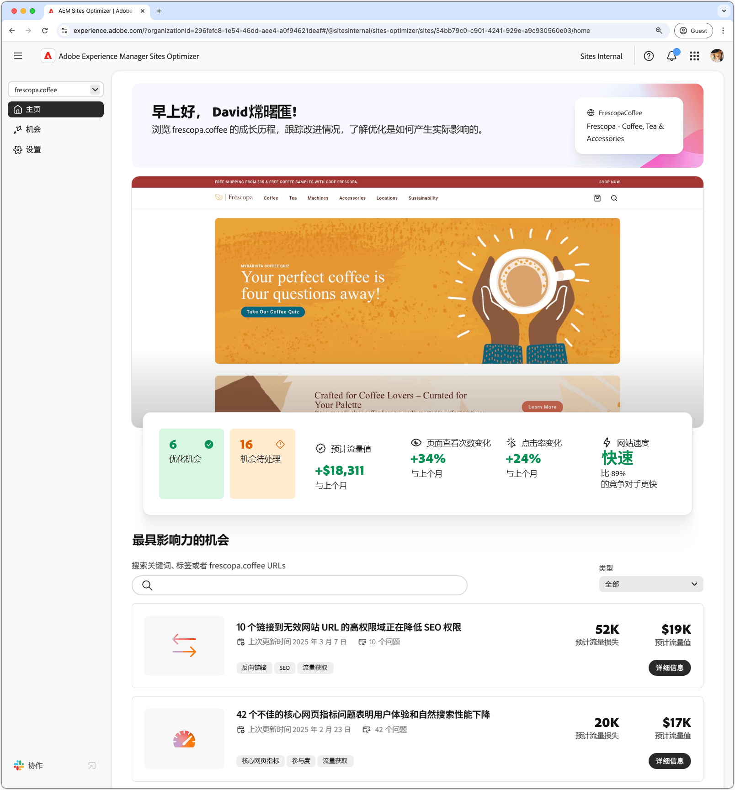
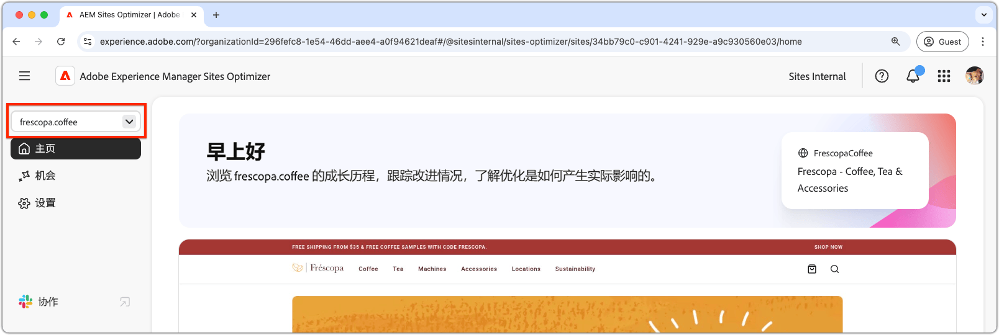
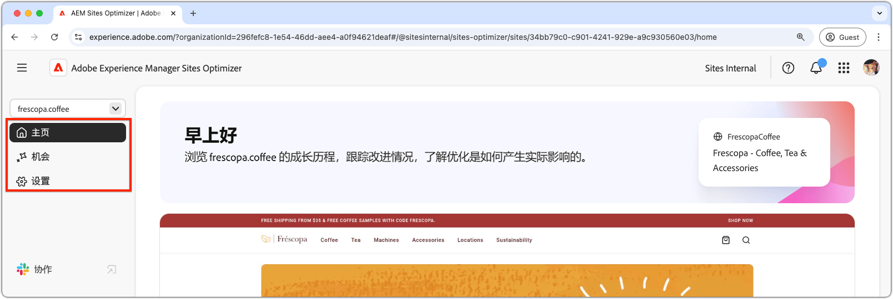
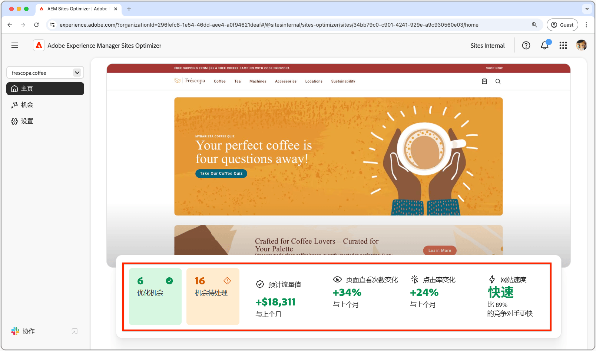
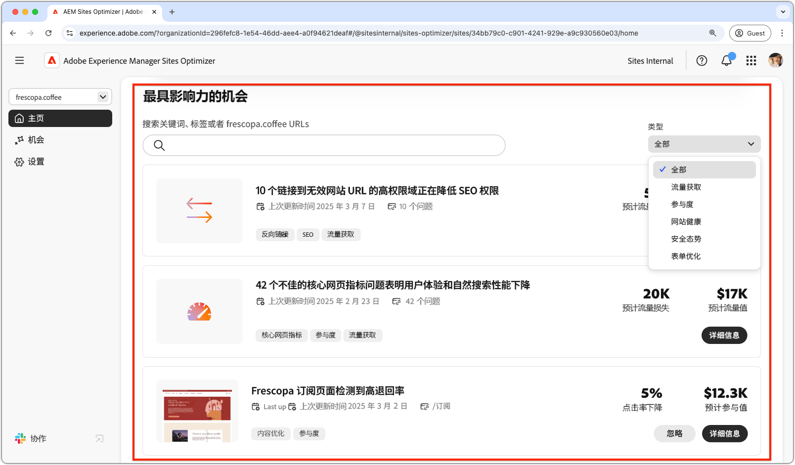
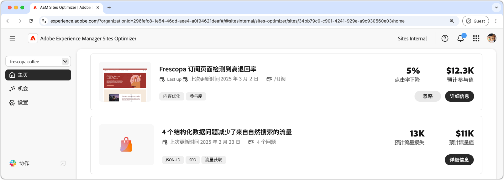

# Sites Optimizer 基础知识

{align="center"}

Sites Optimizer 仪表板提供了网站性能和改进机会的高级概述。

## 域管理器

{align="center"}

域管理器上下文菜单允许您按域选择想要评估和优化的 AEM Sites。Sites Optimizer 提供了在 [Cloud Manager](https://experienceleague.adobe.com/zh-hans/docs/experience-manager-cloud-service/content/implementing/using-cloud-manager/edge-delivery-sites/add-edge-delivery-site) 中注册的所有生产 AEM Sites 的列表。

## 导航

{align="center"}

通过导航部分，可以从 Sites Optimizer 中的任何位置快速、持续访问 Sites Optimizer 的关键区域，其中包括：

* **主页**——主仪表板，提供了网站性能和改进机会的高级概述。
* **机会**——查看和管理 Sites Optimizer 识别的机会，包括已优化的机会和尚未优化的机会。
* **设置**——配置您的 Sites Optimizer 设置，包括正在监控的网站和收到的通知。

## 网站摘要

{align="center"}

“网站摘要”部分提供了您网站性能的快照、Sites Optimizer 在一段时间内如何改进网站以及改进机会。关键量度包括：

* **已优化机会**——为提高经营业绩而改进的已识别的机会数量。
* **待处理机会**——尚未优化的潜在改进数量，代表业务收益领域。
* **预计流量值**——您网站流量的预计值与上月相比发生的变化，有助于衡量 Site Optimizer 对业务目标的贡献。
* **页面浏览量变化**——您网站浏览频率的百分比变化，反映了用户兴趣和内容有效性。
* **点进率变化**——用户点进频率的百分比变化，表示参与度和转化潜力的变化。
* **网站速度**——网站速度和可用性的关键指标，影响用户体验和搜索排名。

## 高影响力机会

{align="center"}

“高影响力机会”部分根据对您网站性能的潜在影响，突出显示了最重要的待改进机会。这些机会按类型分类，让您可以轻松地确定优化工作的优先顺序。

可以通过关键词、标记或 URL 来筛选机会，也可以通过[机会类型](../opportunity-types/overview.md)帮助您专注于最重要的改进领域。

### 机会详细信息

{align="center"}

每个机会都提供了问题的简要描述、其对您网站的潜在影响以及关于完整详细信息的链接。您还可以查看它的状态，表明它是否已优化或仍处于待处理状态。

* **机会标题**——问题的简要描述及其对您网站性能的潜在影响。
* **上次更新**——Sites Optimizer 上次使用新数据更新该机会的日期。
* **问题计数**——在您的网站上识别的该问题实例数。
* **机会类型**——此机会所属的[机会类型](../opportunity-types/overview.md)，例如流量获取、参与度或网站健康状况。

每个机会的摘要信息因类型而异，可能包括有关收入影响、流量、用户参与度或安全威胁的详细信息。

要查看机会的详细信息，请单击&#x200B;**详细信息**&#x200B;按钮。

要从 Sites Optimizer 仪表板和报告中排除某个机会，请单击&#x200B;**忽略**&#x200B;按钮。
