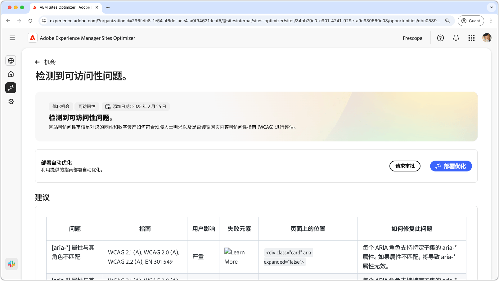
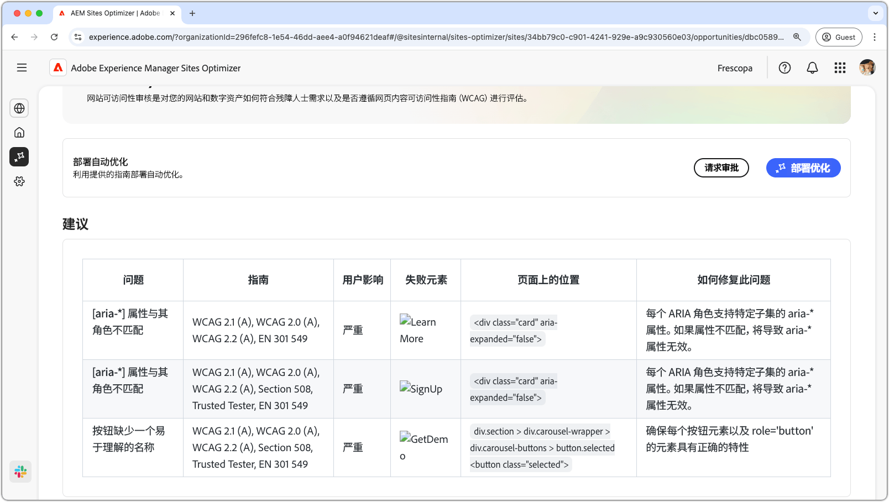

# 无障碍问题机会

{align="center"}

无障碍问题机会可识别您的网站在多大程度上满足了残障人士的需求，以及是否遵循了 [Web 内容无障碍准则（WCAG）](https://www.w3.org/TR/WCAG21/)。评估您的网站在多大程度上符合 WCAG，可以帮助您创建包容性的在线体验，让有视觉、听觉、认知和行动障碍的个体能够导航、与您的内容互动并从中受益。这不仅是出于道德原因，而且还能促进遵守法律要求、改善 SEO，并能扩大受众范围，从而提升用户体验和经营业绩。

## 自动识别

{align="center"}

**无障碍问题机会**&#x200B;可以识别您网站上的无障碍问题，包括以下内容：

* **问题**——发现的特定的无障碍问题。
* **指南**——该问题所违反的 [WCAG 准则 ID](https://www.w3.org/TR/WCAG21/)。
* **用户影响**——评估对残障用户的影响。
* **失败元素**——受该问题影响的网页上的 HTML 元素。
* **页面上的位置**——受该问题影响页面上的元素的 HTML 代码片段。

## 自动建议

{align="center"}

自动建议会在&#x200B;**如何修复问题**&#x200B;字段中提供 AI 生成的推荐，该推荐为如何修复问题提供了规范性指导。

## 自动优化

[!BADGE Ultimate]{type=Positive tooltip="Ultimate"}

{align="center"}

Sites Optimizer Ultimate 添加了针对发现的漏洞部署自动优化的功能。

>[!BEGINTABS]

>[!TAB 部署优化]

{{auto-optimize-deploy-optimization-slack}}

>[!TAB 请求审批]

{{auto-optimize-request-approval}}

>[!ENDTABS]
