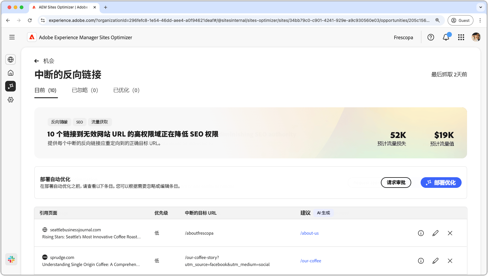
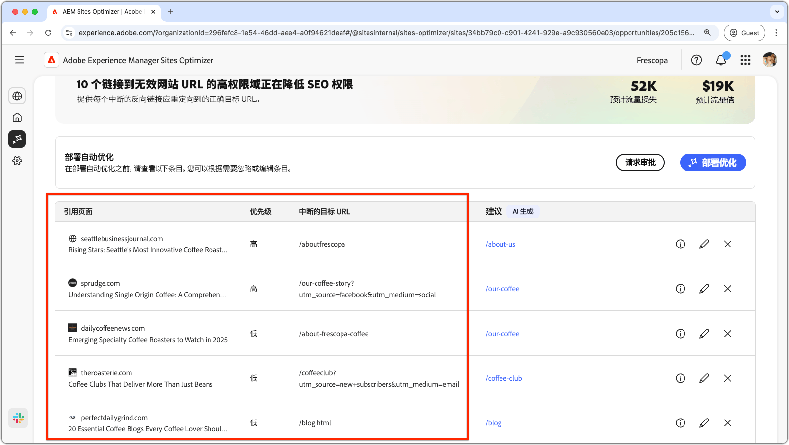
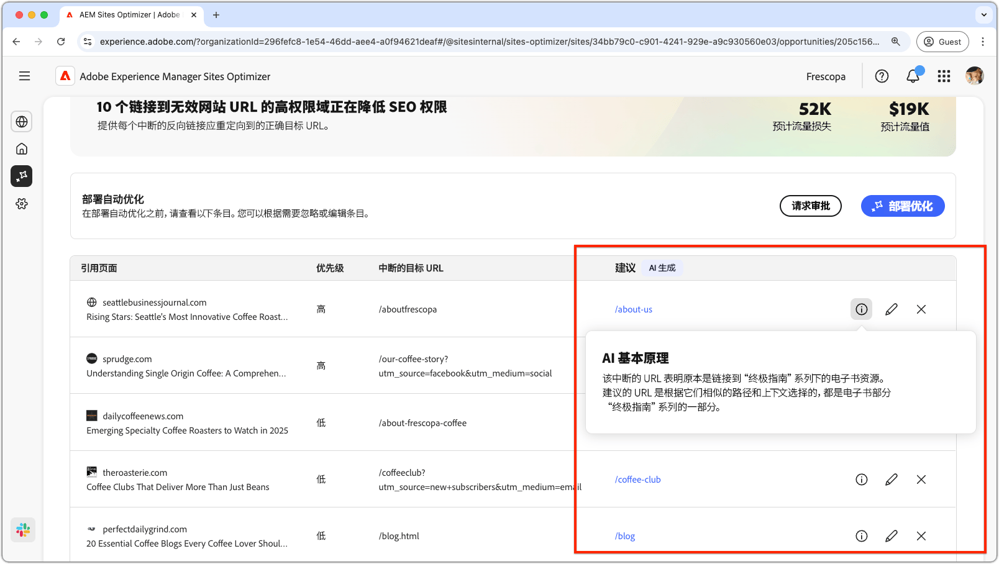
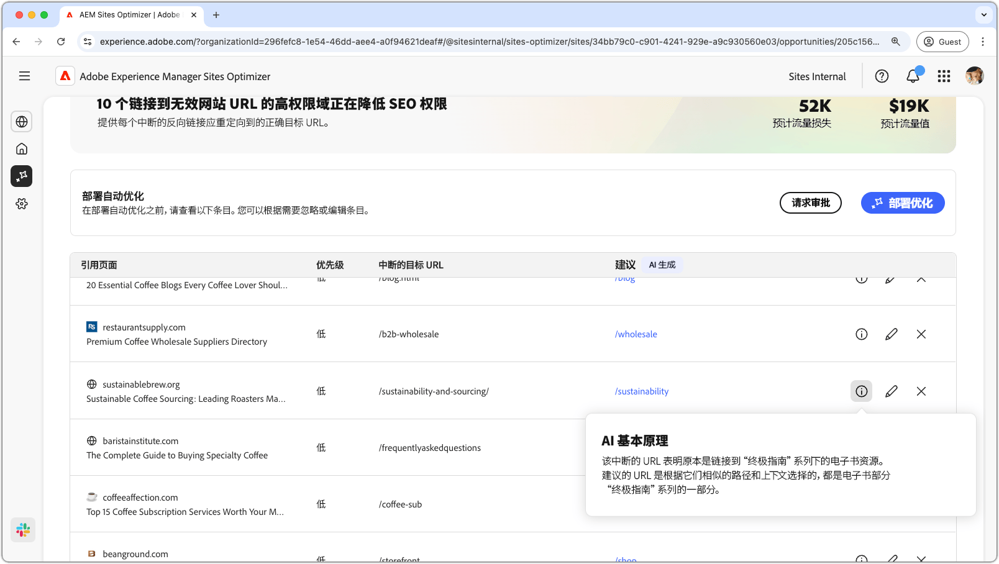
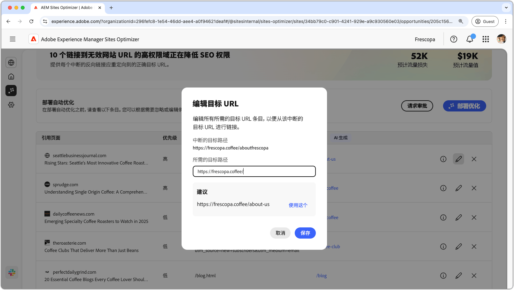
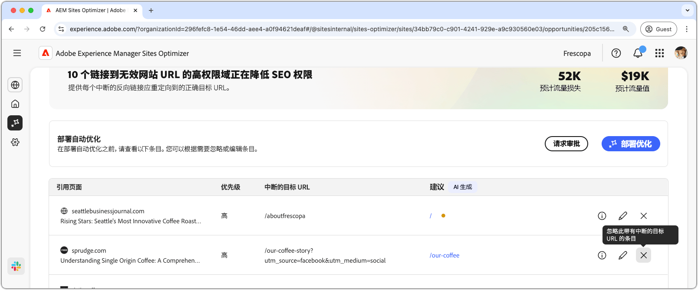
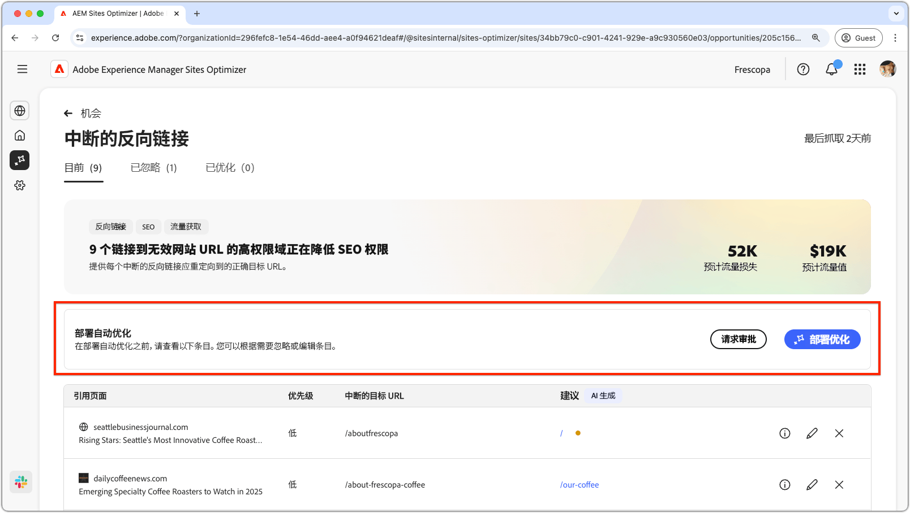
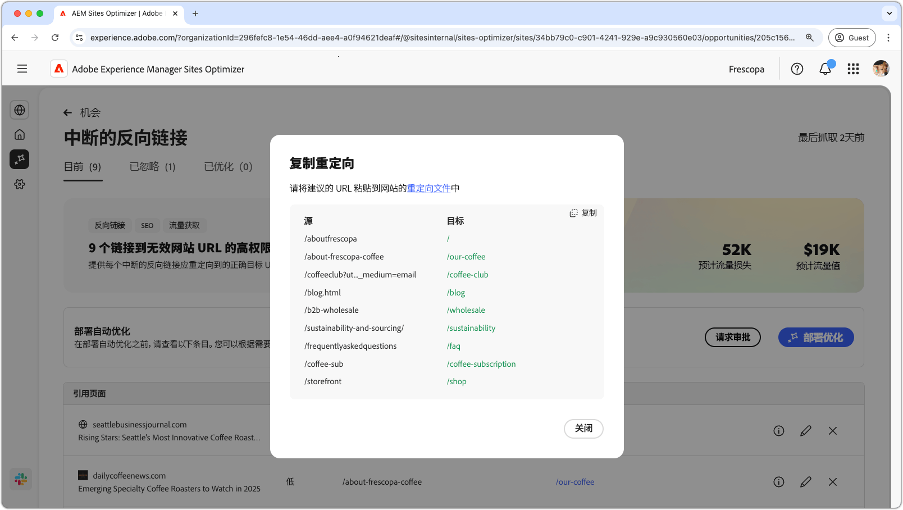
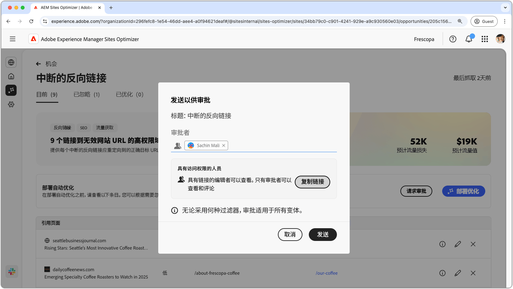

# 中断的反向链接机会

{align="center"}

中断的反向链接机会可以识别从其他网站连接到您的网站时导致 404 错误的链接。由于搜索引擎使用反向链接来确定搜索相关性，因此中断的链接可能会对您网站的 SEO 和可发现性产生负面影响。这些问题可能由 URL 更改或链接页面移除等因素引起。

中断的反向链接机会在页面顶部显示摘要，包括故障总结及其对您的网站和业务的影响。

* **预计的流量损失**——预计的因中断的反向链接而导致的流量损失。
* **预计的流量值**——预计的损失流量值。

## 自动识别

{align="center"}

中断的反向链接机会列出了您网站上所有中断的反向链接，其中包括：

* **引荐页面**——包含中断链接的网站域。
* **优先级**——高、中或低优先级，表示中断的链接对基于 TODO 的 SEO 的影响。
* **中断的目标 URL**——链接到您网站上不存在的 URL。

## 自动建议

{align="center"}

中断的反向链接机会还提供了 AI 生成的建议，指示中断的 URL 应重定向到您网站上的哪个页面。这些建议基于包含中断 URL 的文本以及建议页面的内容。

>[!BEGINTABS]

>[!TAB AI 原理]

{align="center"}

选择&#x200B;**信息**&#x200B;图标，查看所建议 URL 的 AI 原理。该原理解释了为什么 AI 认为所建议的 URL 最适合中断的链接。这可以帮助您了解 AI 的决定过程，并在了解相关信息的情况下决定接受或拒绝该建议。

>[!TAB 编辑目标 URL]

{align="center"}

如果您不同意 AI 生成的建议，可以选择&#x200B;**编辑图标**&#x200B;来编辑所建议的 URL。这样您就可以手动输入您认为最适合中断链接的 URL。Sites Optimizer 还将列出您网站上它认为可能适合中断链接的任何其他 URL。

>[!TAB 忽略条目]

{align="center"}

您可以选择忽略包含中断的目标 URL 的条目。选择&#x200B;**忽略图标**，将中断的反向链接从机会列表中移除。从机会页面顶部的&#x200B;**已忽略**&#x200B;选项卡中可以重新启动已忽略的中断反向链接。

>[!ENDTABS]

## 自动优化

[!BADGE Ultimate]{type=Positive tooltip="Ultimate"}

{align="center"}

Sites Optimizer Ultimate 添加了针对中断的反向链接部署自动优化的功能。选择&#x200B;**自动优化**&#x200B;按钮可自动更新 AEM Site 的重定向规则，以将&#x200B;**中断的目标 URL** 映射到&#x200B;**所建议的 URL**。这可以确保网站访客和搜索机器人在跟踪&#x200B;**引荐页面**&#x200B;上的中断链接时，能够重定向到您网站上的正确页面，从而改善 SEO 和用户体验。

>[!BEGINTABS]

>[!TAB 部署优化]

{align="center"}

选择&#x200B;**部署优化**&#x200B;将更新 AEM Site 的重定向规则，以将&#x200B;**中断的目标 URL** 映射到&#x200B;**所建议的 URL**。这可以确保网站访客和搜索机器人在跟踪&#x200B;**引荐页面**&#x200B;上的中断链接时，能够重定向到您网站上的正确页面，从而改善 SEO 和用户体验。

>[!TAB 请求审批]

{align="center"}

{{auto-optimize-request-approval}}

>[!ENDTABS]
