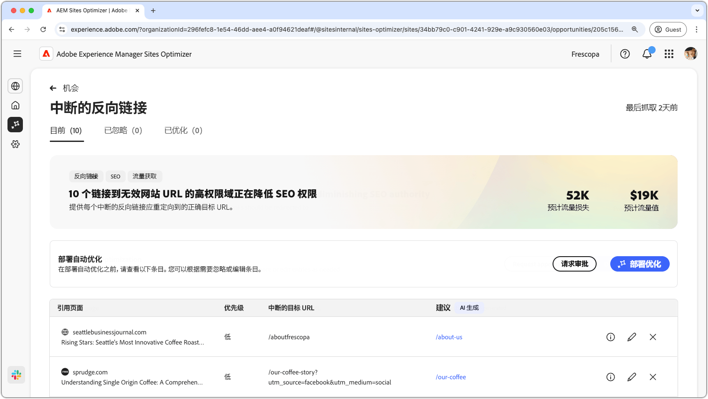
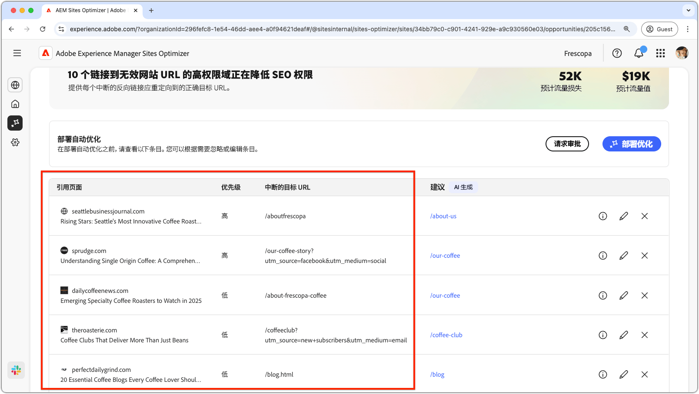
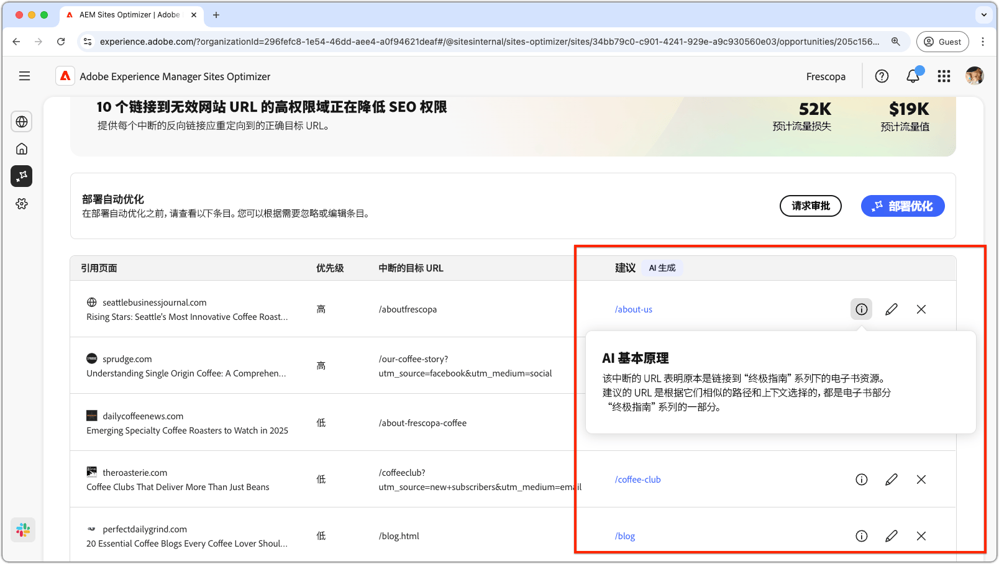
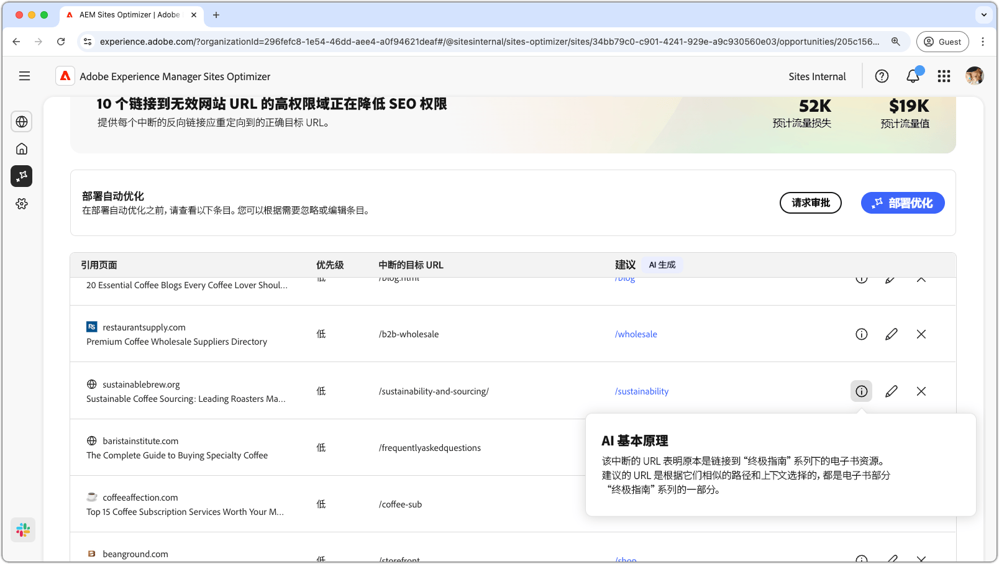
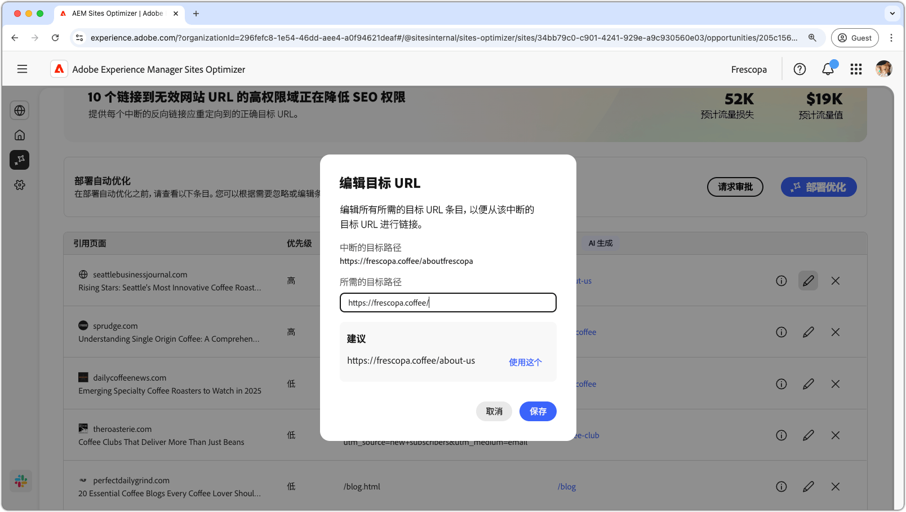
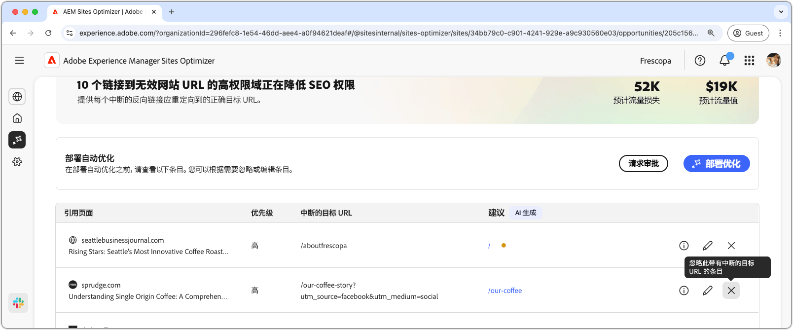

# 中断的反向链接机会

<!--{align="center"}-->

>[!VIDEO](https://video.tv.adobe.com/v/3483263/?captions=chi_hans&learn=on&enablevpops)

中断的后链接机会标识指向网站上不存(404)页面的外部链接。 这些链接会导致引荐流量损失和SEO价值降低，因为搜索引擎依靠反向链接来评估相关性和权威。 在没有适当重定向的情况下，更改URL、删除内容或页面不再可用时，会出现这些问题。 AEM Sites Optimizer可识别所有断开的回溯链接，提供特定的AI建议，并允许一键式部署修复它们，所有这些都在一个集中式视图中完成。

## 自动识别

<!--{align="center"}-->

AEM Sites Optimizer会持续扫描外部数据源，以检测指向网站上不存在的404页面的反向链接。 数据从多个来源聚合，包括Google Search Console、[操作遥测](https://experienceleague.adobe.com/zh-hans/docs/experience-manager-cloud-service/content/sites/operational-telemetry-for-aem-as-a-cloud-service)和第三方SEO平台。 自动识别机会可识别链接到断开URL的外部域，并根据影响（包括域权限和预期流量以及链接权益损失）对其进行优先级排序。

此机会列出了所有已发现的问题，包括以下详细信息：

* **反向链接域和页面** — 包含断开链接的外部页面或域。
* **优先级** — 高、中或低，指示断开的链接对SEO进程的影响。
* **目标URL已损坏** — 您的网站上所链接的URL不存在。

## 自动建议

<!--{align="center"}-->

对于每个标识的已断开回链接，AEM Sites Optimizer会推荐恢复流量和SEO值的最合适目标。 它通过分析以下内容来确定反向链接的意图：

* url结构和令牌
* 锚点文本
* 引用页面的标题和上下文

此意图与现有网站内容匹配，以确定最相关的目标页面。 每个损坏的URL都会映射到精确的替换页面或最相关的页面。 如果无法确定合适的目的地，则会出现该问题以进行手动审查。

>[!BEGINTABS]

>[!TAB AI 原理]

<!--{align="center"}-->

选择&#x200B;**信息**&#x200B;图标，查看所建议 URL 的 AI 原理。 该原理解释了为什么 AI 认为所建议的 URL 最适合中断的链接。 它可以帮助您了解 AI 的决定过程，并在了解相关信息的情况下决定接受或拒绝该建议。

>[!TAB 编辑目标 URL]

<!--{align="center"}-->

如果您不同意 AI 生成的建议，可以选择&#x200B;**编辑图标**&#x200B;来编辑所建议的 URL。 通过编辑，您可以手动输入您认为最适合替代断链的 URL。 Sites Optimizer 还会列出您网站上它认为可能适合中断链接的任何其他 URL。

>[!TAB 忽略条目]

<!--{align="center"}-->

您可以选择忽略包含目标中断 URL 的条目。 选择，将中断的反向链接从机会列表中移除。 从机会页面顶部的&#x200B;**已忽略**&#x200B;选项卡中可以重新启动已忽略的中断反向链接。

>[!ENDTABS]

## 自动优化

<!--[!BADGE Ultimate]{type=Positive tooltip="Ultimate"}-->

在审查并批准建议后，您可以单击&#x200B;**部署优化**。 然后，AEM Sites Optimizer会根据如何在您的实施中管理重定向，将修复应用到创作环境中。 然后，AEM作者可以从内容管理系统(CMS)发布更改。

根据配置，修复将以现有部署工作流中内容或代码更改的形式应用。 优化过程包括以下步骤：

* **验证** — 确保更改按预期运行，并且在部署之前不引入回归。
* **部署** — 通过现有流程应用更改，例如AEM中的内容更新或通过CI/CD管道进行代码部署。
* **权限检查** — 验证用户是否具有部署更改的适当权限。 如果没有，则提供替代输出，例如可下载的重定向列表或代码修补程序。

此过程可确保准确实施重定向，在发布之前进行验证，并与现有配置和管理流程保持一致。
