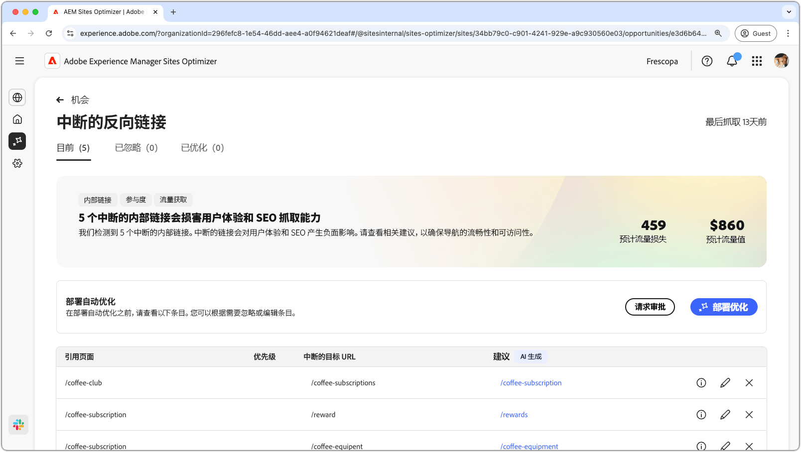
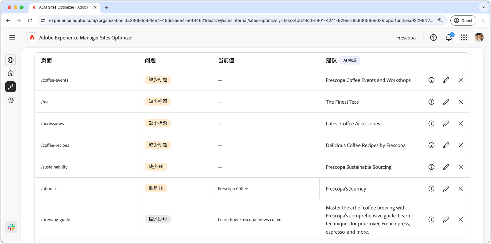

# 中断的内部链接机会

{align="center"}

中断的内部链接会影响搜索引擎对您的网站进行索引的能力，并对用户体验和搜索引擎优化产生负面影响。要帮助修复这个故障，中断的内部链接机会应该指出中断的 URL，并提供有效链接更新的建议。解决这些问题可以提高用户参与度，并确保顺利导航和无障碍性。

中断的内部链接机会在页面顶部显示摘要，包括故障总结及其对您的网站和业务的影响。

* **预计的流量损失**——预计的因中断的内部链接而导致的流量损失。
* **预计的流量值**——预计的损失流量值。

## 自动识别

<!---{align="center"}-->

中断的内部链接机会自动识别并列出了您页面上所有中断的内部链接，包括以下内容：

* **引荐页面**——包含中断链接的页面。
* **中断的目标 URL**——中断的内部链接。
* **建议**——AI 生成的有关如何更新中断链接的建议。更多详细信息，请参阅自动建议部分。

## 自动建议

<!--{align="center"}-->

中断的内部链接机会提供了 AI 生成的有关如何更新中断链接的建议。这些建议基于目标中断的 URL，并提供了合适的替代方案。选择为建议的更新提供了AI生成的理由。

>[!BEGINTABS]

>[!TAB AI 原理]

<!--[AI rationale of broken internal links](./assets/broken-internal-links/auto-suggest-ai-rationale.png) -->

选择以查看所建议URL的AI原理。 该原理解释了为什么 AI 认为所建议的 URL 最适合中断的链接。它还有助于您了解AI的决策过程，并做出是否接受或拒绝建议的明智决策。

>[!TAB 编辑目标 URL]

<!--{align="center"}-->

如果您不同意 AI 生成的建议，可以选择&#x200B;**编辑图标**&#x200B;来编辑所建议的链接值。此功能允许您手动输入所需的链接。 编辑窗口包含链接的&#x200B;**中断目标路径**、您可以手动编辑链接的&#x200B;**所需目标路径**，以及包含 AI 生成建议的字段。完成编辑后，单击&#x200B;**保存**，更新中断的链接条目。输入字段中会显示一个黄色圆点，表示链接已编辑。

>[!TAB 忽略条目]

<!--{align="center"}-->

您可以选择忽略包含目标中断 URL 的条目。选择会从机会列表中删除该条目。 从机会页面顶部的&#x200B;**已忽略**&#x200B;选项卡中可以重新启动已忽略的条目。

>[!ENDTABS]

## 自动优化

[!BADGE Ultimate]{type=Positive tooltip="Ultimate"}

<!---{align="center"}-->

Sites Optimizer Ultimate 添加了针对机会发现中断的链接部署自动优化的功能。<!--- TBD-need more in-depth and opportunity specific information here. What does the auto-optimization do?-->

>[!BEGINTABS]

>[!TAB 部署优化]

{{auto-optimize-deploy-optimization-slack}}

>[!TAB 请求审批]

{{auto-optimize-request-approval}}

>[!ENDTABS]

