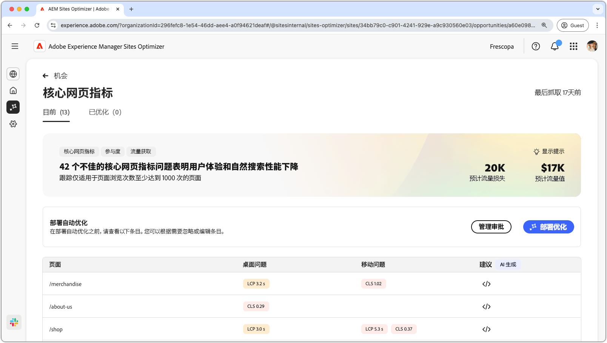
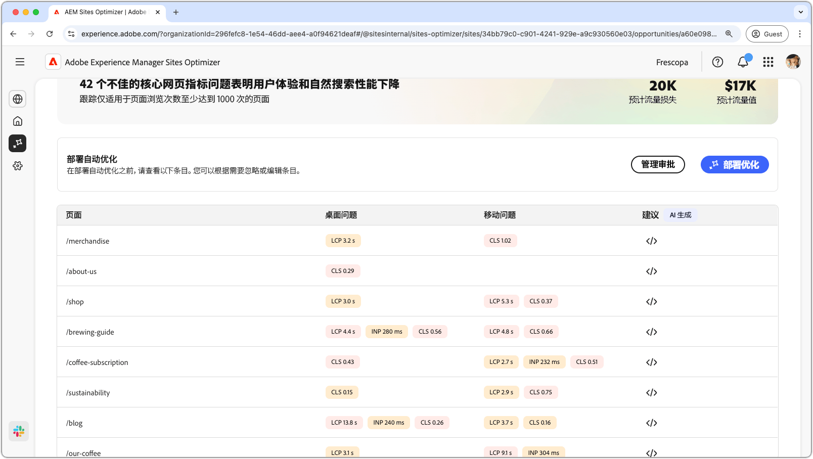
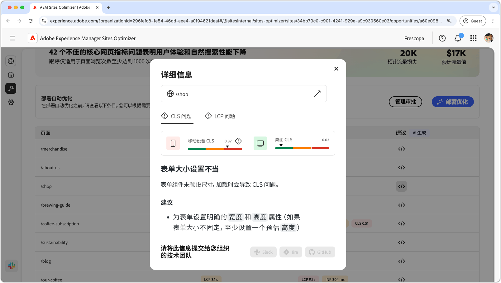
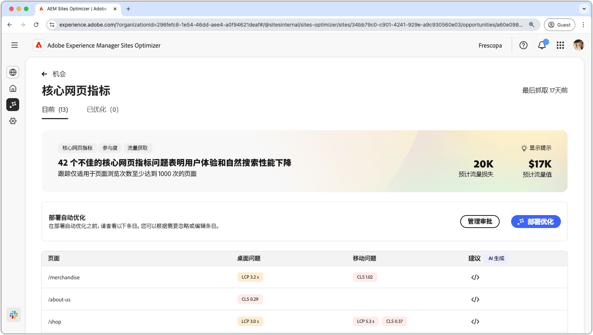

# Core Web Vitals 机会

{align="center"}

Core Web Vitals 机会可以识别可能降低网页用户体验和自然搜索性能的问题。这些问题由一系列因素引起，例如：自定义字体、未优化的JavaScript依赖项、第三方脚本等。 Core Web Vitals 机会指出这些错误元素，并建议可以提高网页性能的修复方法。请注意，只有浏览量至少为 1000 次的页面才可以进行分析。

首先，Core Web Vital 机会在页面顶部显示摘要，包括故障总结及其对您的网站和业务的影响。

* **预计的流量损失**——预计因 Core Web Vital 低于性能阈值而导致的流量损失。
* **预计的流量值**——预计的损失流量值。

## 自动识别

{align="center"}

在页面的下方，您可以看到所有当前问题的列表，这些问题分组如下：

* **移动设备问题**——影响移动设备版页面的问题列表。
* **桌面问题**——影响桌面版页面的问题列表。

每个问题都显示在一张表中，其中&#x200B;**页面**&#x200B;列显示受影响的页面条目。

系统会按照核心Web虚拟报表中的标准性能量度对这些问题进行分组：

* 最大内容绘制&#x200B;**LCP**
* 与下一个绘制&#x200B;**INP**&#x200B;的交互
* 累积布局偏移&#x200B;**CLS**

## 自动建议

{align="center"}

Core Web Vital 机会可以提供 AI 生成的修复建议。单击建议按钮后，将出现一个新窗口，其中包含 **LCP**、**INP** 和 **CLS** 几个类别的性能量度。您可以在这些类别之间切换，以查看特定问题的列表。

每个类别可以包含多个问题，因此请务必向下滚动，以查看完整的问题和推荐列表。此外，每个量度都有针对移动设备和桌面的两种性能衡量。

## 自动优化

[!BADGE Ultimate]{type=Positive tooltip="Ultimate"}

{align="center"}

Sites Optimizer Ultimate 添加了针对 Core Web Vital 机会发现的问题部署自动优化的功能。<!--- TBD-need more in-depth and opportunity specific information here. What does the auto-optimization do?-->

>[!BEGINTABS]

>[!TAB 部署优化]

{{auto-optimize-deploy-optimization-slack}}

>[!TAB 请求审批]

{{auto-optimize-request-approval}}

>[!ENDTABS]

