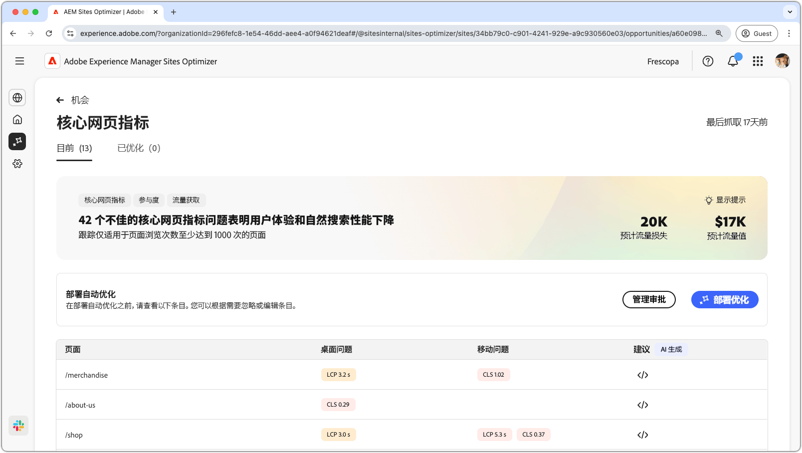

# Core Web Vitals 机会

{align="center"}

Core Web Vitals销售机会可以识别您网站上表现不佳且影响用户体验和自然搜索性能的页面。 这些问题可能是由自定义字体、未优化的JavaScript依赖项和第三方脚本等因素造成的。 Core Web Vitals会测量内容加载速度、页面布局稳定性以及页面对用户交互的响应程度。

AEM Sites Optimizer可检测受这些问题影响的页面、在代码级别提供特定的AI建议，并通过您现有的开发工作流应用修复。 请注意，只能分析至少具有1000次页面查看次数的页面。

## 自动识别

{align="center"}

AEM Sites Optimizer通过使用[操作遥测](https://experienceleague.adobe.com/zh-hans/docs/experience-manager-cloud-service/content/sites/operational-telemetry-for-aem-as-a-cloud-service)检测Core Web Vitals量度(如最大内容绘制(LCP)、累积布局偏移(CLS)和交互到下一绘制(INP))中的回归来持续监视网站性能。 它使用真实的用户数据来识别性能回归并根据问题对用户体验的影响为其设置优先级。

AEM Sites Optimizer显示所有当前问题的列表，按移动设备和桌面设备详述。 **Page**&#x200B;列指示受影响的页面条目和问题按LCP、INP和CLS分类。

## 自动建议

{align="center"}

对于每个已识别的问题，AEM Sites Optimizer会生成规范性代码级别的建议以提高Core Web Vitals性能。 它通过访问代码存储库来评估基础实施。 这使系统能够分析组件、脚本和样式的实施方式，并找出性能问题的根本原因。 基于此分析，系统提供有针对性的建议并生成代码修补程序，这些修补程序指定改进性能所需的更改。 每项建议都可以在应用之前进行审核。

单击建议按钮后，将显示一个新窗口，其中包含性能度量LCP、INP和CLS作为类别。 您可以在这些类别之间切换以查看特定问题的列表。 每个类别都可能包含几个问题，因此请务必向下滚动以查看问题和建议的完整列表。 此外，每个量度都有两个适用于移动设备和台式机的性能标尺。

## 自动优化

[!BADGE Ultimate]{type=Positive tooltip="Ultimate"}

{align="center"}

审核并批准推荐后，您可以单击&#x200B;**部署优化**。 AEM Sites Optimizer会根据发现的问题生成代码修补程序，并通过版本控制流程提供这些修补程序。 优化过程包括以下步骤：

* **问题创建** — 为每次修复创建一个标记的GitHub问题，包括清晰的描述和受影响的URL以查看可见性。
* **拉取请求投放** — 自动打开具有确切代码修复的链接拉取请求，可供审查、测试和合并。
* **状态跟踪** — 跟踪每个修复直至完成，标记部分或失败的后续尝试。

在提供这些更新之前，AEM Sites Optimizer会执行验证，以确保修复解决了基础问题并且不会引入回归。 所有更新都遵循标准开发实践，在合并到生产环境之前需要审核和批准。

这可确保性能优化是准确、经过验证并集成到现有开发和治理流程中的。
