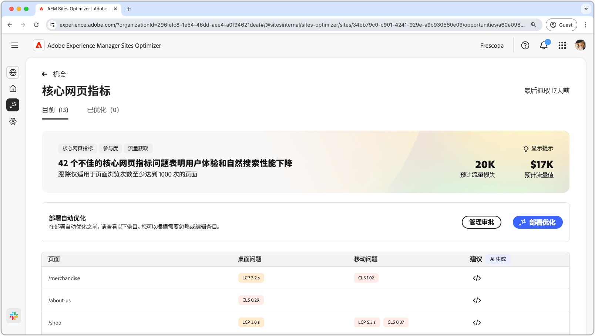
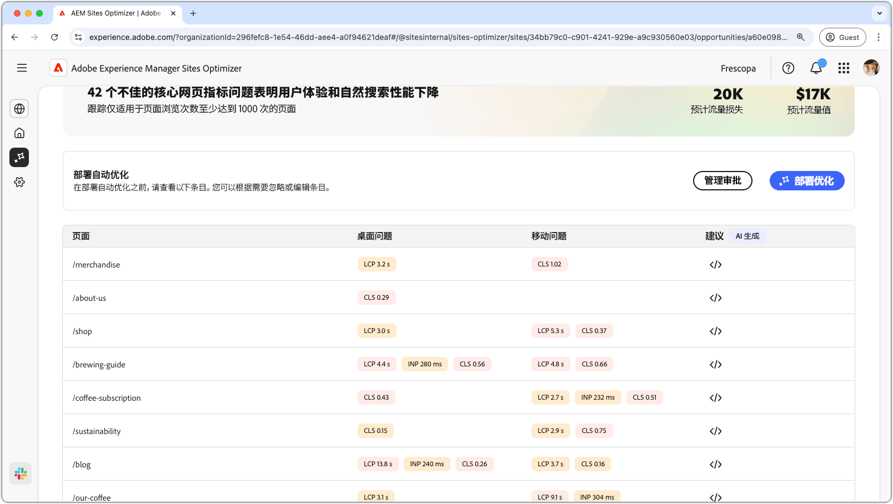
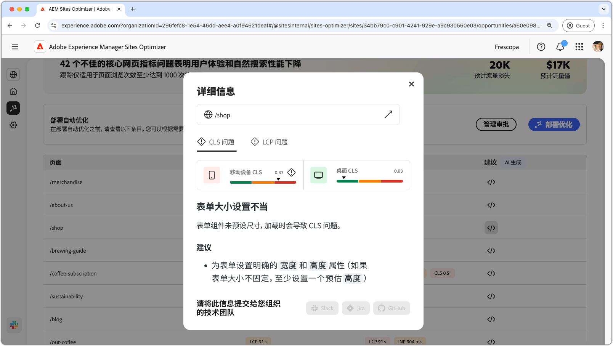

# Core Web Vitals 机会

<!--{align="center"}-->

>[!VIDEO](https://video.tv.adobe.com/v/3483371/?learn=on&enablevpops)

Core Web Vitals 机会可以识别出您的网站上那些表现不佳且影响用户体验和自然搜索性能的页面。 这些问题可能是由自定义字体、未优化的 JavaScript 依赖项和第三方脚本等因素导致的。 Core Web Vitals 会衡量内容加载速度、页面布局的稳定性以及页面对用户交互的响应能力。

AEM Sites Optimizer 会检测受这些问题影响的页面、在代码层面上提供具体的 AI 建议，并通过您现有的开发工作流应用修复。 请注意，只有浏览量至少为 1000 次的页面才可以进行分析。

## 自动识别

<!--{align="center"}-->

AEM Sites Optimizer 使用[运行遥测](https://experienceleague.adobe.com/zh-hans/docs/experience-manager-cloud-service/content/sites/operational-telemetry-for-aem-as-a-cloud-service)检测 Core Web Vitals 量度中的回归，如最大内容渲染时间 (LCP)、累积布局偏移 (CLS) 和直到下一次绘制的交互 (INP)，由此持续监视网站性能。 它使用真实的用户数据来识别性能回归，并根据这些问题对用户体验的影响设置它们的优先级。

AEM Sites Optimizer 显示所有当前问题的列表，按移动设备和桌面设备提供详细信息。 **页面**&#x200B;列表示受影响的页面条目，所有问题按 LCP、INP 和 CLS 分类。

## 自动建议

<!--{align="center"}-->

对于每一个发现的问题，AEM Sites Optimizer 会生成规范性的代码级建议，提高 Core Web Vitals 性能。 它通过访问您的代码存储库来评估底层实施。 这使系统能够分析组件、脚本和样式如何实施，找出性能问题的根本原因。 基于这个分析，系统会提供有针对性的建议，生成代码补丁，指定通过哪些更改改进性能。 每项建议都可以审阅之后再应用。

如果您点击建议按钮，就会出现一个新窗口，其中包含 LCP、INP 和 CLS 几个类别的性能量度。 您可以在这些类别之间切换，查看特定问题的列表。 每个类别可能包含多个问题，因此请务必向下滚动，查看完整的问题和建议列表。 此外，每个量度都有针对移动设备和桌面设备的两种性能衡量。

## 自动优化

<!--[!BADGE Ultimate]{type=Positive tooltip="Ultimate"}-->

建议被审阅和批准之后，您可以点击&#x200B;**部署优化**。 AEM Sites Optimizer 会根据发现的问题生成代码补丁，并通过版本控制流程提供这些补丁。 优化过程包括以下步骤：

* **创建问题**——为每个修复创建一个带标签的 GitHub 问题，包括清晰的描述和受影响的 URL，以便查看。
* **传递提取请求**——自动打开具有确切代码修复的相关联的提取请求，可立即进行审阅、测试和合并。
* **跟踪状态**——跟踪每个修复直至全部完成，标记出部分尝试或失败的尝试，以便跟进。

提供这些更新之前，AEM Sites Optimizer 会执行验证，以确保修复解决了底层问题，并且不会引入回归。 所有更新都遵循标准开发实践，在合并到生产环境中之前需要进行审阅和审批。

这样可确保性能优化不但准确，而且经过验证，并且集成到现有的开发和治理流程中。
