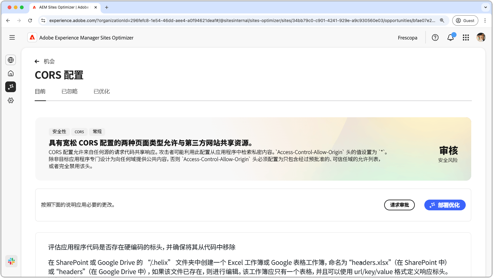
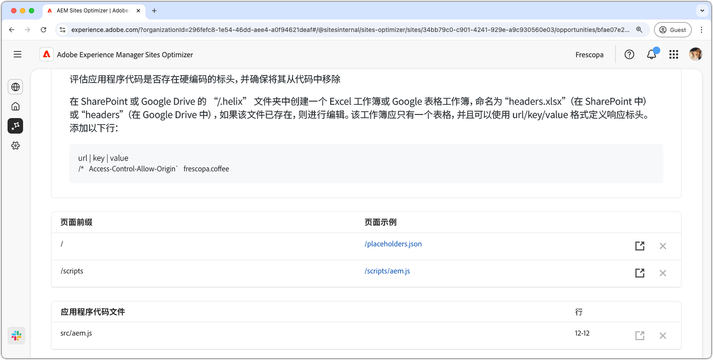

# CORS 配置机会

{align="center"}

正确配置跨源资源共享（CORS）对于保护 Web 应用程序免受未经授权的数据访问至关重要。如果 `Access-Control-Allow-Origin` 标头设置为 `*`，那么任何域都可以请求和接收响应，从而可能将敏感信息暴露给攻击者。该功能提供了一个机会，通过实施一个可控的信任域允许列表或者在不需要 CORS 时将其禁用来加强安全性。确保 CORS 设置的安全性有助于保护私人内容，同时保持授权用户的无缝访问。

## 自动识别

{align="center"}

自动识别功能可扫描您的网站，查找 CORS 错误配置，并检测容易受到未经授权访问影响的 URL。这些 URL 连同以下详细信息均列在顶部表中：

* **页面前缀**——易受到 CORS 错误配置影响的 URL 路径前缀。
* **页面示例**——易受未经授权访问影响的 URL 示例。

## 自动建议

{align="center"}

自动建议提供可能设置了不严谨 CORS 策略的待审查&#x200B;**应用程序代码文件**&#x200B;及其&#x200B;**行**。

## 自动优化

[!BADGE Ultimate]{type=Positive tooltip="Ultimate"}

>[!BEGINTABS]

>[!TAB 部署优化]

{{auto-optimize-deploy-optimization-slack}}

>[!TAB 请求审批]

{{auto-optimize-request-approval}}

>[!ENDTABS]
