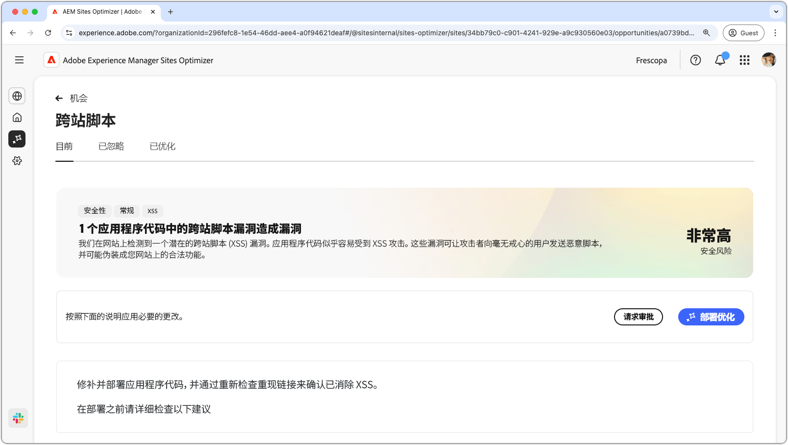
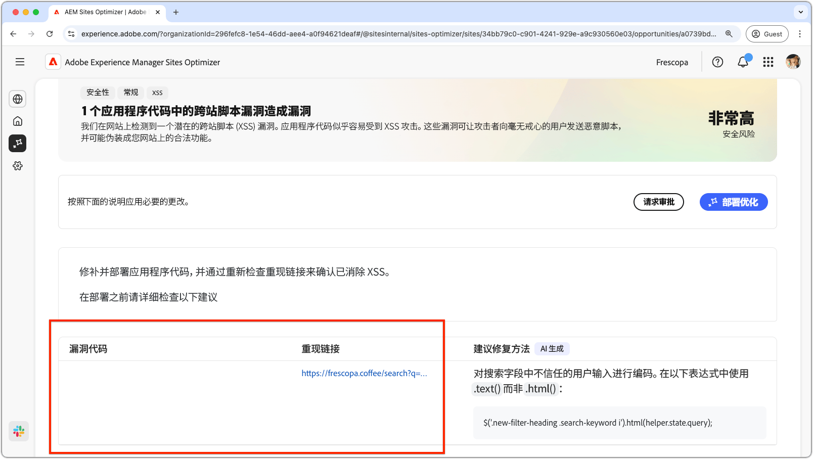
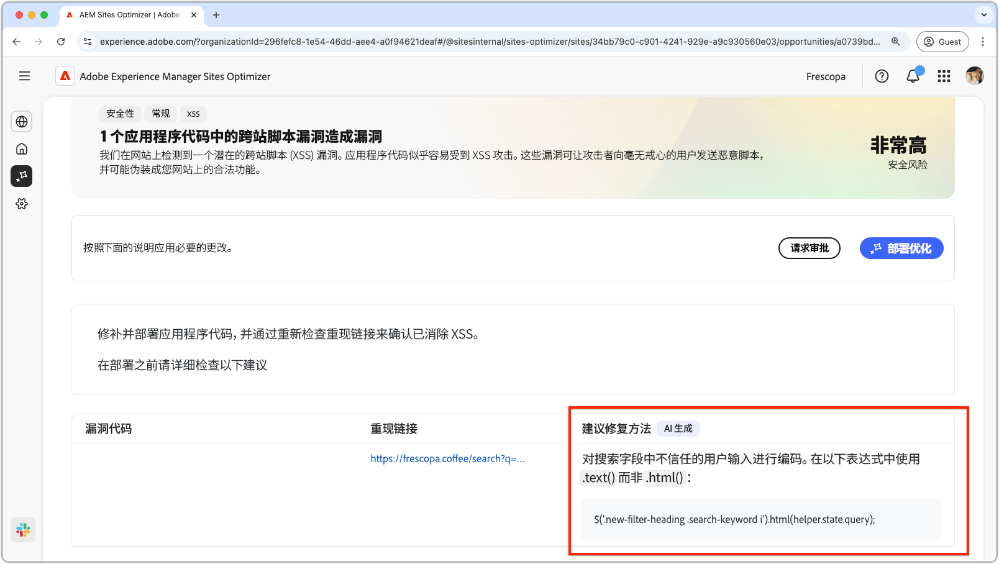

# 跨站点脚本机会

{align="center"}

跨站脚本漏洞分析可识别您网站代码中的安全漏洞。 随后，它会修复可能被攻击者利用的问题，防止其将恶意脚本注入其他用户浏览的网页中。 这些脚本可能窃取敏感信息，例如会话 Cookie；或者代表用户执行操作，例如更改用户的密码。

## 自动识别

{align="center"}

* **易受攻击的代码**——任何容易受到跨站点脚本攻击的代码。
* **重现链接**——发现漏洞的页面的链接。

## 自动建议

{align="center"}

* **建议的修复**——AI 生成的有关如何修复漏洞的建议。

## 自动优化

[!BADGE Ultimate]{type=Positive tooltip="Ultimate"}

>[!BEGINTABS]

>[!TAB 部署优化]

{{auto-optimize-deploy-optimization-slack}}

>[!TAB 请求审批]

{{auto-optimize-request-approval}}

>[!ENDTABS]
