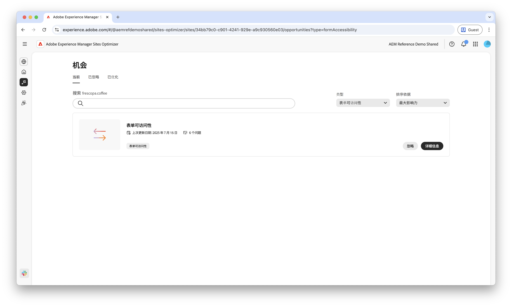
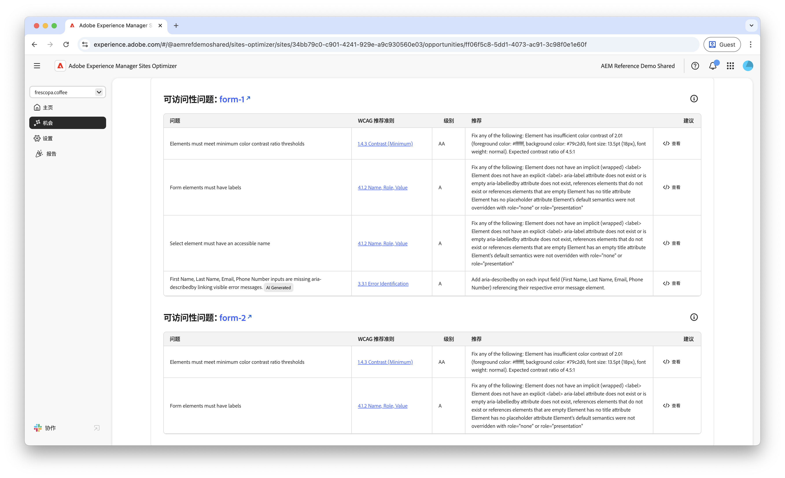
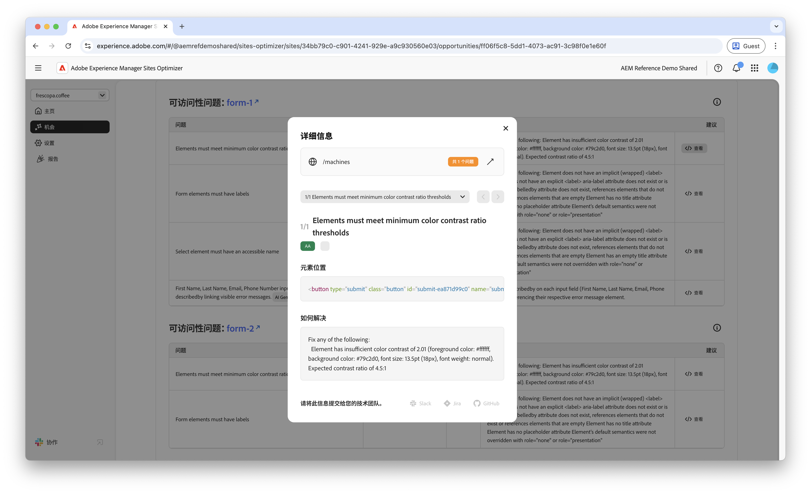
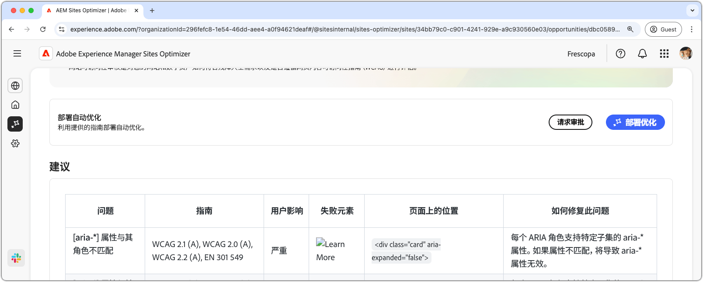

# 表单无障碍可访问性问题机会

{align="center"}

表单无障碍可访问性问题机会可识别您的网站在多大程度上满足了残障人士的需求，以及是否遵循了 [Web 内容无障碍指南（WCAG）](https://www.w3.org/TR/WCAG21/)。评估您的网站在多大程度上符合 WCAG，可以帮助您创建包容性的表单体验，让有视觉、听觉、认知和行动障碍的人能够在您的表单中导航、与其互动并成功填写表单。这一功能不仅在道德伦理上至关重要，还有助于满足法律合规要求、提升表单完成率，拓展您的受众覆盖范围，从而优化用户体验并提升业务表现。

## 自动识别

{align="center"}

**表单无障碍可访问性问题机会**&#x200B;可以识别您表单中的无障碍问题，包括以下方面：

* **问题**——在您的表单中发现的特定的无障碍问题。
* **WCAG 标准**——表单问题所违反的 [WCAG 指南 ID](https://www.w3.org/TR/WCAG21/)。
* **等级**——表单问题的[符合性等级](https://www.w3.org/WAI/WCAG21/Understanding/conformance#levels)。
* **建议** ——关于如何解决表单中的无障碍可访问性问题的具体指导，包括代码示例和最佳实践。
* **源 HTML**——表单问题所涉及的页面上的表单元素的 HTML 片段。

## 自动建议

{align="center"}

自动建议会在&#x200B;**建议**&#x200B;字段中提供 AI 生成的建议，为如何解决表单无障碍问题提供规范性指导。

<!-- 

## Auto-optimize

[!BADGE Ultimate]{type=Positive tooltip="Ultimate"}

{align="center"}

Sites Optimizer Ultimate adds the ability to deploy auto-optimization for the form accessibility issues found.

>[!BEGINTABS]

>[!TAB Deploy optimization]

{{auto-optimize-deploy-optimization-slack}}

>[!TAB Request approval]

{{auto-optimize-request-approval}}

>[!ENDTABS]
-->

