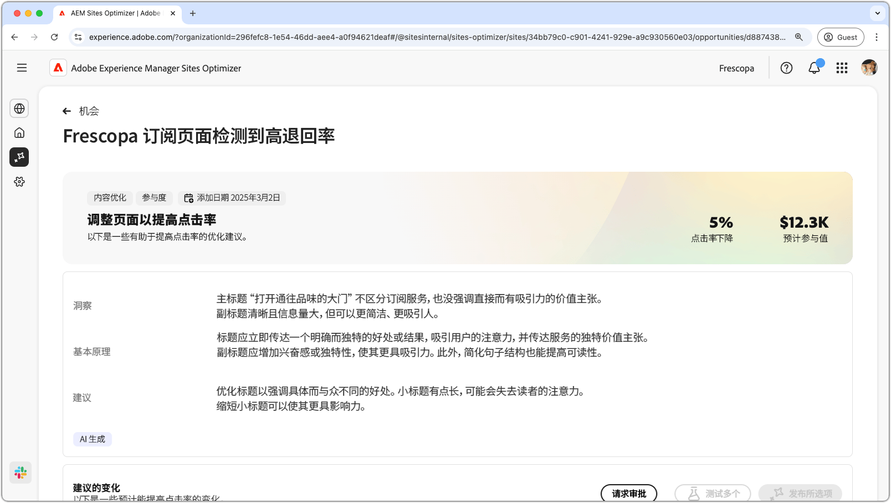
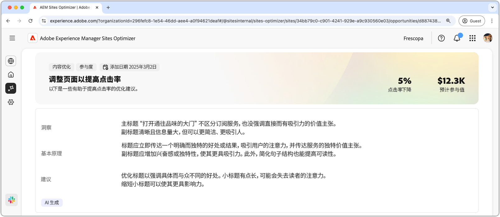
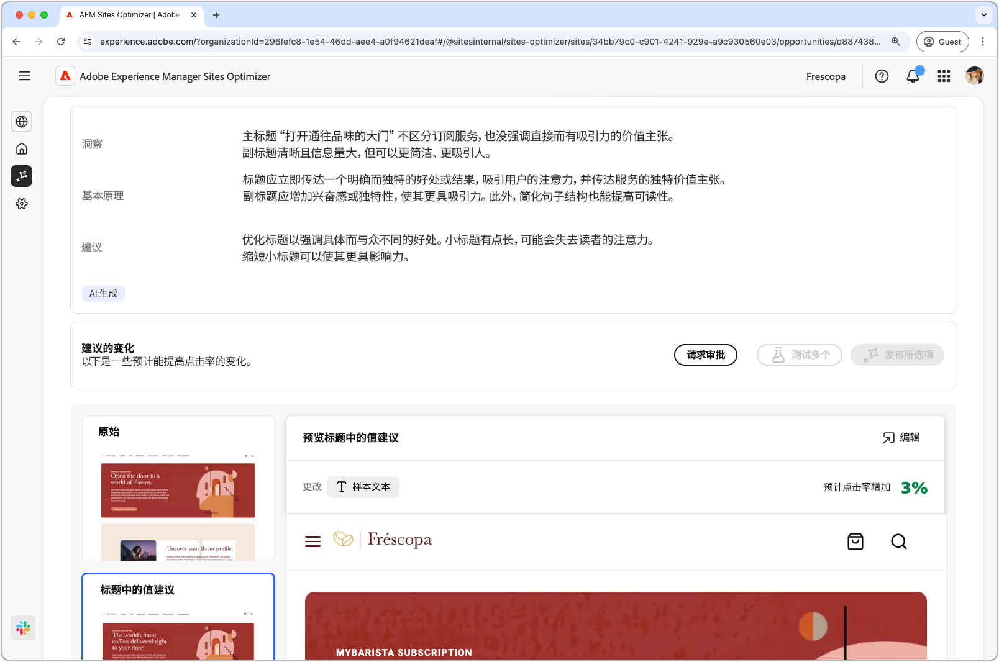
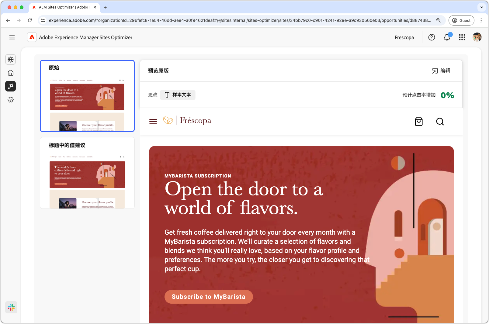
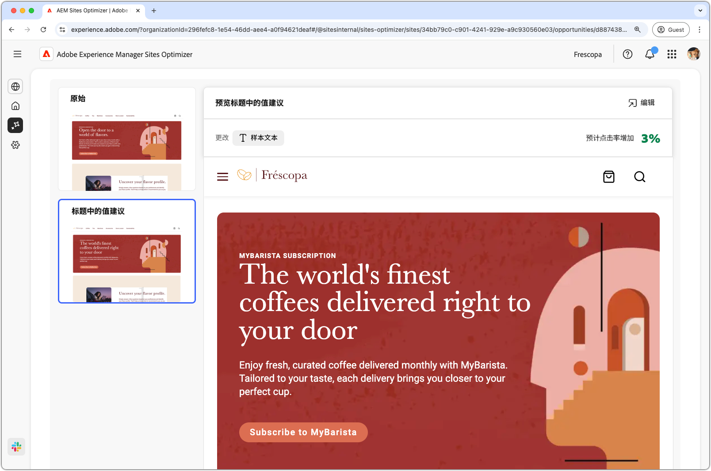
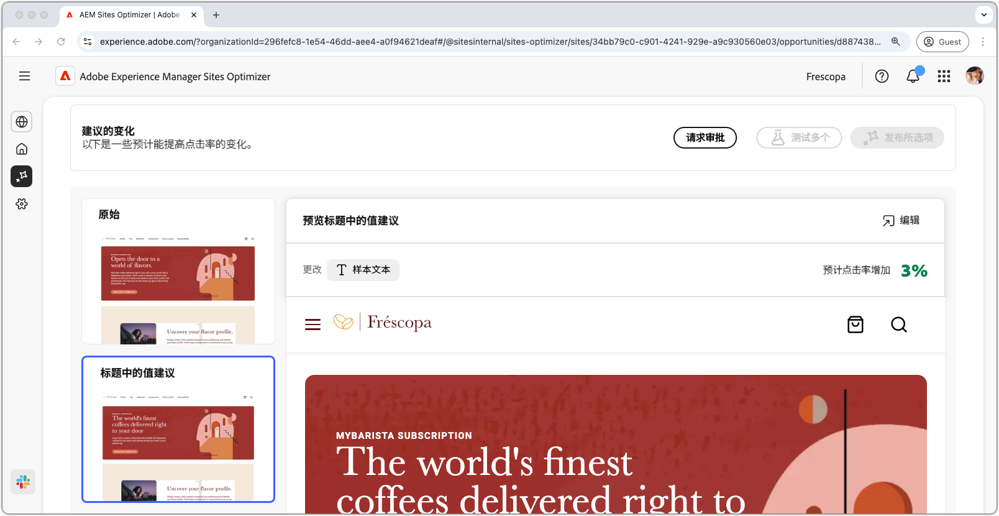

# 高跳出率机会

{align="center"}

高跳出率机会可以识别您网站上跳出率较高的表单。此机会类型可帮助您了解哪些表单的效果不佳，并提供有关如何提高参与率的建议。 通过优化表单浏览量，您可以增加表单提交的数量，并提高网站的整体性能。

## 自动识别

{align="center"}

每个具有低查看次数的表单的网页都作为自己的&#x200B;**高跳出率**&#x200B;机会列出。 机会页面的顶部显示了该机会的简短摘要和 AI 原理。

## 自动建议

{align="center"}

自动建议提供了 AI 生成的网页变体，旨在提高您表单的浏览量。每个变量都会显示&#x200B;**项目转化率提升**（基于其提高表单参与度的潜力），从而帮助您优先处理最有效的建议。

>[!BEGINTABS]

>[!TAB 对照变体]

{align="center"}

控制变量是网站上当前提供的原始表单。 此变体可作为基准，用于比较建议变体的性能。

>[!TAB 建议的变体]

{align="center"}

建议的变体是人工智能生成的网页变体，旨在降低表单的跳出率。 每个变量都会显示&#x200B;**预计点击率提升**（基于其提高表单参与度的潜力），从而帮助您优先处理最有效的建议。

单击每个变体，即可在屏幕右侧进行预览。在预览顶部提供以下操作和信息：

* **更改**——此变体与&#x200B;**控制**&#x200B;变体相比有哪些更改的简短摘要。
* **预计的点进率增加**——如果实施此变体，预计点进率将会增加。
* **编辑**——单击即可在 AEM 创作中编辑此变体。

>[!ENDTABS]

## 自动优化

[!BADGE Ultimate]{type=Positive tooltip="Ultimate"}

{align="center"}

Sites Optimizer Ultimate 添加了针对低浏览量机会发现的问题部署自动优化的功能。

>[!BEGINTABS]

>[!TAB 测试多个]

>[!TAB 发布所选项]

{{auto-optimize-deploy-optimization-slack}}

>[!TAB 请求审批]

{{auto-optimize-request-approval}}

>[!ENDTABS]
