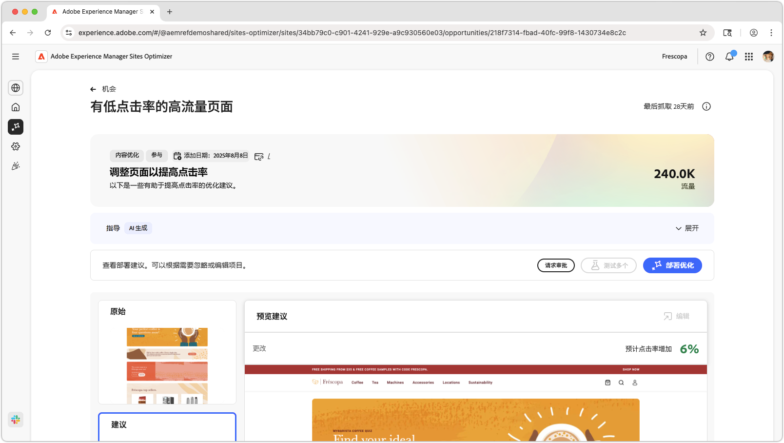
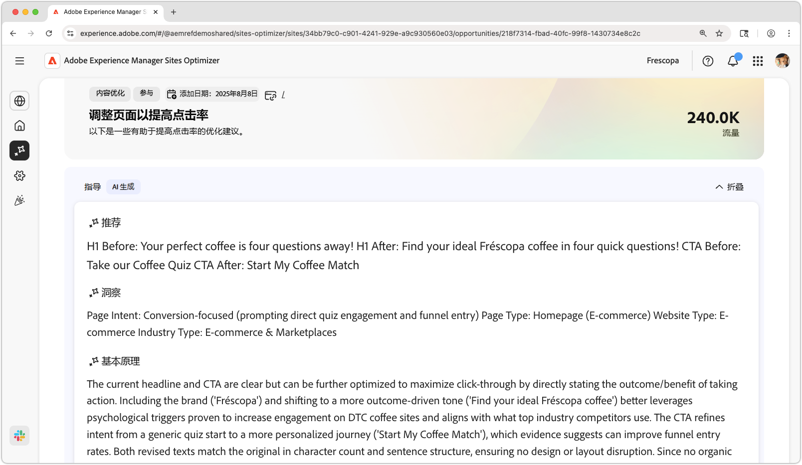
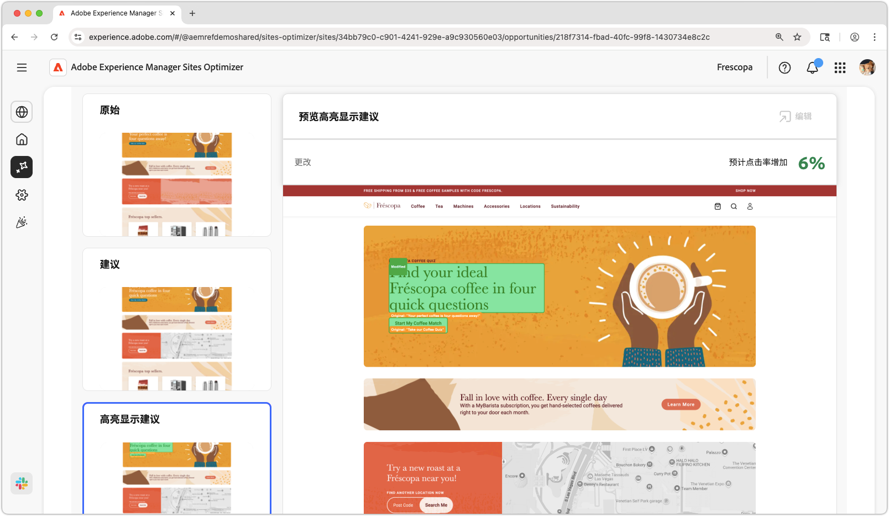
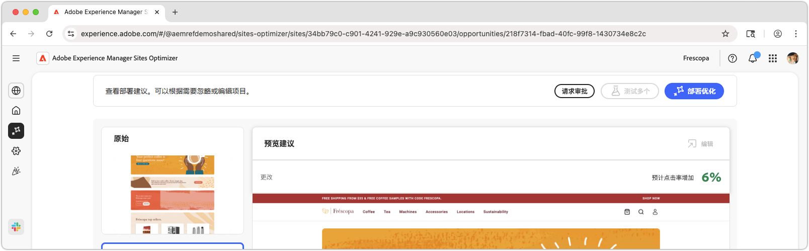

# 高流量页面具有低CTR机会

{align="center"}

高流量页面具有低CTR机会可识别您网站上接收大量流量但点进率(CTR)较低的页面。 通过分析这些页面，您可以发现可能阻碍用户参与的潜在问题，并采取措施改进其性能。 此机会对于优化网站内容和布局，最终提高转化率和改善用户体验至关重要。

## 自动识别

{align="center"}

**高流量页面具有低CTR机会**&#x200B;标识您网站上具有低CTR的高流量页面，并包括以下内容：

* **推荐** — 改进页面CTR的建议操作。
* **Insight** — 说明页面CTR为何较低。
* **理由** — 推荐背后的原因。

## 自动建议

{align="center"}

自动建议提供了人工智能生成的关于优化的Web体验外观的建议。 建议包括&#x200B;**高亮显示的**&#x200B;视图，以便轻松查看建议了哪些更改。

可以选择建议以全屏查看它们、它们的预计CTR影响以及在将它们应用于页面之前编辑它们的能力。

## 自动优化

[!BADGE Ultimate]{type=Positive tooltip="Ultimate"}

{align="center"}

Sites Optimizer Ultimate增加了为建议优化部署自动优化的功能。

>[!BEGINTABS]

>[!TAB 部署优化]

{{auto-optimize-deploy-optimization-slack}}

>[!TAB 请求审批]

{{auto-optimize-request-approval}}

>[!ENDTABS]
