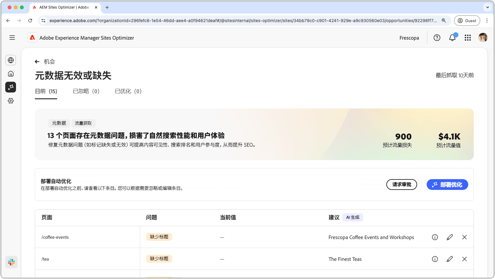
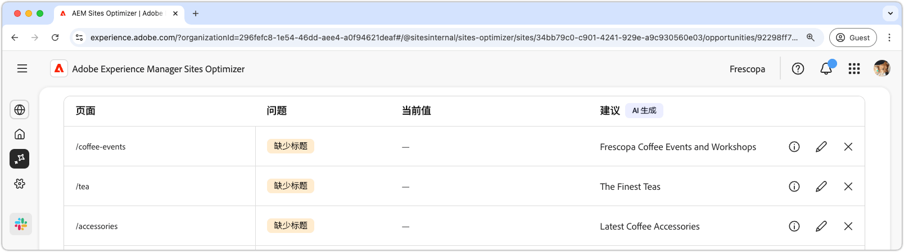
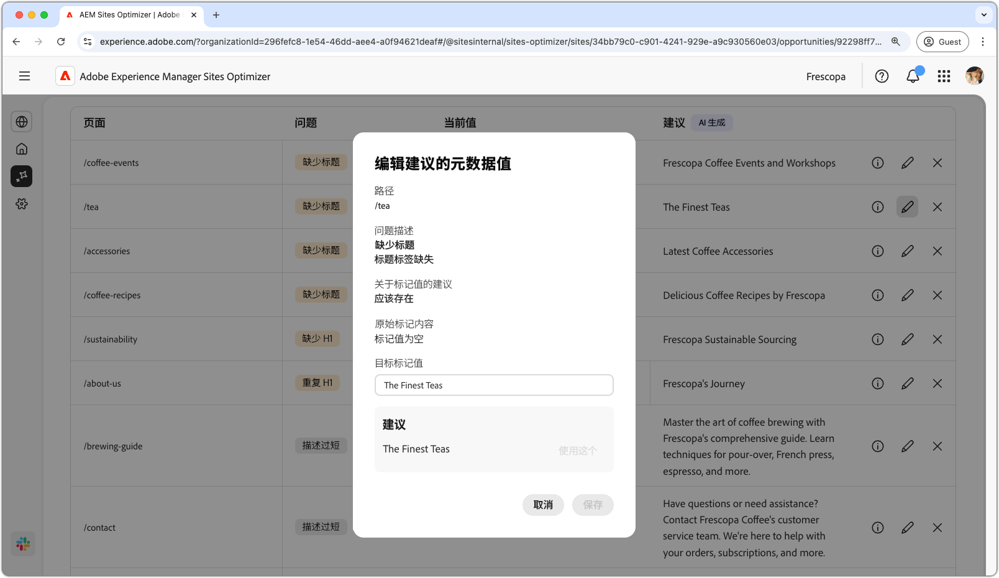
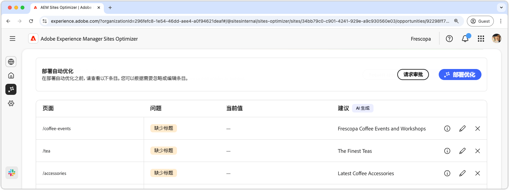

# 元数据无效或缺失机会

{align="center"}

元数据无效或缺失机会可以识别您网页上元数据缺失或错误。修复元数据问题可提高内容可见性、搜索排名和用户参与度，从而提升 SEO。这些问题可能由标记缺失或无效、描述太长或太短等因素引起。

元数据无效或缺失机会在页面顶部显示摘要，包括故障总结及其对您的网站和业务的影响。

* **预计的流量损失**——预计的因元数据错误而导致的流量损失。
* **预计的流量值**——预计的损失流量值。

## 自动识别

{align="center"}

元数据无效或缺失机会列出了您页面上所有元数据错误，包括以下内容：

* **页面**——包含元数据无效或缺失的页面。
* **问题**——表示影响元数据标记的问题类型。这些问题包括标题缺失、H1 重复等。
* **值**——当前需要更改的元数据标记值。
* **建议**——AI 生成的适合标记更新的建议。更多详细信息，请参阅以下部分。

## 自动建议

{align="center"}

元数据无效或缺失机会还提供了 AI 生成的有关如何更改或更新元数据标记的建议。这些建议基于包含元数据错误的初始标记和建议更新的内容。

>[!BEGINTABS]

>[!TAB AI 原理]

选择&#x200B;**信息图标**，提供所建议更新的 AI 原理。

>[!TAB 编辑建议的元数据值]

{align="center"}

如果您不同意 AI 生成的建议，可以选择&#x200B;**编辑图标**&#x200B;来编辑所建议的元数据值。这样您就可以手动输入您认为最适合元数据的值。编辑窗口包含以下内容：

* **路径**——包含元数据（或缺少元数据）的页面路径。
* **问题描述**——表示影响元数据标记的问题类型及简短描述。
* **关于标记值的建议**——AI 生成的有关如何更改或更新元数据标记的建议。例如，标记更新应该包含多少个字符等。
* **原始标记内容**——原始标记值。
* **目标标记值**——编辑此字段，手动添加所需的标记值。选择&#x200B;**保存**&#x200B;后，该值将应用于建议的更新。
* **建议**——AI 生成的有关如何更改该值的建议。
* **保存**——保存并应用&#x200B;**目标标记值**&#x200B;字段中的值。

>[!TAB 忽略条目]

您可以选择忽略包含目标中断或元数据无效的条目。选择&#x200B;**忽略图标**，从机会列表中移除该条目。从机会页面顶部的&#x200B;**已忽略**&#x200B;选项卡中可以重新启动已忽略的条目。

>[!ENDTABS]

## 自动优化

[!BADGE Ultimate]{type=Positive tooltip="Ultimate"}

{align="center"}

Sites Optimizer Ultimate 添加了针对元数据无效或缺失机会发现的问题部署自动优化的功能。<!--- TBD-need more in-depth and opportunity specific information here. What does the auto-optimization do?-->

>[!BEGINTABS]

>[!TAB 部署优化]

{{auto-optimize-deploy-optimization-slack}}

>[!TAB 请求审批]

{{auto-optimize-request-approval}}

>[!ENDTABS]
