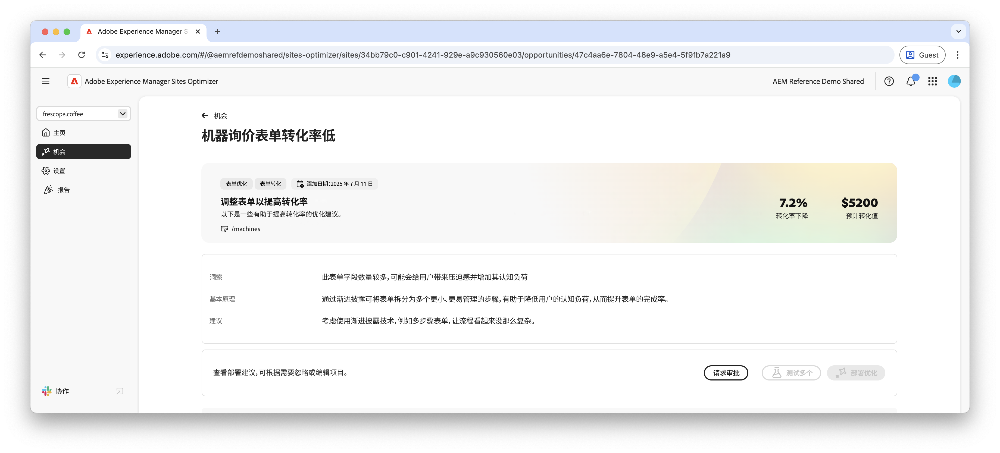
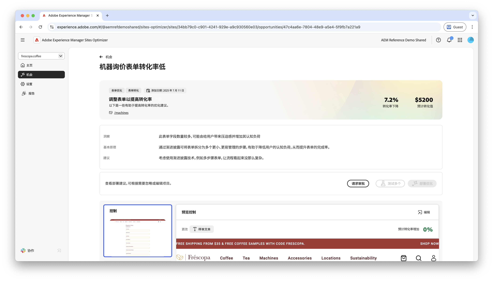

# 低转化机会

{align="center"}

低转化机会可以识别您网站上转化率较低的表单。这个机会有助于您了解哪些表单表现不佳，并就如何提高其参与率提出建议。通过优化表单转化，您可以增加表单提交的数量，并提高网站的整体性能。

## 自动识别

{align="center"}

每个包含低转化表单的网页都会被列为自己的&#x200B;**低转化**&#x200B;机会。机会页面的顶部显示了该机会的简短摘要和 AI 原理。

## 自动建议

{align="center"}

自动建议会提供 AI 生成的网页变体，旨在提高您表单的转化。每个变体都会根据其提高表单参与度的潜力显示&#x200B;**预计转化率增加**，帮助您优先选择最有效的建议。

>[!BEGINTABS]

>[!TAB 对照变体]

{align="center"}

对照变体是您网站上当前存在的原始表单。此变体可作为基准，用于比较建议变体的性能。

>[!TAB 建议的变体]

{align="center"}

建议的变体是 AI 生成的网页变体，旨在提高您表单的转化。每个变体都会根据其提高表单参与度的潜力显示&#x200B;**预计的转化率增加**，帮助您优先选择最有效的建议。

单击每个变体，即可在屏幕右侧进行预览。在预览顶部提供以下操作和信息：

* **更改**——此变体与&#x200B;**控制**&#x200B;变体相比有哪些更改的简短摘要。
* **预计的转化率增加**——如果实施此变体，预计表单参与度将会增加。
* **编辑**——单击即可在 AEM 创作中编辑此变体。

>[!ENDTABS]

## 自动优化

[!BADGE Ultimate]{type=Positive tooltip="Ultimate"}

{align="center"}

Sites Optimizer Ultimate 添加了针对低转化机会发现的问题部署自动优化的功能。

>[!BEGINTABS]

>[!TAB 测试多个]

>[!TAB 发布所选项]

{{auto-optimize-deploy-optimization-slack}}

>[!TAB 请求审批]

{{auto-optimize-request-approval}}

>[!ENDTABS]
