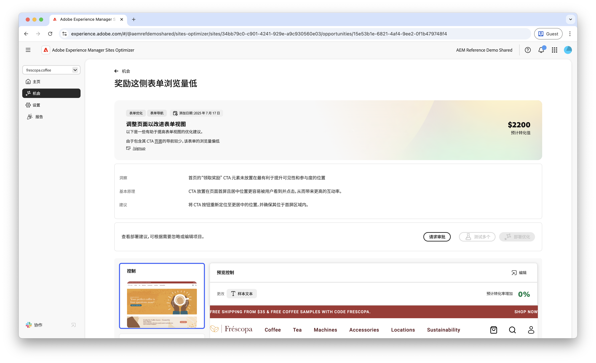
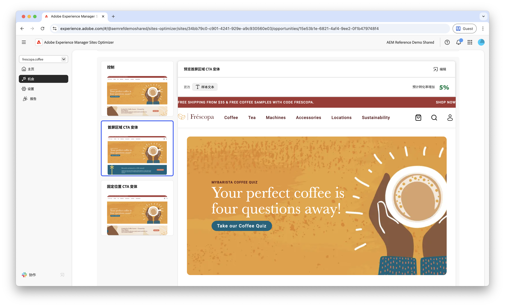
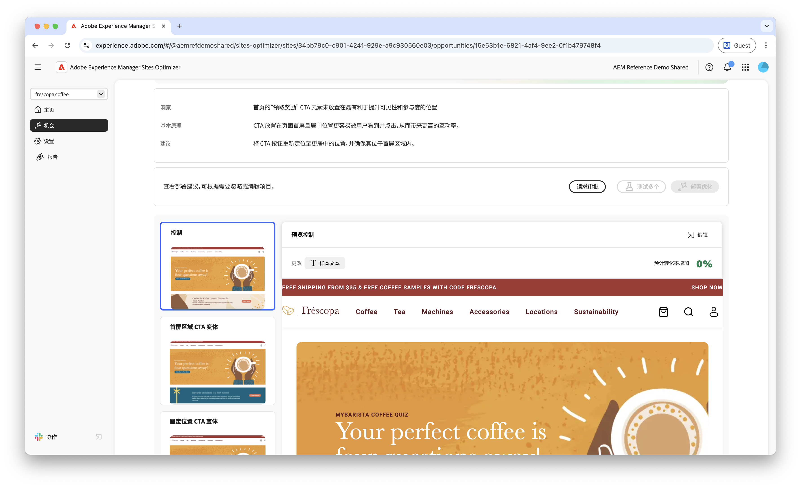
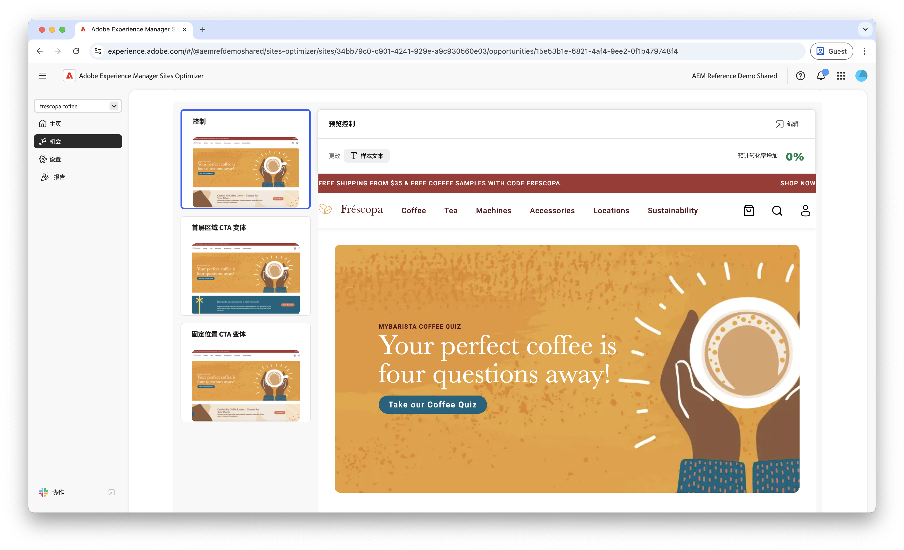
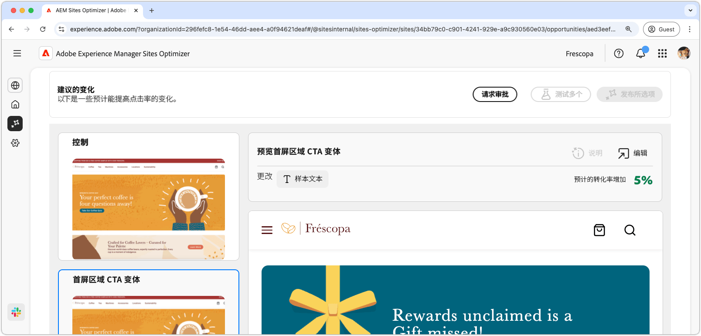

# 表单低导航机会

 表单优化功能在早期访问计划中提供。您可以使用官方电子邮件 ID 写信给 aem-forms-ea@adobe.com，加入早期访问计划并申请使用该功能。

{align="center"}

低导航机会可以识别您网站上导航率较低的表单。这种机会类型可以帮助您了解哪些表单未被用户发现或访问，并提供有关如何提高表单可见性的建议。

## 自动识别

{align="center"}

每个包含低导航表单的网页都会被列为自己的&#x200B;**低导航**&#x200B;机会。机会页面的顶部显示了该机会的简短摘要和原理。

## 自动建议

自动建议会提供 AI 生成的表单变体，旨在提高您表单的导航。每个变体都会根据其提高表单可见性和无障碍性的潜力显示&#x200B;**预计的转化率增加**，帮助您优先选择最有效的建议。

>[!BEGINTABS]

>[!TAB 对照变体]

{align="center"}

对照变体是您网站上当前存在的原始表单。此变体可作为基准，用于比较建议变体的性能。

>[!TAB 建议的变体]

{align="center"}

建议的变体是 AI 生成的表单变体，旨在提高您表单的导航。每个变体都会根据其提高表单可见性和无障碍性的潜力显示&#x200B;**预计的转化率增加**，帮助您优先选择最有效的建议。

单击每个变体，即可在屏幕右侧进行预览。在预览顶部提供以下操作和信息：

* **更改**——此变体与&#x200B;**控制**&#x200B;变体相比有哪些更改的简短摘要。
* **预计的转化率增加**——实施此变体后预计的表单参与度增加量。
* **编辑**——单击即可在 AEM 创作中编辑此变体。

>[!ENDTABS]

<!-- 

## Auto-optimize

[!BADGE Ultimate]{type=Positive tooltip="Ultimate"}

{align="center"}

Sites Optimizer Ultimate adds the ability to deploy auto-optimization for the issues found by the low navigation opportunity.

>[!BEGINTABS]

>[!TAB Test multiple]

>[!TAB Publish selected]

{{auto-optimize-deploy-optimization-slack}}

>[!TAB Request approval]

{{auto-optimize-request-approval}}

>[!ENDTABS]

-->
