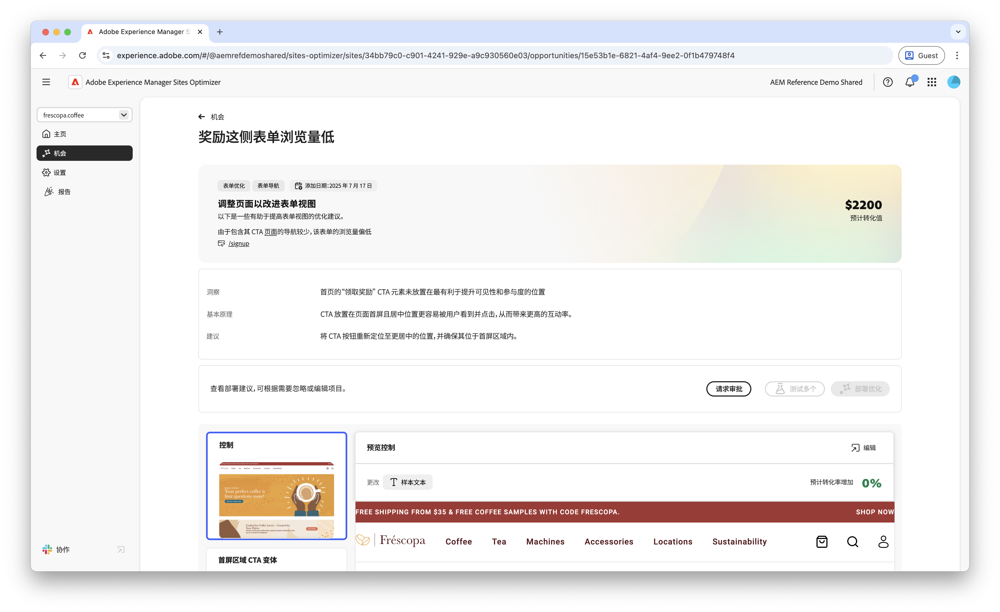
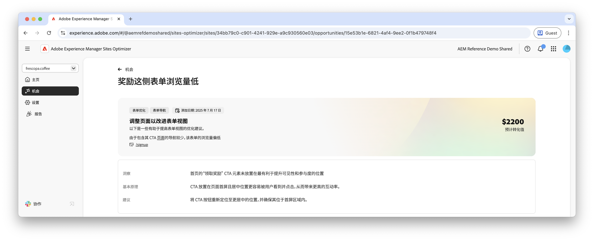

# 低查看机会

{align="center"}

低查看次数机会可识别您网站上查看率较低的表单。 此机会可帮助您了解哪些表单的效果不佳，并提供有关如何提高参与率的建议。 通过优化表单视图，您可以增加表单提交的数量并提高网站的整体性能。

## 自动识别

{align="center"}

每个具有低查看次数的表单的网页都作为自己的&#x200B;**低查看次数**&#x200B;机会列出。 机会页的顶部显示了机会的简要摘要和AI原理。

## 自动建议

{align="center"}

自动建议提供AI生成的网页变体，这些变体旨在提高表单的查看次数。 每个变量会根据其提高表单参与度的潜力显示&#x200B;**项目转化率提升**，从而帮助您优先处理最有效的建议。

>[!BEGINTABS]

>[!TAB 控件变量]

{align="center"}

控制变量是网站上当前活动的原始表单。 此变量用作比较建议变量的性能的基线。

>[!TAB 建议的变体]

{align="center"}

建议的变体是人工智能生成的网页变体，旨在提高表单的查看次数。 每个变量会根据其改善表单参与度的潜力显示&#x200B;**预计转化率提升**，从而帮助您优先处理最有效的建议。

单击每个变体可在屏幕右侧预览它。 在预览的顶部，提供了以下操作和信息：

* **更改** — 此变量中与&#x200B;**Control**&#x200B;变量更改的内容简要摘要。
* **预计转化率增长** — 如果实施此变量，则预计表单参与度将增长。
* **编辑** — 单击可在AEM创作中编辑变体。

>[!ENDTABS]

## 自动优化[!BADGE Ultimate]{type=Positive tooltip="Ultimate"}

{align="center"}

Sites Optimizer Ultimate添加了为“低查看次数”机会发现的问题部署自动优化的功能。

>[!BEGINTABS]

>[!TAB 测试多个]

>[!TAB 发布选定项]

{{auto-optimize-deploy-optimization-slack}}

>[!TAB 请求审批]

{{auto-optimize-request-approval}}

>[!ENDTABS]
