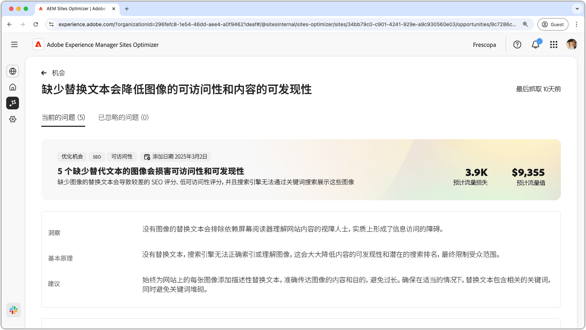
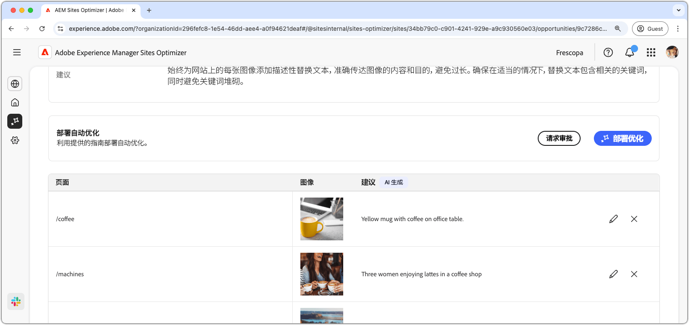
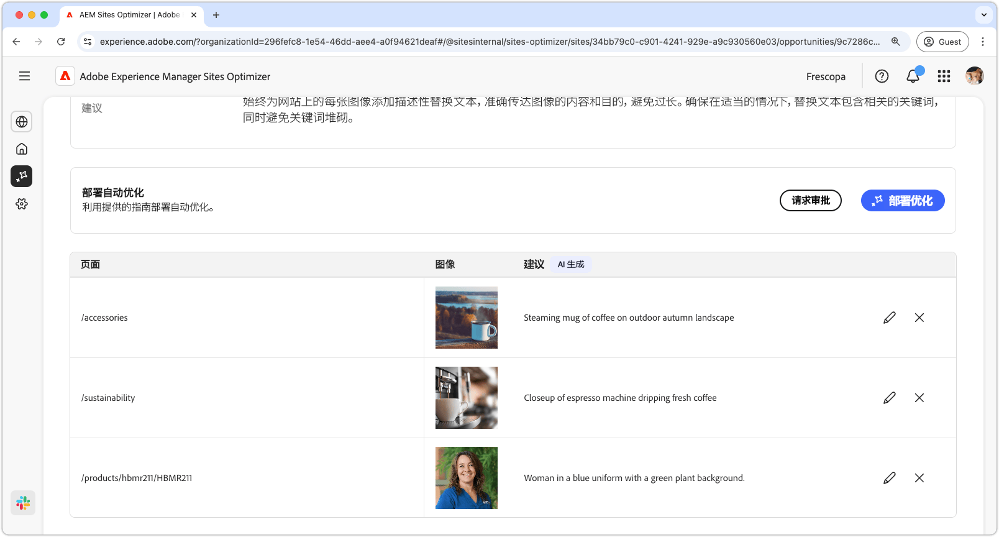
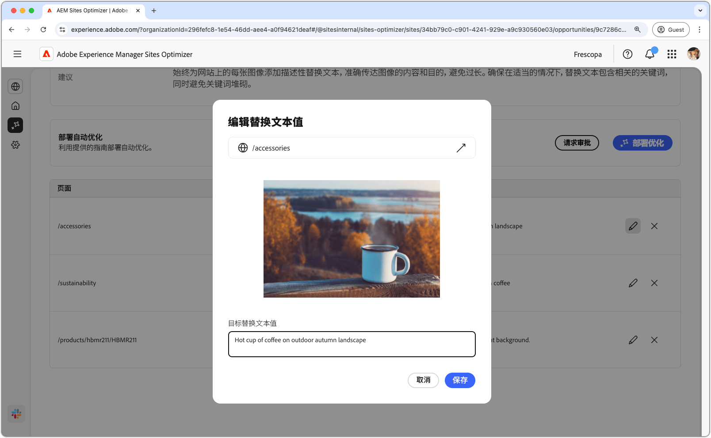

# 缺少替代文本机会

{align="center"}

缺少替代文本机会可以识别您网站上没有描述性替代文本的图像。如果没有替代文本，搜索引擎就无法正确索引或理解图像，从而大大降低内容的可发现性和潜在搜索排名，最终限制您的受众范围。此外，如果没有图像替代文本，依赖屏幕阅读器来理解 Web 内容的视觉障碍用户就会被排除在外，在实际上造成信息访问障碍。

缺少替代文本机会在页面顶部显示摘要，包括故障总结及其对您的网站和业务的影响。

* **预计的流量损失**——预计的因缺少替代文本而导致的流量损失。
* **预计的流量值**——预计的损失流量值。

还有一个附加字段，显示与该机会相关的原理、洞察和建议。

## 自动识别

{align="center"}

缺少替代文本机会列出了您网站上所有缺少替代文本的图像。此部分包含以下类别：

* **页面**——包含缺少替代文本的页面路径。
* **图像**——缺失描述性替代文本的图像。
* **建议**——AI 生成的替代文本建议。

## 自动建议

{align="center"}

自动建议提供了 AI 生成的图像替代文本的建议。AI 生成的建议旨在帮助您快速为图像添加替代文本，而无需手动分析每张图像。

>[!BEGINTABS]

>[!TAB 编辑缺少替代文本]

{align="center"}

如果您不同意 AI 生成的建议，可以选择&#x200B;**编辑图标**&#x200B;来编辑所建议的替代文本。这样您就可以手动调整您认为最适合图像的文字。编辑窗口包含以下内容：

* **页面路径**——只读字段，显示出现缺少替代文本问题的页面路径。单击路径旁边的箭头，打开相应的页面。
* **图像**——需要替代文本的图像的只读预览。
* **目标替代文本**——可编辑字段，您可以在其中手动输入图像的描述性替代文本。确保替代文本简洁明了地传达图像的内容和目的。自然地包含相关的关键词，不要过多。

>[!TAB 忽略条目]

您可以选择忽略机会列表中的条目。选择&#x200B;**忽略图标**，从列表中移除该条目。从机会页面顶部的&#x200B;**已忽略**&#x200B;选项卡中可以重新启动已忽略的条目。

>[!ENDTABS]

## 自动优化

[!BADGE Ultimate]{type=Positive tooltip="Ultimate"}

{align="center"}

Sites Optimizer Ultimate 添加了针对缺少替代文本机会发现的问题部署自动优化的功能。<!--- TBD-need more in-depth and opportunity specific information here. What does the auto-optimization do?-->

>[!BEGINTABS]

>[!TAB 部署优化]

{{auto-optimize-deploy-optimization-slack}}

>[!TAB 请求审批]

{{auto-optimize-request-approval}}

>[!ENDTABS]
