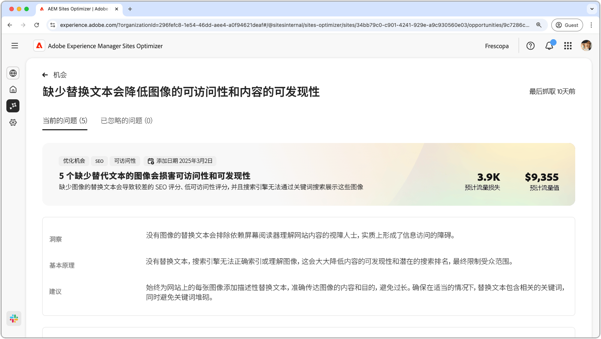
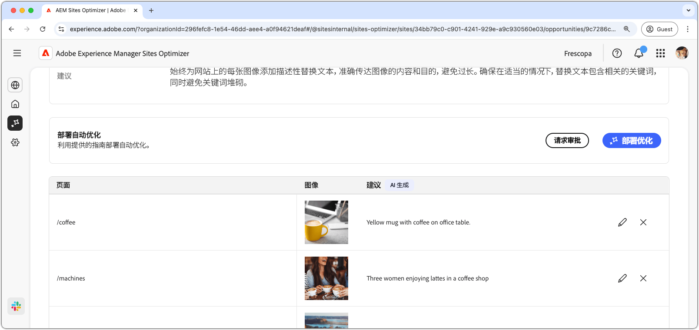
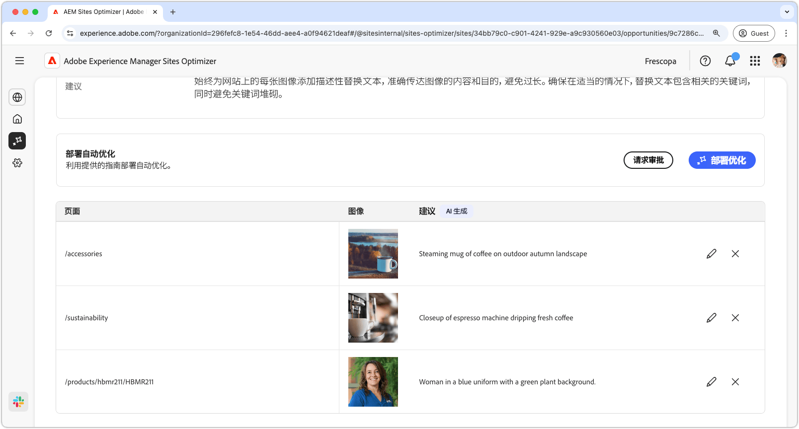
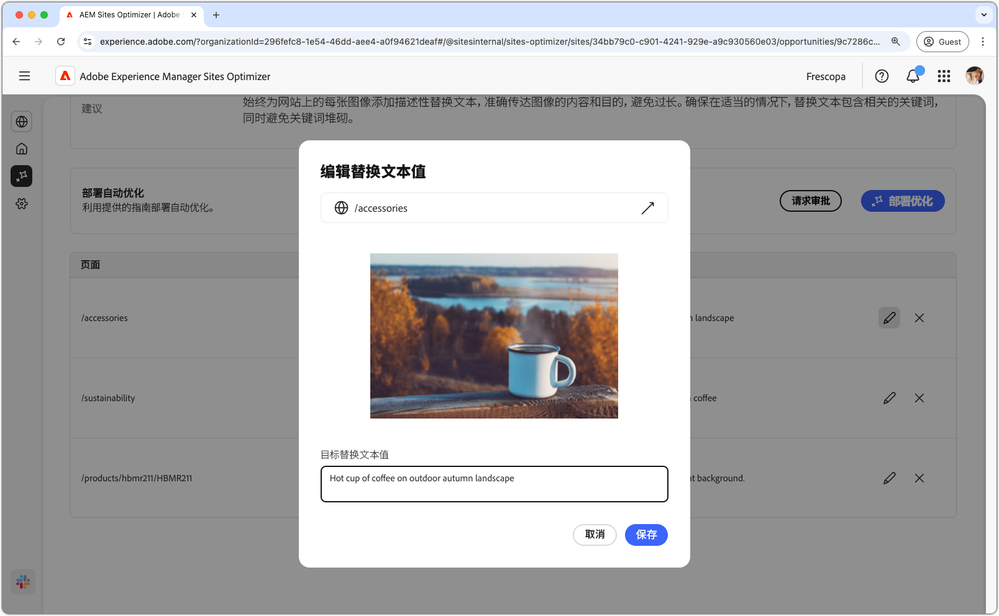

# 缺少替代文本机会

<!--{align="center"}-->

>[!VIDEO](https://video.tv.adobe.com/v/3483251/?learn=on&enablevpops)

缺少替换文本机会可识别出您的网站上那些没有描述性替换文本的图像。 如果没有替换文本，依赖屏幕阅读器的用户就无法解读视觉内容，造成访问障碍。 这样还会限制搜索引擎理解和索引图像的方式，从而降低内容可发现性和搜索性能。 AEM Sites Optimizer 会识别缺少替换文本的问题，提供特定的 AI 建议，并允许一键式部署修复这些问题，所有这些都在同一个集中视图中完成。

## 自动识别

<!--{align="center"}-->

AEM Sites Optimizer 使用一种多步骤审核来扫描您的网站，这种审核方法将网站抓取、真实用户流量数据和 AI 分析结合在一起，以识别那些需要但未定义替换文本的图像。 它还会评估页面上的图像，根据 Web 内容无障碍准则 (WCAG) 确定是否需要替换文本，排除那些装饰性或非信息性的图像。 根据图像在页面中所起的作用和相关性分析图像，确定对无障碍性和 SEO 影响最大的修复的优先级。

此机会提供一个发现问题的列表，包括：

* **页面**——包含缺少替代文本的页面路径。
* **图像**——缺失描述性替代文本的图像。

## 自动建议

<!--{align="center"}-->

对于每一个发现的问题，AEM Sites Optimizer 会为图像建议一个描述性替换文本。 它使用 AI 视觉模型分析图像，并生成一个反映了图像的内容和在页面中作用的描述。 建议简洁明了、具有相关性，且符合无障碍性最佳做法。 每个建议都可以在应用之前进行审阅和编辑。

>[!BEGINTABS]

>[!TAB 编辑缺少替代文本]

<!--{align="center"}-->

如果您不同意 AI 生成的建议，可以选择&#x200B;**编辑图标**&#x200B;来编辑所建议的替代文本。 使用该功能可以手动调整您认为最适合图像的文字。 编辑窗口包含以下内容：

* **页面路径**——只读字段，显示出现缺少替代文本问题的页面路径。 单击路径旁边的箭头，打开相应的页面。
* **图像**——需要替代文本的图像的只读预览。
* **目标替代文本**——可编辑字段，您可以在其中手动输入图像的描述性替代文本。 确保替代文本简洁明了地传达图像的内容和目的。 自然地包含相关的关键词，不要过多。

>[!TAB 忽略条目]

您可以选择忽略机会列表中的条目。 选择，从列表中移除该条目。 从机会页面顶部的&#x200B;**已忽略**&#x200B;选项卡中可以重新启动已忽略的条目。

>[!ENDTABS]

## 自动优化

<!--[!BADGE Ultimate]{type=Positive tooltip="Ultimate"}-->

建议被审阅和批准之后，您可以点击&#x200B;**部署优化**。 然后，AEM Sites Optimizer 会根据您的实施中管理替换文本的方式，将修复应用到创作环境中。 然后，AEM 作者可以从内容管理系统 (CMS) 发布这些更改。

根据配置情况，更新可以直接应用于页面内容、资产元数据或支持性内容模型。 优化过程包括以下步骤：

* **验证**——确保在不影响现有功能的情况下安全应用更新。
* **部署**——通过现有流程应用更新，例如在 AEM 中更新内容或者与内容 API 集成。
* **权限检查**——验证用户是否具有应用更改的适当权限。 如果没有，可以使用可下载更新等替代输出进行传递。

在受支持的情况下，更新有版本控制，从而提供版本可见性和回滚能力。 这样可确保替换文本更新被准确应用，与现有的实施保持一致，并且符合治理和无障碍性标准。

AEM Sites Optimizer 会根据您的设置按照下述方法自动应用替换文本更新：

>[!BEGINTABS]

>[!TAB Edge Delivery Services]

更新源文档（例如 Google Docs 或 SharePoint）。

>[!TAB AEM as a Cloud Service]

通过内容 API 直接写入更新，提供版本控制和回滚支持。

>[!TAB 数字资产管理（可选）]

在适用的情况下更新资产级替换文本。

>[!ENDTABS]
