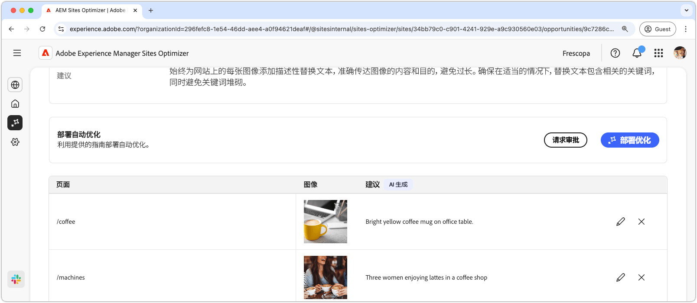

# 缺少替换文本机会

{align="center"}

缺少替换文字机会标识您的网站上没有描述性替换文字的图像。 搜索引擎无法在不使用替换文本的情况下正确索引或理解图像，这会显着减少内容的可发现性和潜在的搜索排名，最终限制受众范围。 此外，没有图像的替代文本排除了视力障碍人士，这些人士依靠屏幕阅读器来了解Web内容，这实际上给信息访问带来了障碍。

丢失的替换文本机会在页面顶部显示一个摘要，包括问题及其对您的网站和业务影响的摘要。

* **预计的流量丢失** — 由于缺少替换文本而预计的流量丢失。
* **预计流量值** — 丢失流量的预计值。

还有一个字段显示与销售机会相关的理由、见解和建议。

## 自动识别

{align="center"}

缺少替换文字机会列出了网站上缺少替换文字的所有图像。 本节包含以下类别：

* **页面** — 包含缺少的替换文本的页面的路径。
* **图像** — 图像缺少描述性替换文本。
* **建议** — 替代文本的AI生成的建议。

## 自动建议

{align="center"}

自动建议为图像的替换文本提供人工智能生成的建议。 AI生成的建议旨在帮助您快速向图像添加替换文本，而无需手动分析每个图像。

>[!BEGINTABS]

>[!TAB 编辑缺少的替换文字]

{align="center"}

如果您不同意AI生成的建议，可以通过选择&#x200B;**编辑图标**&#x200B;来编辑建议的替换文本。 这允许您手动调整您认为最适合图像的文本。 编辑窗口包含以下内容：

* **页面路径** — 只读字段，显示出现缺少替换文本问题的页面的路径。 单击路径旁边的箭头可打开相应的页面。
* **图像** — 需要替换文本的图像的只读预览。
* **目标ALT文本** — 可编辑的字段，您可以在其中手动输入图像的描述性替代文本。 确保替换文本简洁明了地传达图像的内容和目的。 相关时，可自然包含关键字，而不会使其过载。

>[!TAB 忽略条目]

您可以选择忽略机会列表中的条目。 选择&#x200B;**忽略图标**&#x200B;会从列表中删除该条目。 可以从机会页面顶部的&#x200B;**Ignored**&#x200B;选项卡重新参与已忽略的条目。

>[!ENDTABS]

## 自动优化[!BADGE Ultimate]{type=Positive tooltip="Ultimate"}

{align="center"}

Sites Optimizer Ultimate添加了对由缺少替换文本机会发现的问题部署自动优化的功能。<!--- TBD-need more in-depth and opportunity specific information here. What does the auto-optimization do?-->

>[!BEGINTABS]

>[!TAB 部署优化]

{{auto-optimize-deploy-optimization-slack}}

>[!TAB 请求审批]

{{auto-optimize-request-approval}}

>[!ENDTABS]
