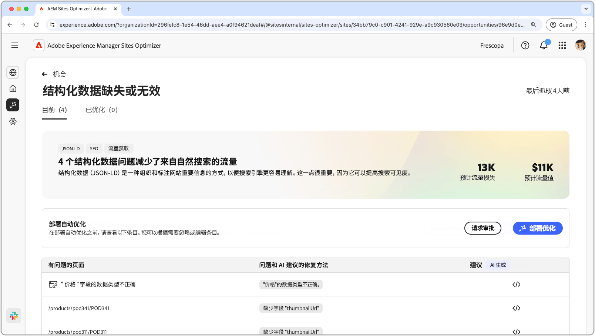
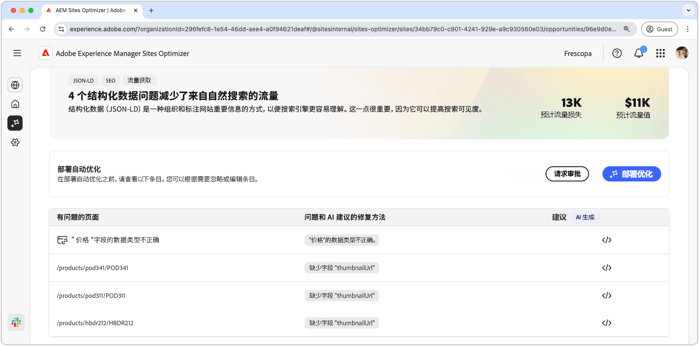
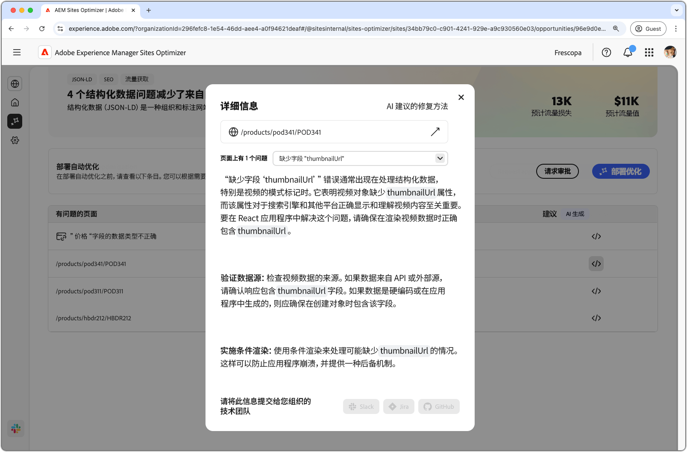

# 结构化数据缺失或无效机会

{align="center"}

结构化数据缺失或无效机会可以识别 Json-LD 标准化格式中结构化数据缺失或错误。结构化数据是一种组织、描述和标记网站上重要信息的方式。这有助于搜索引擎解释您网页的内容，并提高在搜索结果中的可见性。更好的搜索结果可以吸引更多用户访问您的网站。

结构化数据缺失或无效机会在页面顶部显示摘要，包括故障总结及其对您的网站和业务的影响。

* **预计的流量损失**——预计的因结构化数据错误而导致的流量损失。
* **预计的流量值**——预计的损失流量值。

## 自动识别

{align="center"}

结构化数据缺失或无效机会列出了在您的网页上检测到的所有问题，包含以下类别：

* **有问题的页面**——结构化数据无效或缺失的页面。
* **问题和 AI 建议的修复方案**——表示影响页面的结构化数据问题的类型。
* **建议**——AI 生成的适合结构化数据更新的建议。更多详细信息，请参阅以下部分。

## 自动建议

{align="center"}

结构化数据无效或缺失机会还提供了 AI 生成的有关如何更改或更新结构化数据的建议。单击建议按钮后，将出现一个新窗口，其中包含以下内容：

* **页面路径**——包含结构化数据无效或缺失的页面路径的字段。
* **问题**——包含问题数量并列出所有问题的下拉菜单的字段。
* **建议字段**——由 AI 生成的适合结构化数据更新的描述和建议。您可以向下滚动查看更多建议和问题。

## 自动优化

[!BADGE Ultimate]{type=Positive tooltip="Ultimate"}

{align="center"}

Sites Optimizer Ultimate 添加了针对结构化数据无效或缺失机会发现的问题部署自动优化的功能。<!--- TBD-need more in-depth and opportunity specific information here. What does the auto-optimization do?-->

>[!BEGINTABS]

>[!TAB 部署优化]

{{auto-optimize-deploy-optimization-slack}}

>[!TAB 请求审批]

{{auto-optimize-request-approval}}

>[!ENDTABS]
