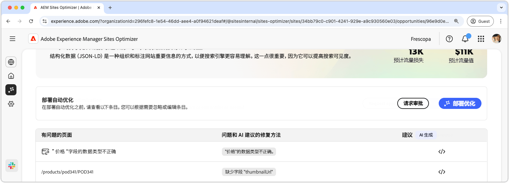

# 缺少结构化数据机会或结构化数据机会无效

{align="center"}

缺少或无效的结构化数据机会标识Json-LD标准化格式中的缺少或错误的结构化数据。 结构化数据是组织、描述和标记您网站上的重要信息的方法。 它可帮助搜索引擎解释页面的内容，从而提高搜索结果的可见性。 更好的搜索结果可能会导致更多用户参与您的网站。

缺少或无效的结构化数据机会会在页面顶部显示摘要，包括问题及其对网站和业务影响的摘要。

* **预计的流量丢失** — 由于错误的结构化数据导致的预计的流量丢失。
* **预计流量值** — 丢失流量的预计值。

## 自动识别

{align="center"}

缺少或无效的结构化数据机会列出了在您的页面上检测到的所有问题，并包含以下类别：

* **有问题的页面** — 包含无效或缺少结构化数据的页面。
* **问题和AI建议的修复** — 指示影响页面的结构化数据问题的类型。
* **建议** — 由AI生成的建议，用于适合的结构化数据更新。 有关更多详细信息，请参阅下面的部分。

## 自动建议

{align="center"}

无效或缺失的结构化数据机会还提供了有关如何更改或更新结构化数据的AI生成的建议。 单击“建议”按钮后，将显示一个新窗口，其中包含下列内容：

* **页面路径** — 一个字段，其中包含具有无效或缺少结构化数据的页面的路径。
* **问题** — 包含问题数的字段和列出所有问题的下拉菜单。
* **建议字段** — 由AI生成的描述和建议，用于适合的结构化数据更新。 您可以向下滚动以获取其他建议和问题。

## 自动优化[!BADGE Ultimate]{type=Positive tooltip="Ultimate"}

{align="center"}

Sites Optimizer Ultimate添加了对由无效或缺少的结构化数据机会发现的问题部署自动优化的功能。<!--- TBD-need more in-depth and opportunity specific information here. What does the auto-optimization do?-->

>[!BEGINTABS]

>[!TAB 部署优化]

{{auto-optimize-deploy-optimization-slack}}

>[!TAB 请求审批]

{{auto-optimize-request-approval}}

>[!ENDTABS]
