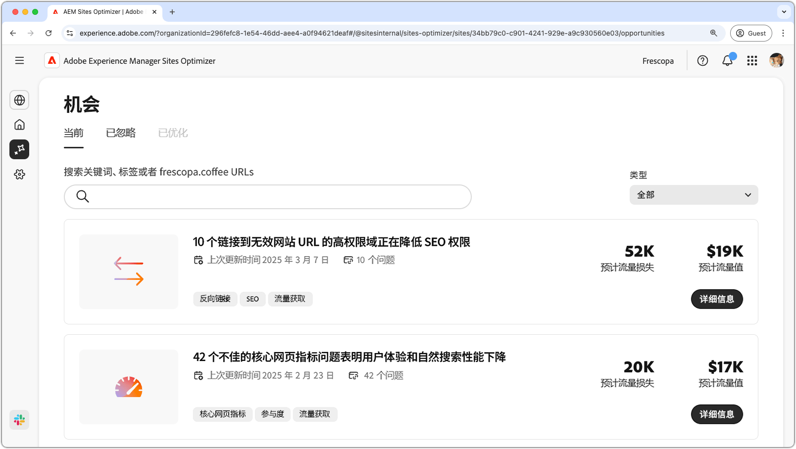
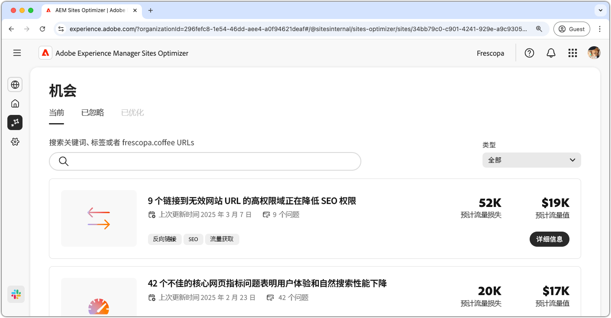
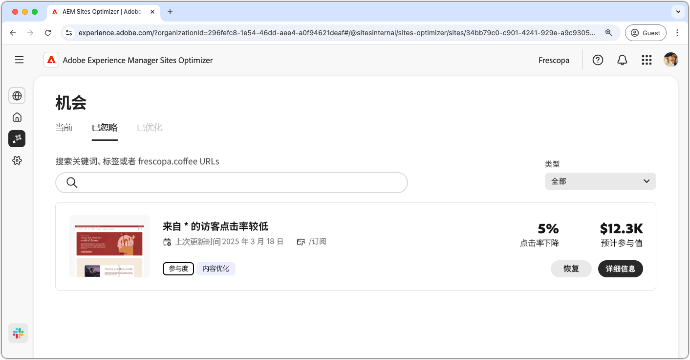

# 机会文档

{align="center"}

Sites Optimizer 是由 Adobe AI 提供支持的不断扩展的机会集，旨在为您的网站识别并建议改进。每个机会都提供了对潜在商业价值的洞察，突出了需要关注的领域，并提供了可操作的优化推荐。单击每个机会可了解已识别的问题、建议的改进，以及如何实施这些变化以增强网站性能和用户体验的分步指导。

通过 [Site Optimizer 的持续导航](/help/documentation/basics.md#navigation)中的&#x200B;**机会**&#x200B;菜单选项可获取机会。

## 机会状态

使用位于顶部的选项卡可以按状态组织和筛选机会：

>[!BEGINTABS]

>[!TAB 当前]

{align="center"}

当前待处理的机会。

>[!TAB 已忽略]

{align="center"}

已被忽略的机会。已忽略的机会可以从这个视图中恢复。

>[!TAB 已优化]

已优化机会的历史列表。

>[!ENDTABS]

## 机会

选择[机会状态](#opportunity-status)后，您可以查看机会列表。机会列表可以通过以下方式进一步筛选：

* **搜索**——通过&#x200B;**关键字、标记或 URL** 搜索机会。
* **机会类型**——使用&#x200B;**类型**&#x200B;下拉菜单按[机会类型](/help/opportunity-types/overview.md)筛选机会。

### 机会详细信息

{align="center"}

每个机会都提供了问题的简要描述、其对您网站的潜在影响以及关于完整详细信息的链接。您还可以查看它的状态，表明它是否已优化或仍处于待处理状态。

* **机会标题**——问题的简要描述及其对您网站性能的潜在影响。
* **上次更新**——Sites Optimizer 上次使用新数据更新该机会的日期。
* **问题计数**——在您的网站上识别的该问题实例数。
* **机会类型**——此机会所属的[机会类型](/help/opportunity-types/overview.md)，例如流量获取、参与度或网站健康状况。

每个机会的摘要信息因类型而异，可能包括有关收入影响、流量、用户参与度或安全威胁的详细信息。

要查看机会的详细信息，请单击&#x200B;**详细信息**&#x200B;按钮。

要从 Sites Optimizer 仪表板中排除机会，请单击&#x200B;**忽略**&#x200B;按钮。此操作会将机会移至&#x200B;[**已忽略** 选项卡](#opportunity-status)。

## 所有机会

浏览 Sites Optimizer 中提供的所有可能的机会：

<!-- CARDS

* ./accessibility-issues.md
  {title=Accessibility issues}
  {image=../../assets/common/card-arrows.png} 
* ./broken-backlinks.md
  {title=Broken backlinks}
  {image=../../assets/common/card-arrows.png}
* ./broken-internal-links.md
  {title=Broken internal links}
  {image=../../assets/common/card-link.png}
* ./cors-configuration.md
  {title=CORS configuration}
  {image=../../assets/common/card-code.png}
* ./core-web-vitals.md
  {title=Core web vitals}
  {image=../../assets/common/card-performance.png}
* ./cross-site-scripting.md
  {title=Cross-site scripting}
  {image=../../assets/common/card-code.png}
* ./high-bounce-rate.md
  {title=High bounce rate}
  {image=../../assets/common/card-arrows.png}    
* ./invalid-or-missing-metadata.md
  {title=Invalid or missing metadata}
  {image=../../assets/common/card-code.png}
* ./missing-alt-text.md
  {title=Missing alt text}
  {image=../../assets/common/card-arrows.png}
* ./missing-invalid-structured-data.md
  {title=Missing or invalid structured data}
  {image=../../assets/common/card-bag.png}
* ./sitemap-issues.md
  {title=Sitemap issues}
  {image=../../assets/common/card-relationship.png}
* ./website-permissions.md
  {title=Website permissions}
  {image=../../assets/common/card-people.png}
* ./website-vulnerabilities.md
  {title=Website vulnerabilities}
  {image=../../assets/common/card-puzzle.png}
  
--->
<!-- START CARDS HTML - DO NOT MODIFY BY HAND -->

    

        

            

                <figure class="image x-is-16by9">
                    
                </figure>
            

            

                

                    

                        <a href="./accessibility-issues.md" target="_blank" rel="referrer" title="无障碍问题">无障碍问题</a>
                    

                    
了解无障碍问题机会，以及如何使用它来提高您网站的安全性。

                

                <a href="./accessibility-issues.md" target="_blank" rel="referrer" class="spectrum-Button spectrum-Button--outline spectrum-Button--primary spectrum-Button--sizeM" style="align-self: flex-start; margin-top: 1rem;">
                    了解详情
                </a>
            

        

    

    

        

            

                <figure class="image x-is-16by9">
                    
                </figure>
            

            

                

                    

                        <a href="./broken-backlinks.md" target="_blank" rel="referrer" title="中断的反向链接">中断的反向链接</a>
                    

                    
了解中断的反向链接机会，以及如何使用它来提高流量获取。

                

                <a href="./broken-backlinks.md" target="_blank" rel="referrer" class="spectrum-Button spectrum-Button--outline spectrum-Button--primary spectrum-Button--sizeM" style="align-self: flex-start; margin-top: 1rem;">
                    了解详情
                </a>
            

        

    

    

        

            

                <figure class="image x-is-16by9">
                    
                </figure>
            

            

                

                    

                        <a href="./broken-internal-links.md" target="_blank" rel="referrer" title="中断的内部链接">中断的内部链接</a>
                    

                    
了解中断的链接机会，以及如何使用它来提高您网站的参与度。

                

                <a href="./broken-internal-links.md" target="_blank" rel="referrer" class="spectrum-Button spectrum-Button--outline spectrum-Button--primary spectrum-Button--sizeM" style="align-self: flex-start; margin-top: 1rem;">
                    了解详情
                </a>
            

        

    

    

        

            

                <figure class="image x-is-16by9">
                    
                </figure>
            

            

                

                    

                        <a href="./cors-configuration.md" target="_blank" rel="referrer" title="CORS 配置">CORS 配置</a>
                    

                    
了解 CORS 配置机会，并识别和修复网站安全漏洞。

                

                <a href="./cors-configuration.md" target="_blank" rel="referrer" class="spectrum-Button spectrum-Button--outline spectrum-Button--primary spectrum-Button--sizeM" style="align-self: flex-start; margin-top: 1rem;">
                    了解详情
                </a>
            

        

    

    

        

            

                <figure class="image x-is-16by9">
                    
                </figure>
            

            

                

                    

                        <a href="./core-web-vitals.md" target="_blank" rel="referrer" title="Core Web Vitals">Core Web Vitals</a>
                    

                    
了解 Core Web Vitals 机会，以及如何使用它来提高流量获取。

                

                <a href="./core-web-vitals.md" target="_blank" rel="referrer" class="spectrum-Button spectrum-Button--outline spectrum-Button--primary spectrum-Button--sizeM" style="align-self: flex-start; margin-top: 1rem;">
                    了解详情
                </a>
            

        

    

    

        

            

                <figure class="image x-is-16by9">
                    
                </figure>
            

            

                

                    

                        <a href="./cross-site-scripting.md" target="_blank" rel="referrer" title="跨站点脚本">跨站点脚本</a>
                    

                    
了解跨站点脚本机会，并识别和修复网站安全漏洞。

                

                <a href="./cross-site-scripting.md" target="_blank" rel="referrer" class="spectrum-Button spectrum-Button--outline spectrum-Button--primary spectrum-Button--sizeM" style="align-self: flex-start; margin-top: 1rem;">
                    了解详情
                </a>
            

        

    

    

        

            

                <figure class="image x-is-16by9">
                    
                </figure>
            

            

                

                    

                        <a href="./high-bounce-rate.md" target="_blank" rel="referrer" title="高跳出率">高跳出率</a>
                    

                    
了解低浏览量机会，以及如何使用它来提高您网站的表单参与度。

                

                <a href="./high-bounce-rate.md" target="_blank" rel="referrer" class="spectrum-Button spectrum-Button--outline spectrum-Button--primary spectrum-Button--sizeM" style="align-self: flex-start; margin-top: 1rem;">
                    了解详情
                </a>
            

        

    

    

        

            

                <figure class="image x-is-16by9">
                    
                </figure>
            

            

                

                    

                        <a href="./invalid-or-missing-metadata.md" target="_blank" rel="referrer" title="元数据无效或缺失">元数据无效或缺失</a>
                    

                    
了解元数据无效或缺失机会，以及如何使用它来提高流量获取。

                

                <a href="./invalid-or-missing-metadata.md" target="_blank" rel="referrer" class="spectrum-Button spectrum-Button--outline spectrum-Button--primary spectrum-Button--sizeM" style="align-self: flex-start; margin-top: 1rem;">
                    了解详情
                </a>
            

        

    

    

        

            

                <figure class="image x-is-16by9">
                    
                </figure>
            

            

                

                    

                        <a href="./missing-alt-text.md" target="_blank" rel="referrer" title="缺少替代文本">缺少替代文本</a>
                    

                    
了解缺少替代文本机会，以及如何使用它来提高您网站上的参与度。

                

                <a href="./missing-alt-text.md" target="_blank" rel="referrer" class="spectrum-Button spectrum-Button--outline spectrum-Button--primary spectrum-Button--sizeM" style="align-self: flex-start; margin-top: 1rem;">
                    了解详情
                </a>
            

        

    

    

        

            

                <figure class="image x-is-16by9">
                    
                </figure>
            

            

                

                    

                        <a href="./missing-invalid-structured-data.md" target="_blank" rel="referrer" title="结构化数据缺失或无效">结构化数据缺失或无效</a>
                    

                    
了解结构化数据缺失或无效机会，以及如何使用它来提高流量获取。

                

                <a href="./missing-invalid-structured-data.md" target="_blank" rel="referrer" class="spectrum-Button spectrum-Button--outline spectrum-Button--primary spectrum-Button--sizeM" style="align-self: flex-start; margin-top: 1rem;">
                    了解详情
                </a>
            

        

    

    

        

            

                <figure class="image x-is-16by9">
                    
                </figure>
            

            

                

                    

                        <a href="./sitemap-issues.md" target="_blank" rel="referrer" title="Sitemap 问题">Sitemap 问题</a>
                    

                    
了解 Sitemap 问题机会，以及如何使用它来提高流量获取。

                

                <a href="./sitemap-issues.md" target="_blank" rel="referrer" class="spectrum-Button spectrum-Button--outline spectrum-Button--primary spectrum-Button--sizeM" style="align-self: flex-start; margin-top: 1rem;">
                    了解详情
                </a>
            

        

    

    

        

            

                <figure class="image x-is-16by9">
                    
                </figure>
            

            

                

                    

                        <a href="./website-permissions.md" target="_blank" rel="referrer" title="网站权限">网站权限</a>
                    

                    
了解网站权限机会，以及如何使用它来提高您网站的安全性。

                

                <a href="./website-permissions.md" target="_blank" rel="referrer" class="spectrum-Button spectrum-Button--outline spectrum-Button--primary spectrum-Button--sizeM" style="align-self: flex-start; margin-top: 1rem;">
                    了解详情
                </a>
            

        

    

    

        

            

                <figure class="image x-is-16by9">
                    
                </figure>
            

            

                

                    

                        <a href="./website-vulnerabilities.md" target="_blank" rel="referrer" title="网站漏洞">网站漏洞</a>
                    

                    
了解网站漏洞机会，以及如何使用它来提高您网站的安全性。

                

                <a href="./website-vulnerabilities.md" target="_blank" rel="referrer" class="spectrum-Button spectrum-Button--outline spectrum-Button--primary spectrum-Button--sizeM" style="align-self: flex-start; margin-top: 1rem;">
                    了解详情
                </a>
            

        

    

<!-- END CARDS HTML - DO NOT MODIFY BY HAND -->

