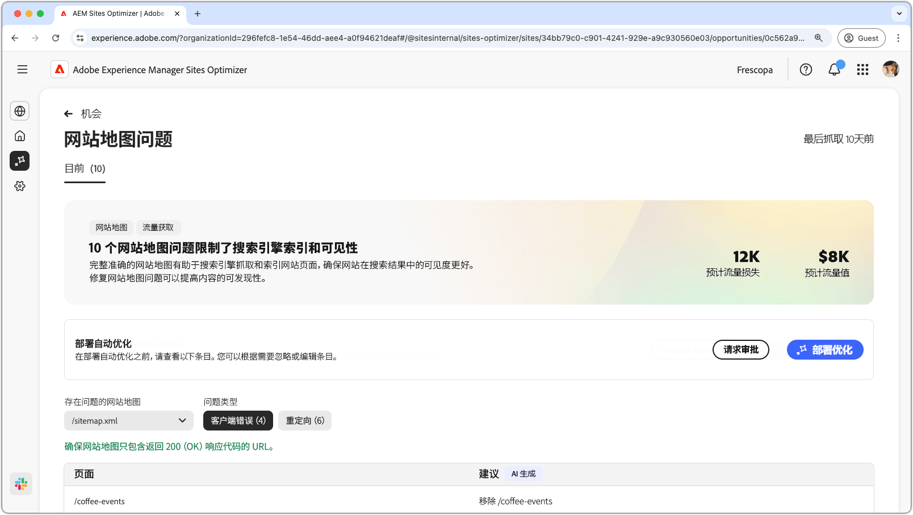
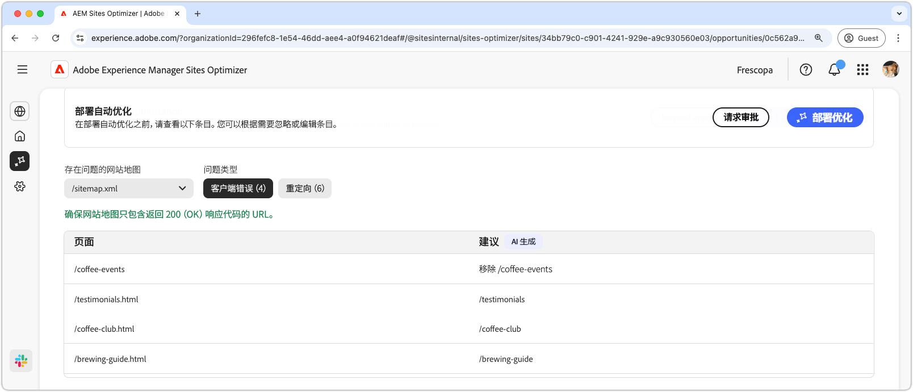
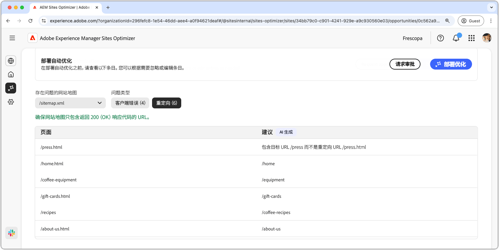
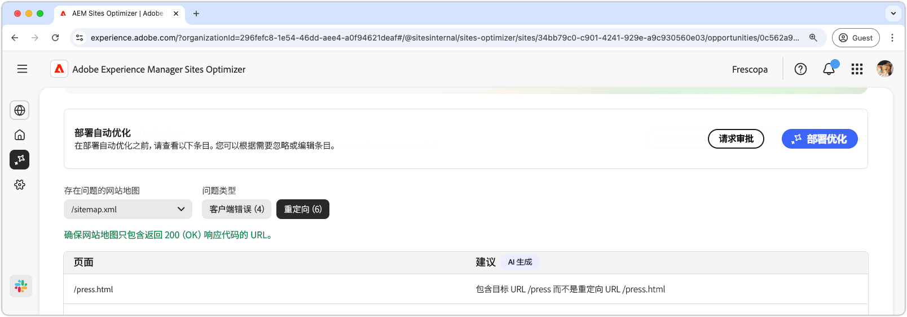

# Sitemap 问题机会

{align="center"}

完整准确的 Sitemap 有助于搜索引擎高效地抓取网站页面并编制索引，确保在搜索结果中达到更好的可见性。Sitemap 机会可以识别您 Sitemap 中存在的潜在问题。修复这些问题可以极大地提高搜索引擎对您网站的索引编制和网站内容可发现性。

摘要显示在页面顶部，包括故障总结及其对您的网站和业务的影响。

* **预计的流量损失**——预计因 Sitemap 问题导致的流量损失。
* **预计的流量值**——预计的损失流量值。

## 自动识别

可以使用以下标准来筛选 Sitemap 问题：

* **有问题的 Sitemap**——所分析的 Sitemap URL 包含潜在问题。
* **问题类型**——Sitemap 中识别的问题类型：
   * **客户端错误**——未返回 `200 Success` 响应的条目。
   * **重定向**——错误或错误配置的重定向。

>[!BEGINTABS]

>[!TAB 客户端错误]

{align="center"}

如果您 Sitemap 中的 URL 返回这些错误，搜索引擎可能会认为您的 Sitemap 已过时或页面被错误移除。客户端表示来自客户端（浏览器或者爬网程序）的请求无效。常见的有：

* **404 未找到**——请求的页面不存在。
* **403 禁止**——服务器拒绝访问请求的页面。
* **410 不存在**——页面被故意移除，并且不会返回。
* **401 未授权**——需要身份验证但未提供。

这些错误可能会损害 SEO，尤其是当重要页面返回 **404 或 410** 时，因为搜索引擎可能会取消对它们的索引。

每个问题都显示在一张表中，其中&#x200B;**页面**&#x200B;列显示受影响的 Sitemap 条目：

* **页面**——存在问题的 Sitemap 条目的 URL。

>[!TAB 重定向]

{align="center"}

Sitemap 应该只包含最终目标 URL，而不是重定向的 URL。重定向的目的是引导用户和爬网程序到正确的位置，但如果错误配置，也会造成故障：

* **302 找到（临时重定向）**——如果错误地使用它来代替 **301**，可能会导致 SEO 问题。
* **307 临时重定向**——与 302 类似，但保留 HTTP 方法。
* **重定向循环**——当页面重定向回其自身或创建无限循环时。
* **中断的重定向**——当重定向导致不存在或 4xx 页面时。

每个问题都显示在一张表中，其中&#x200B;**页面**&#x200B;列显示受影响的 Sitemap 条目：

* **页面**——存在问题的 Sitemap 条目的 URL。

>[!ENDTABS]

## 自动建议

[符合筛选条件](#auto-identify)的每个 Sitemap 问题都会列在一个表中，其中包含以下列：

* **页面**——存在问题的 Sitemap 条目的 URL。
* **建议**——针对该问题的推荐修复方法。

建议通常包括更新的网页路径，以纠正 Sitemap 条目。在某些情况下，建议中还可能提供更详细的说明，例如指定正确的重定向目标。

## 自动优化

[!BADGE Ultimate]{type=Positive tooltip="Ultimate"}

{align="center"}

Sites Optimizer Ultimate 添加了部署 Sitemap 自动优化的功能。

>[!BEGINTABS]

>[!TAB 部署优化]

{{auto-optimize-deploy-optimization-slack}}

>[!TAB 请求审批]

{{auto-optimize-request-approval}}

>[!ENDTABS]
