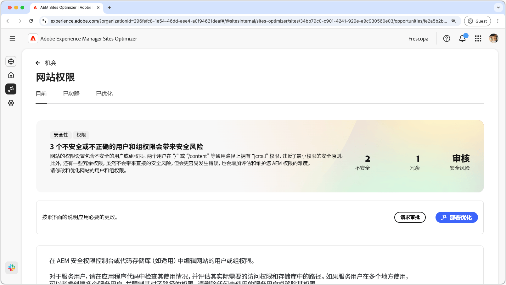
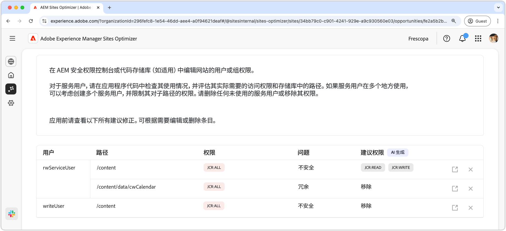
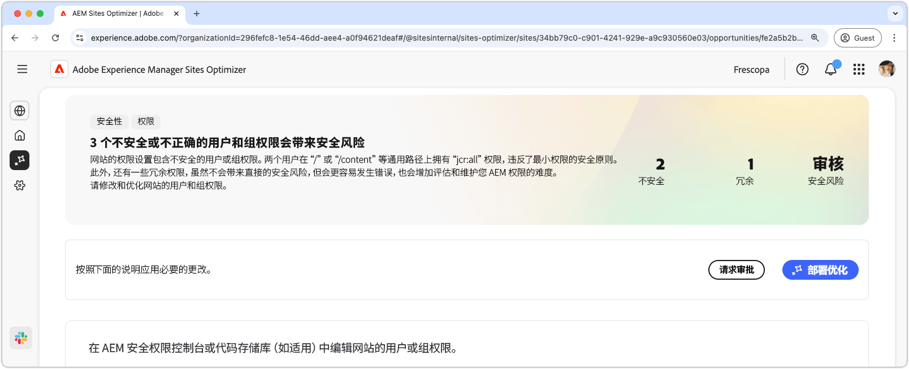

# 网站权限机会

{align="center"}

通过网站权限机会优化网站权限，这对于维护安全且可管理的 AEM 环境至关重要。使用网站权限机会，您可以通过移除过于宽泛的权限（例如 `jcr:all` 在 `/` 或 `/content` 等通用路径上的权限）来优化访问控制，并使用户访问与最低权限原则保持一致。通过简化权限和消除冗余，您可以降低安全风险、提高可维护性并防止未来出现错误配置。通过在 AEM 安全权限控制台或代码存储库中查看和更新权限来采取行动，确保服务用户只拥有他们真正需要的访问权限。

## 自动识别

{align="center"}

**网站权限机会**&#x200B;功能会自动识别并列出

* **用户**——具有可疑权限的用户帐户。
* **路径**——AEM 中受权限影响的路径。
* **权限**——可疑的权限。
* **问题**——表示影响权限的问题类型。

## 自动建议

{align="center"}

自动建议会在&#x200B;**建议的权限**&#x200B;字段中提供 AI 生成的推荐，允许您用安全的替代权限替换任何被标记的权限。

## 自动优化

[!BADGE Ultimate]{type=Positive tooltip="Ultimate"}

{align="center"}

Sites Optimizer Ultimate 添加了针对发现的漏洞部署自动优化的功能。

>[!BEGINTABS]

>[!TAB 部署优化]

{{auto-optimize-deploy-optimization-slack}}

>[!TAB 请求审批]

{{auto-optimize-request-approval}}

>[!ENDTABS]
