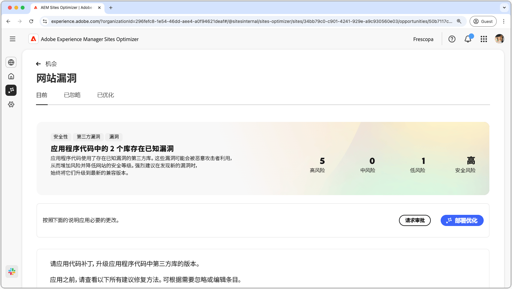
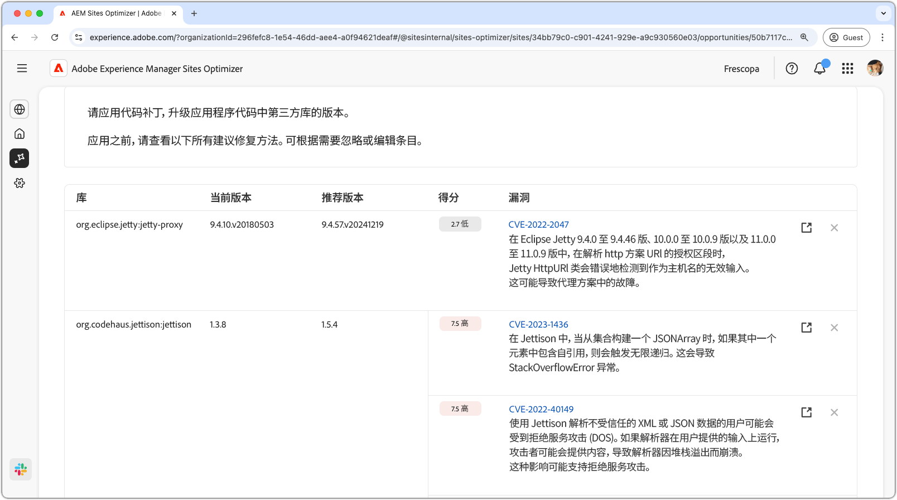
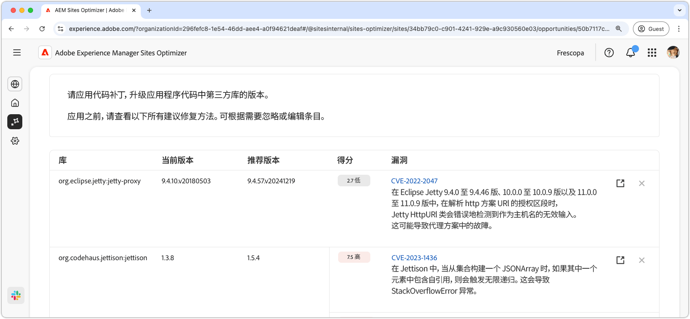
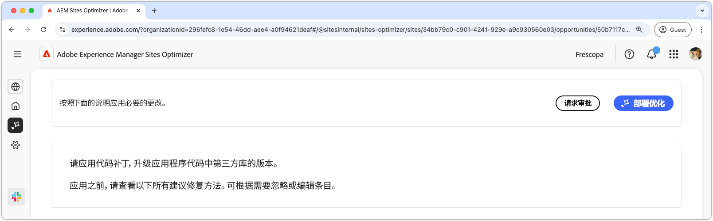

# 网站漏洞机会

{align="center"}

网站漏洞机会可识别应用程序代码使用的第三方库中的安全漏洞。 恶意攻击者利用此类漏洞，会增加风险并降低网站的安全状态。

网站漏洞机会在页面顶部显示摘要，其中包括以下内容：

* **发现的问题**——发现的漏洞数量，按其代表的安全风险分类（低、中、高）。
* **聚合的安全风险**——根据机会发现的漏洞，您网站面临的整体安全风险。

## 自动识别

{align="center"}

**网站漏洞机会**&#x200B;功能会自动识别并列出在您的应用程序代码使用的第三方库中发现的漏洞。它提供以下详细信息：

* **库**——包含漏洞的第三方库。单个库可能存在多个漏洞。
* **当前版本**——当前使用的库版本。
* **推荐版本**——解决漏洞的建议版本。
* **分数**——漏洞的严重性评级，也包含在页面顶部的摘要中。
* **漏洞**——提供更多详细信息的漏洞标识符、简短描述以及国家漏洞数据库（NVD）的链接。单击标识符或描述旁边的链接可访问 NVD 链接。

## 自动建议

{align="center"}

自动建议为您应升级到的易受攻击的库的&#x200B;**推荐版本**&#x200B;提供AI生成的建议。 每个条目都有一个&#x200B;**分数**，表示其总体严重性，有助于确定最关键漏洞的优先级。

>[!BEGINTABS]

>[!TAB 漏洞详细信息]

每个漏洞都包含一个连接到[国家漏洞数据库（NVD）](https://nvd.nist.gov/)中详细信息的链接。单击该漏洞标识符或说明右侧的链接项，将转到该漏洞的NVD页面。

>[!TAB 忽略条目]

您可以选择忽略漏洞列表中的条目。选择会从列表中删除条目。 从机会页面顶部的&#x200B;**已忽略**&#x200B;选项卡中可以重新启动已忽略的条目。<!---right now it does not seem to be implemented, but the page description mentions this functionality-->

>[!ENDTABS]

## 自动优化

[!BADGE Ultimate]{type=Positive tooltip="Ultimate"}

{align="center"}

Sites Optimizer Ultimate 添加了针对发现的漏洞部署自动优化的功能。

>[!BEGINTABS]

>[!TAB 部署优化]

{{auto-optimize-deploy-optimization-slack}}

>[!TAB 请求审批]

{{auto-optimize-request-approval}}

>[!ENDTABS]