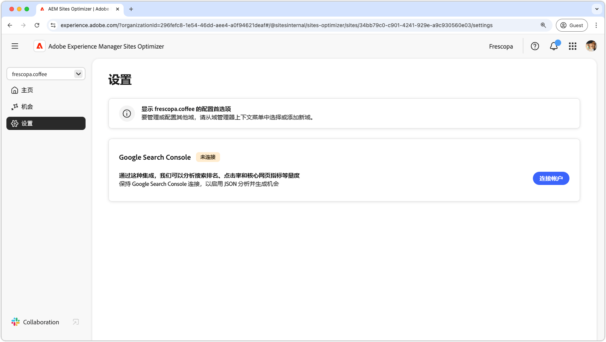

# Sites Optimizer 文档

{align="center"}

欢迎访问 Sites Optimizer 文档。在这里，您可以找到有关如何使用Sites Optimizer优化AEM网站的信息。

## Site Optimizer 基础知识

浏览 AEM Sites Optimizer 文档以了解关键 UI 组件，包括主页仪表板、设置配置和优化洞察的机会列表。

<!-- CARDS 

* ./basics.md
  {title = Basics}
  {image = ./assets/basics/card.png}
* ./opportunities/overview.md
  {title = Opportunities}
* ./settings.md
  {title = Settings}

-->
<!-- START CARDS HTML - DO NOT MODIFY BY HAND -->

    

        

            

                <figure class="image x-is-16by9">
                    
                </figure>
            

            

                

                    

                        <a href="./basics.md" target="_blank" rel="referrer" title="基础知识">基础知识</a>
                    

                    
了解 Sites Optimizer 的基础知识和导航方法。

                

                <a href="./basics.md" target="_blank" rel="referrer" class="spectrum-Button spectrum-Button--outline spectrum-Button--primary spectrum-Button--sizeM" style="align-self: flex-start; margin-top: 1rem;">
                    了解详情
                </a>
            

        

    

    

        

            

                <figure class="image x-is-16by9">
                    
                </figure>
            

            

                

                    

                        <a href="./opportunities/overview.md" target="_blank" rel="referrer" title="机会">机会</a>
                    

                    
了解所有可用的 Site Optimizer 机会，以及如何使用它们来提高您网站的性能。

                

                <a href="./opportunities/overview.md" target="_blank" rel="referrer" class="spectrum-Button spectrum-Button--outline spectrum-Button--primary spectrum-Button--sizeM" style="align-self: flex-start; margin-top: 1rem;">
                    了解详情
                </a>
            

        

    

    

        

            

                <figure class="image x-is-16by9">
                    
                </figure>
            

            

                

                    

                        <a href="./settings.md" target="_blank" rel="referrer" title="设置">设置</a>
                    

                    
了解如何配置 Sites Optimizer 设置，并与其他工具集成。

                

                <a href="./settings.md" target="_blank" rel="referrer" class="spectrum-Button spectrum-Button--outline spectrum-Button--primary spectrum-Button--sizeM" style="align-self: flex-start; margin-top: 1rem;">
                    了解详情
                </a>
            

        

    

<!-- END CARDS HTML - DO NOT MODIFY BY HAND -->

