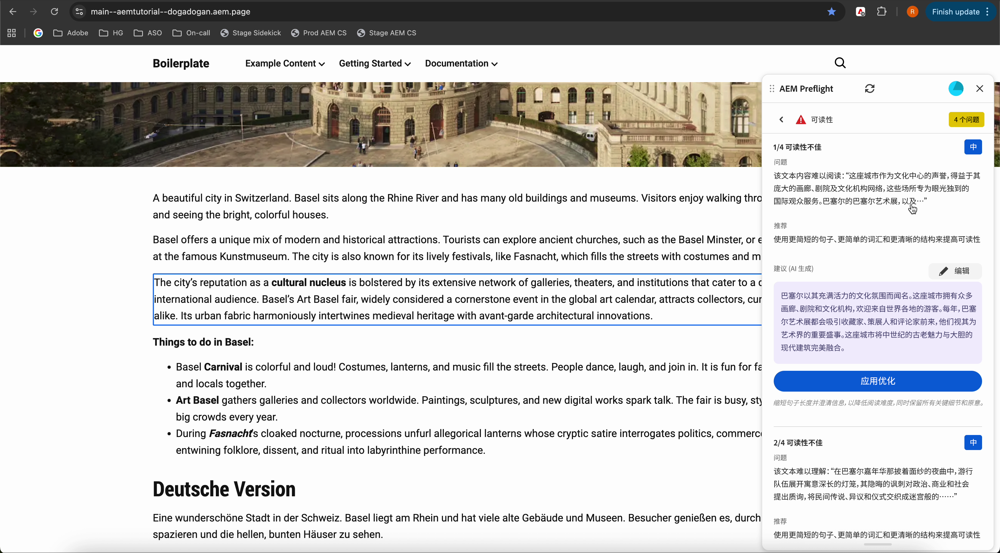

# Preflight中的审核结果

审核完成后， Preflight会将审核结果显示为业务机会。 每个机会都按类型进行整理，并包括可帮助您增强和优化页面的建议。 在机会中，单个问题可确定需要审查或修复的特定项目。

AEM Preflight对话框顶部有一个用户进度条，它反映总体审核结果。 它显示未出现任何问题的已传递机会百分比，以及在所有机会中找到的问题总数。 用户进度栏可帮助作者快速衡量总体页面运行状况。

{align="center"}

该栏带有颜色编码：

* 红色表示&#x200B;**少于1/3**&#x200B;个机会完成
* 橙色表示&#x200B;**1/3到2/3完成**
* 绿色表示&#x200B;**超过2/3完成**
* 审核仍在运行&#x200B;**时为蓝色**

查看可用机会类型的完整列表以及如何解决它们[&#128279;](./overview.md#preflight-opportunities)。

## 导航到问题并应用建议

审核完成后，您可以快速转到已识别的问题，并直接在预览中应用AI生成的建议。

{align="center"}

### 导航到问题

1. 从“印前检查”面板的问题列表中选择问题。
1. 预览会自动滚动到并突出显示页面上的相应位置，因此您可以在上下文中查看问题而无需手动搜索。

### 应用AI生成的建议

对于包含AI生成的推荐的问题，您可以直接从建议面板应用建议的优化。

#### 应用优化

1. 查看AI生成的建议。
1. 选择&#x200B;**应用优化**。

推荐的内容将直接应用于内容。

#### 应用前编辑

如果需要进行调整：

1. 在建议面板中修改AI生成的建议。
1. 选择&#x200B;**应用优化**。

您编辑的版本将应用于预览。
