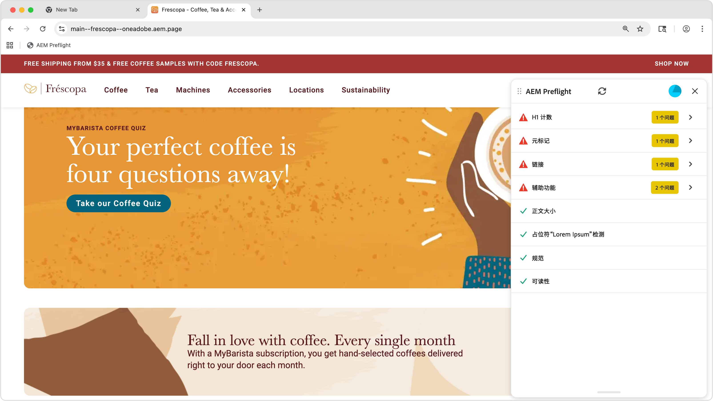

# 印前检查基础知识

{align="center"}

Preflight可帮助您识别在发布网页之前增强网页功能的机会。 Preflight扩展通过对您的内容运行审核来识别商机，并将结果显示在面板中，这样您就可以在发布之前处理这些商机。

## 显示Preflight的位置

印前检查功能可在不同的创作环境中使用：

* **通用编辑器** - Preflight扩展显示在&#x200B;**侧边栏**&#x200B;中。 选择该选项以开始审核当前页面。
* **基于文档的创作** — 通过Sidekick或小书签对预览的页面内容运行预检工具以查看机会列表。
* **AEM Sites页面编辑器** — 使用浏览器中的Preflight小书签开始审核。

有关设置说明，请参阅[预检设置](./setup.md)。

## 开始审核

要运行Preflight，请执行以下操作：

1. 在创作环境(通用编辑器、基于文档的预览或AEM Sites页面编辑器)中打开要审核的页面。
2. 打开“印前检查”面板 — 从侧边栏中选择“印前检查扩展”，或单击Sidekick中的“印前检查”按钮。
3. 印前检查分析页面并显示发现可增强页面的机会。

## 审核结果

审核完成后， Preflight将显示找到的业务机会。 每个机会都按类型进行整理，并包含有关如何解决问题的详细信息。

AEM Preflight对话框顶部有一个用户进度条，用于反映总体审核结果。 它显示未出现任何问题的已传递机会百分比，以及在所有机会中找到的问题总数。 用户进度栏可帮助作者快速衡量总体页面运行状况。

## 关于印前检查机会

Preflight会评估内容的多个方面，包括辅助功能、元数据、链接和可读性。 有关可用机会类型的完整列表以及如何解决它们，请参阅[印前检查机会](./overview.md)。