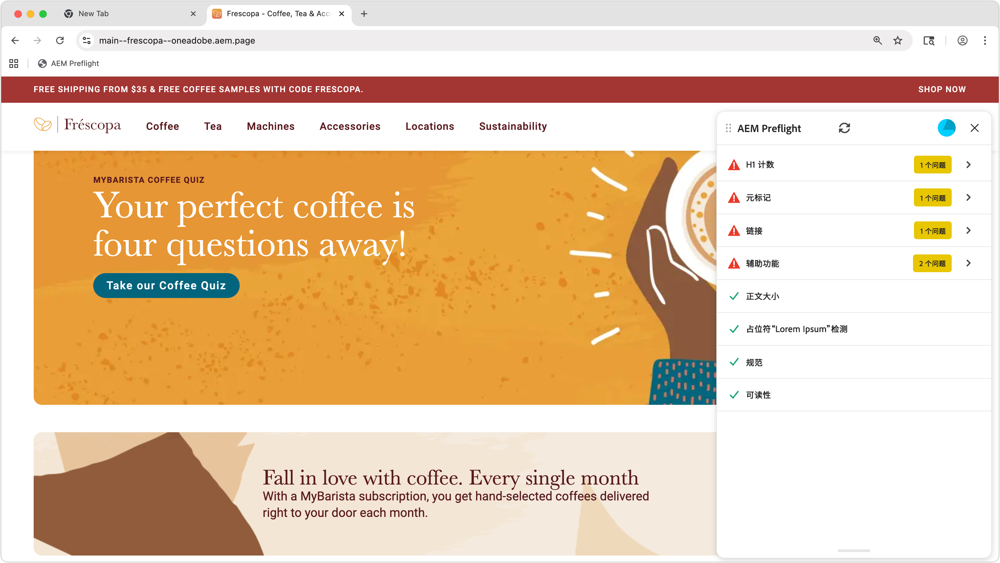
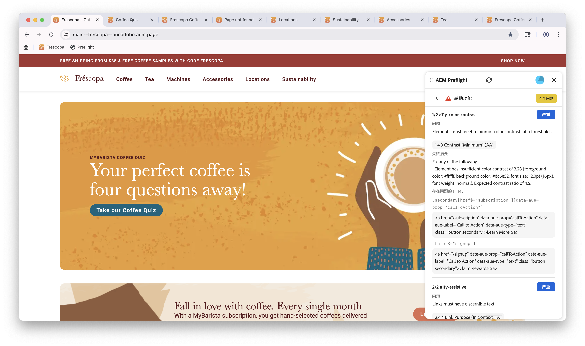
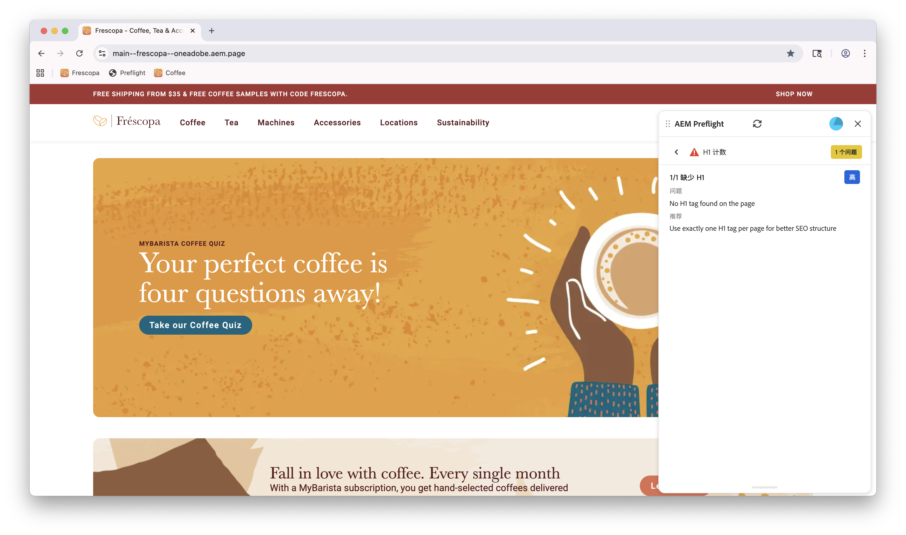
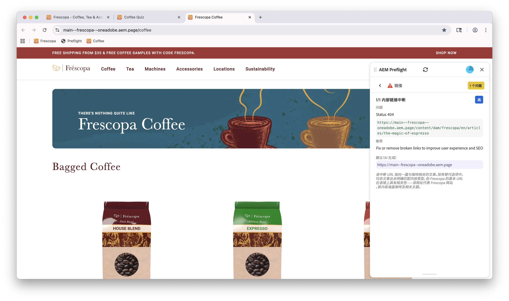
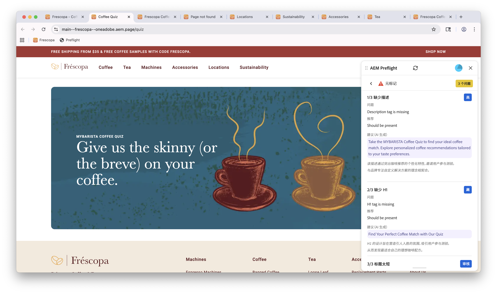

# 预检机会

{align="center"}

Sites Optimizer印前检查机会由一组评估组成，这些评估在网页发布之前分析网站内容和结构的不同方面。 这些评估有助于识别潜在问题，并提供切实可行的建议以提高网站的整体质量和性能。

## 印前检查设置

按照[Preflight设置](./setup.md)指南中的步骤在网站中配置Preflight扩展。

## 预检机会

<!-- CARDS
* ./accessibility.md
* ./h1-count.md
* ./links.md
* ./meta-data.md
* ./readability.md
-->
<!-- START CARDS HTML - DO NOT MODIFY BY HAND -->

    

        

            

                <figure class="image x-is-16by9">
                    
                </figure>
            

            

                

                    

                        <a href="./accessibility.md" target="_blank" rel="referrer" title="预检辅助功能机会">预检辅助功能机会</a>
                    

                    
了解Sites Optimizer中的Preflight辅助功能机会。

                

                <a href="./accessibility.md" target="_blank" rel="referrer" class="spectrum-Button spectrum-Button--outline spectrum-Button--primary spectrum-Button--sizeM" style="align-self: flex-start; margin-top: 1rem;">
                    了解详情
                </a>
            

        

    

    

        

            

                <figure class="image x-is-16by9">
                    
                </figure>
            

            

                

                    

                        <a href="./h1-count.md" target="_blank" rel="referrer" title="预检H1计数机会">预检H1计数机会</a>
                    

                    
了解Sites Optimizer中的Preflight辅助功能机会。

                

                <a href="./h1-count.md" target="_blank" rel="referrer" class="spectrum-Button spectrum-Button--outline spectrum-Button--primary spectrum-Button--sizeM" style="align-self: flex-start; margin-top: 1rem;">
                    了解详情
                </a>
            

        

    

    

        

            

                <figure class="image x-is-16by9">
                    
                </figure>
            

            

                

                    

                        <a href="./links.md" target="_blank" rel="referrer" title="印前检查链接机会">印前检查链接机会</a>
                    

                    
了解Sites Optimizer中的预检链接机会。

                

                <a href="./links.md" target="_blank" rel="referrer" class="spectrum-Button spectrum-Button--outline spectrum-Button--primary spectrum-Button--sizeM" style="align-self: flex-start; margin-top: 1rem;">
                    了解详情
                </a>
            

        

    

    

        

            

                <figure class="image x-is-16by9">
                    
                </figure>
            

            

                

                    

                        <a href="./meta-data.md" target="_blank" rel="referrer" title="预检元数据机会">预检元数据机会</a>
                    

                    
了解Sites Optimizer中的预检元数据机会。

                

                <a href="./meta-data.md" target="_blank" rel="referrer" class="spectrum-Button spectrum-Button--outline spectrum-Button--primary spectrum-Button--sizeM" style="align-self: flex-start; margin-top: 1rem;">
                    了解详情
                </a>
            

        

    

    

        

            

                <figure class="image x-is-16by9">
                    
                </figure>
            

            

                

                    

                        <a href="./readability.md" target="_blank" rel="referrer" title="预检可读性机会">预检可读性机会</a>
                    

                    
了解Sites Optimizer中的预检可读性机会。

                

                <a href="./readability.md" target="_blank" rel="referrer" class="spectrum-Button spectrum-Button--outline spectrum-Button--primary spectrum-Button--sizeM" style="align-self: flex-start; margin-top: 1rem;">
                    了解详情
                </a>
            

        

    

<!-- END CARDS HTML - DO NOT MODIFY BY HAND -->
