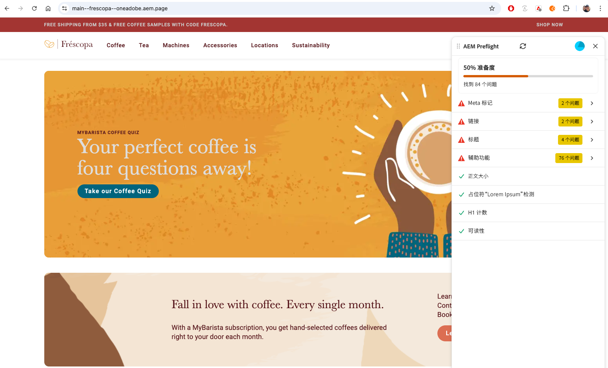
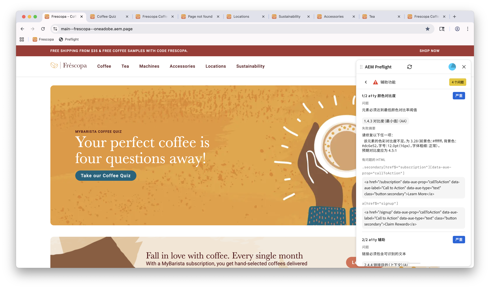
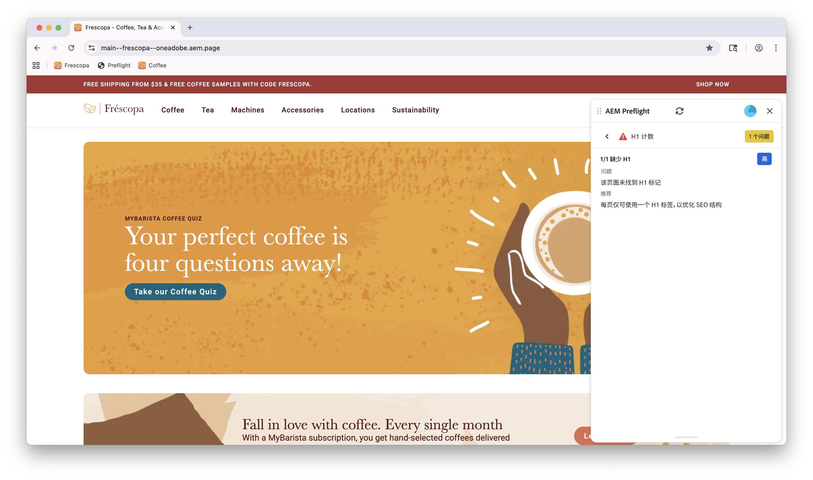
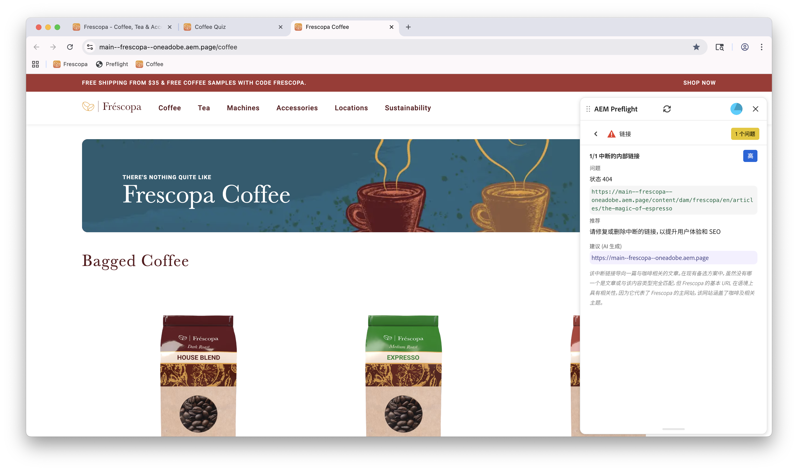
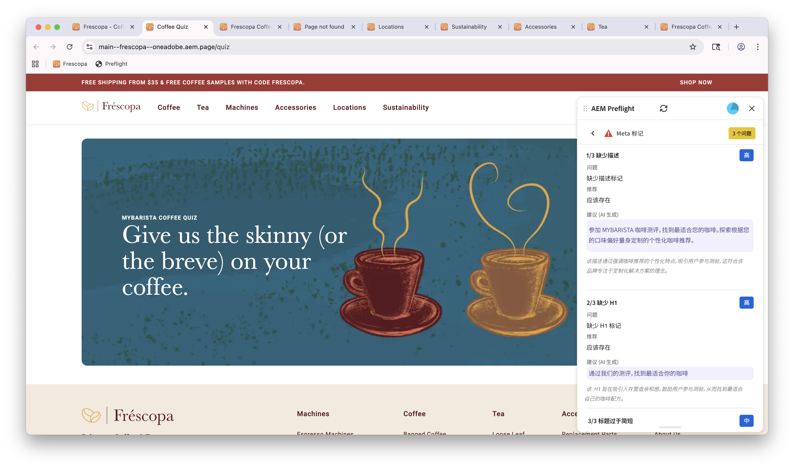
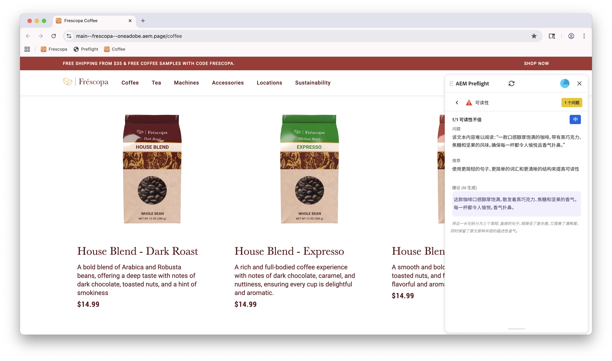

# AEM Sites Optimizer Preflight

{align="center"}

AEM Sites Optimizer 中的 Preflight 可分析内容和结构，标记出问题，提供可操作的建议，帮助您在页面正式发布之前验证和优化页面。 它经过专门设计，面向希望能确保页面高质量、高性能、发布准备就绪、同时减少返工的作者、营销人员和开发人员。

Preflight 的核心是机会，它会在页面发布之前评估几个关键方面，通过一组这样的审核识别机会。 这些审核能够发现潜在问题，提供明确、可操作的建议，以提高整体质量和性能。

## 开始使用 Preflight

开始使用 Preflight 非常简单。 只需设置 Preflight，在您的创作环境中打开它，然后在您的页面上运行审核，Preflight 会自动完成其余工作。

1. [设置 Preflight](./setup.md)——了解如何为您的 AEM 实例设置 Preflight
1. [访问 Preflight](./access-preflight.md)——了解 Preflight 在创作环境中显示在哪里
1. [运行审核](./audits.md)——了解如何启动 Preflight 审核
1. [审核结果和机会](./audit-results.md)——了解如何解读审核结果

## 预检机会

<!--
CARDS

* ./opportunities/accessibility.md
* ./opportunities/h1-count.md
* ./opportunities/links.md
* ./opportunities/meta-data.md
* ./opportunities/readability.md
-->
<!-- START CARDS HTML - DO NOT MODIFY BY HAND -->

    

        

            

                <figure class="image x-is-16by9">
                    
                </figure>
            

            

                

                    

                        <a href="./opportunities/accessibility.md" target="_blank" rel="referrer" title="Preflight 无障碍性机会">预检辅助功能机会</a>
                    

                    
了解 Sites Optimizer 中的 Preflight 无障碍性机会。

                

                <a href="./opportunities/accessibility.md" target="_blank" rel="referrer" class="spectrum-Button spectrum-Button--outline spectrum-Button--primary spectrum-Button--sizeM" style="align-self: flex-start; margin-top: 1rem;">
                    了解详情
                </a>
            

        

    

    

        

            

                <figure class="image x-is-16by9">
                    
                </figure>
            

            

                

                    

                        <a href="./opportunities/h1-count.md" target="_blank" rel="referrer" title="Preflight H1 计数机会">预检 H1 计数机会</a>
                    

                    
了解 Sites Optimizer 中的 Preflight 无障碍性机会。

                

                <a href="./opportunities/h1-count.md" target="_blank" rel="referrer" class="spectrum-Button spectrum-Button--outline spectrum-Button--primary spectrum-Button--sizeM" style="align-self: flex-start; margin-top: 1rem;">
                    了解详情
                </a>
            

        

    

    

        

            

                <figure class="image x-is-16by9">
                    
                </figure>
            

            

                

                    

                        <a href="./opportunities/links.md" target="_blank" rel="referrer" title="Preflight 链接机会">预检链接机会</a>
                    

                    
了解 Sites Optimizer 中的 Preflight 链接机会。

                

                <a href="./opportunities/links.md" target="_blank" rel="referrer" class="spectrum-Button spectrum-Button--outline spectrum-Button--primary spectrum-Button--sizeM" style="align-self: flex-start; margin-top: 1rem;">
                    了解详情
                </a>
            

        

    

    

        

            

                <figure class="image x-is-16by9">
                    
                </figure>
            

            

                

                    

                        <a href="./opportunities/meta-data.md" target="_blank" rel="referrer" title="Preflight 元数据机会">预检元数据机会</a>
                    

                    
了解 Sites Optimizer 中的 Preflight 元数据机会。

                

                <a href="./opportunities/meta-data.md" target="_blank" rel="referrer" class="spectrum-Button spectrum-Button--outline spectrum-Button--primary spectrum-Button--sizeM" style="align-self: flex-start; margin-top: 1rem;">
                    了解详情
                </a>
            

        

    

    

        

            

                <figure class="image x-is-16by9">
                    
                </figure>
            

            

                

                    

                        <a href="./opportunities/readability.md" target="_blank" rel="referrer" title="Preflight 可读性机会">预检可读性机会</a>
                    

                    
了解 Sites Optimizer 中的 Preflight 可读性机会。

                

                <a href="./opportunities/readability.md" target="_blank" rel="referrer" class="spectrum-Button spectrum-Button--outline spectrum-Button--primary spectrum-Button--sizeM" style="align-self: flex-start; margin-top: 1rem;">
                    了解详情
                </a>
            

        

    

<!-- END CARDS HTML - DO NOT MODIFY BY HAND -->
