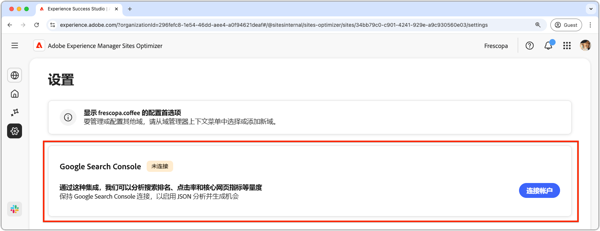

# Sites Optimizer 设置

{align="center"}

Site Optimizer 设置是配置您 Sites Optimizer 体验的中心枢纽。

## Google Search Console

{align="center"}

AEM Sites Optimizer 中的 Google Search Console 设置连接器可以分析关键 SEO 量度，例如搜索排名、点进率和 Core Web Vitals。通过保持与 Google Search Console 的连接，您可以利用 JSON 分析来发现优化机会，并提高网站性能。

要设置此连接器，您必须拥有该域 Google Search Console 管理访问权限的凭据。
