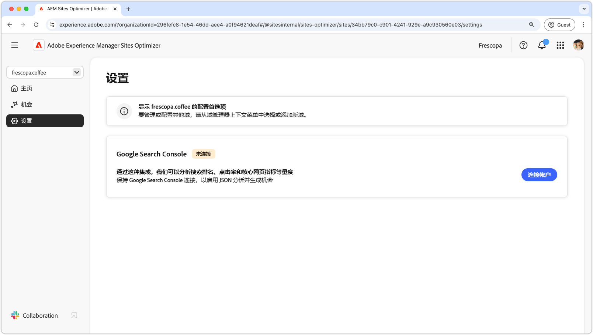
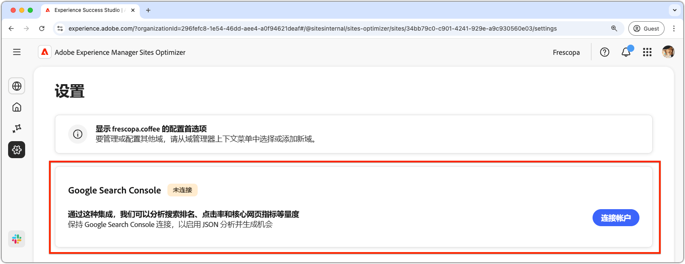
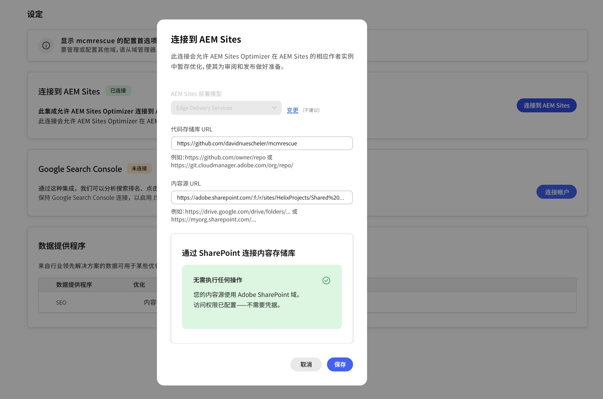
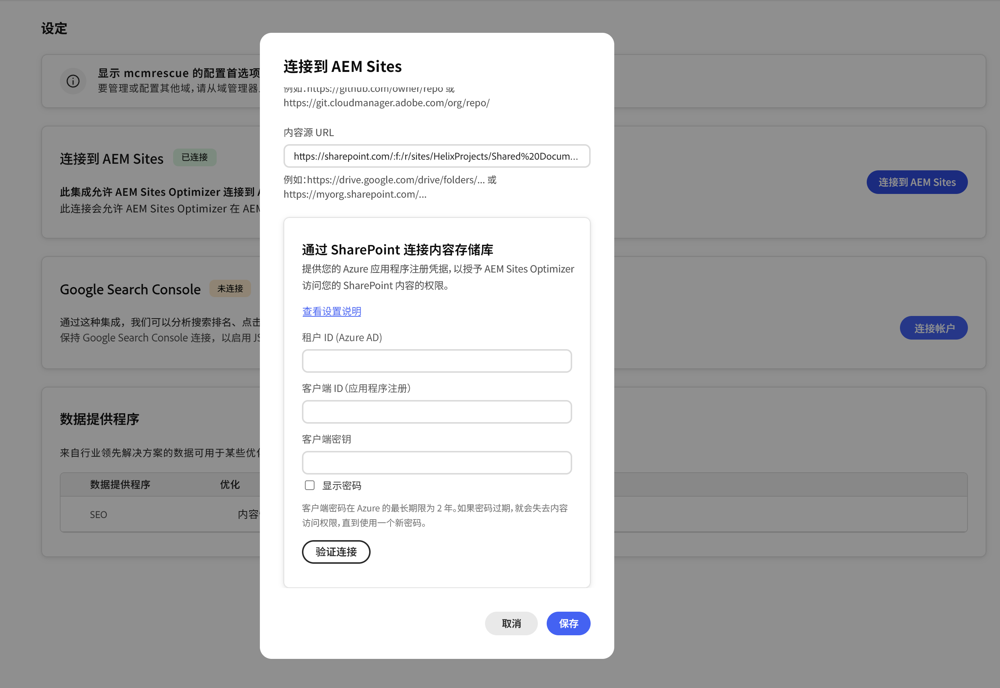
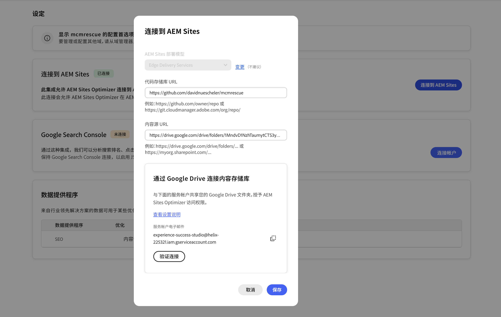

# Sites Optimizer 设置

{align="center"}

Sites Optimizer 设置是配置您的 Sites Optimizer 体验的中心枢纽。

## Google Search Console

{align="center"}

AEM Sites Optimizer 中的 Google Search Console 设置连接器可以分析关键 SEO 量度，例如搜索排名、点进率和 Core Web Vitals。 通过保持与 Google Search Console 的连接，您可以利用 JSON 分析来发现优化机会，并提高网站性能。

要设置此连接器，您必须拥有该域 Google Search Console 管理访问权限的凭据。

## 连接到 AEM Sites

以下指南介绍了如何将您现有的 Edge Delivery Services (EDS) 网站连接到 AEM Sites Optimizer。 在开始之前，请确保您的 EDS 网站已设置并运行正常。此连接专门用于 AEM Sites Optimizer 访问您的内容。

连接需要两个步骤：

1. 提供您的代码存储库 URL 和内容源 URL。
2. 授予 AEM Sites Optimizer 访问您的内容源的权限。

### 步骤 1：链接您的代码存储库和内容源

在 AEM Sites Optimizer 中前往&#x200B;**设置 → 连接到 AEM Sites**，然后输入以下内容：

- **代码存储库 URL**——EDS 网站的 GitHub URL，例如：
  `https://github.com/owner/repo`

- **内容源 URL**——支持您的 EDS 网站的 SharePoint 文件夹或 Google Drive 文件夹的 URL，例如：
  `https://drive.google.com/drive/folders/...` 或 `https://myorg.sharepoint.com/...`

输入内容源 URL 后，AEM Sites Optimizer 将检测您的内容源类型，并在下面显示相关的访问说明。

### 步骤 2：授予对内容源的访问权限

按照与您的内容源匹配的部分操作。

#### SharePoint — Adobe 域

{align="center"}

如果您的内容源 URL 使用 Adobe SharePoint 域，就无需进一步操作。 访问权限已配置完毕。 点击&#x200B;**保存**，完成连接。

#### SharePoint — 自定义域

如果您的内容源 URL 使用您组织自己的 SharePoint 域，您就需要注册一个 Azure 应用程序，将其凭据提供给 AEM Sites Optimizer。

##### 您需要什么

- 在 Azure 门户中注册应用程序的权限，或者可以代表您注册应用程序的联系人。
- 授予 API 同意声明的租户管理员权限，或者可以为您批准 API 同意声明的管理员。

##### 步骤 2a：在 Azure 中注册应用程序

1. 前往 **Azure Portal → Microsoft Entra ID → 应用程序注册 → 新注册**。
2. 为其命名，例如：`AEM Sites Optimizer`。
3. 保留所有其他默认值，然后点击&#x200B;**注册**。
4. 在&#x200B;**概述**&#x200B;页面上，记下：
   - **应用程序（客户端）ID**
   - **目录（租户）ID**

##### 步骤 2b：添加 API 权限

1. 前往 **API 权限 → 添加权限 → Microsoft Graph → 应用程序权限**。
2. 添加以下两项：
   - `Sites.Selected` — 对特定 SharePoint 网站收藏集的受限访问权限。
   - `Files.SelectedOperations.Selected` — 在没有登录用户的情况下的文件访问权限。
3. 为这两项点击&#x200B;**授予管理员同意**。

{align="center"}

>[!NOTE]
>
>要授予管理员同意，需要租户管理员权限。 如果您没有此权限，请让您的 IT 或 Azure 管理员完成这个步骤，然后继续。

##### 步骤 2c：创建客户端密码

{align="center"}

1. 前往&#x200B;**证书和密码 → 新客户端密码**。
2. 设置一个描述和到期日，然后点击&#x200B;**添加**。
3. 立即复制密码值——它只显示一次。

##### 步骤 2d：授予应用程序访问您的 SharePoint 网站的权限

您可以使用 Microsoft Graph Explorer、PowerShell 或直接调用 Graph API 来授予应用程序访问权限。

导航到 [Microsoft Graph Explorer](https://developer.microsoft.com/graph/graph-explorer)，使用您的 Microsoft 帐户登录，然后运行以下请求：

1. 查找您的网站 ID：

```
GET https://graph.microsoft.com/v1.0/sites/{tenant}.sharepoint.com:/sites/{site-name}
```

1. 从回答中复制 `id`，然后授予网站级访问权限：

```
POST https://graph.microsoft.com/v1.0/sites/{siteId}/permissions
```

主体：

```json
{
  "roles": ["write"],
  "grantedToIdentities": [{
    "application": {
      "id": "{your-client-id}",
      "displayName": "{Your app name}"
    }
  }]
}
```

##### 步骤 2e：在 AEM Sites Optimizer 中输入凭据

{align="center"}

返回到&#x200B;**连接到 AEM Sites** 对话框，在&#x200B;**通过 SharePoint 连接内容存储库**&#x200B;中输入以下内容：

- **租户 ID (Azure AD)** — 来自应用程序注册 → 概述。
- **客户端 ID（应用程序注册）** — 来自应用程序注册 → 概述。
- **客户端密码**——在步骤 2c 中创建。

点击&#x200B;**验证连接**，确认访问权限，然后点击&#x200B;**保存**。

#### Google Drive

{align="center"}

1. 在 Google Drive 中，右键单击支持您的 EDS 网站的文件夹，然后选择&#x200B;**共享**。
2. 在&#x200B;**添加人员和组**&#x200B;字段中，输入&#x200B;**连接到 AEM Sites** 对话框中显示的服务帐户电子邮件：
   `experience-success-studio@helix-225321.iam.gserviceaccount.com`
3. 将权限级别设置为&#x200B;**编辑者**。
4. 取消勾选&#x200B;**通知人员**，然后点击&#x200B;**共享**。

共享完成后，在对话框中点击&#x200B;**验证连接**，然后点击&#x200B;**保存**。
