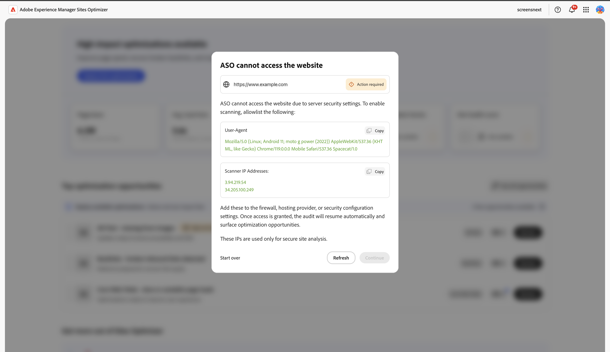

# Sites Optimizer 试用版

使用针对现有&#x200B;**Sites Optimizer客户（Edge Delivery Services、Cloud Services和Managed Services）的此试用版开始使用AEM Sites**。 您的域数据已预先加入，因此您可以立即开始优化。 以下视频将指导您完成试用版体验，为您介绍如何开始使用。

>[!IMPORTANT]
>
>在开始之前，请确保您的站点符合以下要求：
>
>* 它基于AEM Sites（Edge Delivery Services、Cloud Service或Managed Services）构建。
>* 它是一个生产站点，而不是开发、QA、暂存、创作或预览环境。
>* 它可公开访问，且不在登录之后。
>* 它使用AEM Sites前端投放。 当前不支持Headless交付。

>[!VIDEO](https://video.tv.adobe.com/v/3483253/?learn=on&enablevpops)

>[!TIP]
>
> 如有任何问题或请求，请联系 [siteoptimizer-now@adobe.com](mailto:siteoptimizer-now@adobe.com)。

## 立即开始使用试用版！

请按照以下步骤开始使用您的试用版：

1. 使用您的 AEM Sites IMS 组织 ID 登录 [www.sitesoptimizer.live](http://www.sitesoptimizer.live/)。
2. 查看关键量度，如页面浏览量、加载时间和参与度，以及按影响确定优先级的最佳优化机会。
3. 探索三种可用的机会类型：[中断的反向链接](./opportunities/broken-backlinks.md)、[Core Web Vitals](./opportunities/core-web-vitals.md) 和[缺少替换文本](./opportunities/missing-alt-text.md)。
4. 对于每个机会，最多审阅三个发现的问题。 使用 AI 生成的建议，在准备就绪后将优化直接部署到您的 AEM 环境中。
5. 随时升级到完整许可证，以解锁更多机会。

## 试用版中有哪些功能

试用版包括以下功能：

* 三种机会类型：[中断的反向链接](./opportunities/broken-backlinks.md)、[Core Web Vitals](./opportunities/core-web-vitals.md) 和 [缺少替换文本](./opportunities/missing-alt-text.md)。
* 每个月每个机会最多三个问题。
* 每个问题提供完整工作流：自动识别、自动建议、自动优化。
  * **自动识别**——使用多个数据源检测您网站上的问题。
  * **自动建议**——为每个问题提供规范性的 AI 生成的建议。
  * **自动优化**——获得批准后，将修复直接部署到您的创作环境中。 更新会遵循您现有的工作流，允许您的团队通过 AEM 审阅和发布。

## 允许Sites Optimizer访问您的网站

Sites Optimizer会扫描您的网站以确定优化机会。 如果您的站点位于防火墙、内容分发网络(CDN)或其他阻止无法识别的客户端的安全配置后面，则扫描仪无法访问您的页面。 发生这种情况时，载入会显示Sites Optimizer无法访问您的网站的&#x200B;**所需操作**&#x200B;消息，并且扫描将暂停直到您允许访问。

{align="center"}

要使扫描仪通过，请在防火墙、托管提供程序或安全配置中允许列表以下两项。 对于AEM Cloud Service站点，请将扫描仪的允许规则添加到Cloud Manager中的[CDN流量过滤器规则](https://experienceleague.adobe.com/zh-hans/docs/experience-manager-cloud-service/content/security/traffic-filter-rules-including-waf)，该规则可在User-Agent和IP地址上匹配。 如果您使用[Cloud Manager IP允许列表](https://experienceleague.adobe.com/en/docs/experience-manager-cloud-service/content/implementing/using-cloud-manager/ip-allow-lists/introduction)限制访问，请将扫描程序的IP地址也添加到所应用的允许列表。

* **User-Agent** — 扫描程序使用包含令牌`Spacecat/1.0`的User-Agent标识自身。 允许列表此令牌，最好是“包含”匹配项，因此即使完整的User-Agent字符串发生更改，该令牌也能继续工作。
* **扫描程序IP地址** —允许列表扫描程序的出站IP地址。

载入屏幕显示要允许列表的精确用户代理和IP地址，每个地址都有一个&#x200B;**复制**&#x200B;按钮，因此您可以将当前值直接复制到配置中。

在允许列表扫描仪后，在登录屏幕上选择&#x200B;**刷新**。 授予访问权限后，扫描会自动恢复并显示您的优化机会。

>[!NOTE]
>
>这些IP地址仅用于分析您的站点。 列入允许列表它们不会授予任何其他访问权限。

## 为Edge Delivery试用站点启用自动修复

了解试用客户如何在Google Drive或SharePoint中创作的Edge Delivery Services (EDS)网站上，为自动修复建议启用&#x200B;**部署到作者**&#x200B;操作。

>[!NOTE]
>
>此要求仅适用于其网站是在Google Drive或SharePoint中创作的试用组织。 付费客户以及在“人行横道”或“暗巷”中创作的网站不受影响。

试用客户必须属于&#x200B;**ASO-EDS-Autofix-Users** IMS组。 如果该组不存在，则贵组织的管理员可以创建该组并添加您。

1. 登录到[Adobe Admin Console](https://adminconsole.adobe.com/)。
1. 选择&#x200B;**用户** > **用户组**。
1. 选择&#x200B;**添加用户组**。
1. 对于&#x200B;**用户组名称**，请完全输入：

   ```
   ASO-EDS-Autofix-Users
   ```

   >[!IMPORTANT]
   >
   > 组名称必须完全匹配，包括大小写。 它区分大小写匹配，因此不同的拼写或大小写（例如，`ASO-EDS-Autofix-users`）无效。 创建组后，请勿重命名该组。

1. 选择&#x200B;**保存**。

   {align="center"}

1. 打开新组并选择&#x200B;**添加用户**。
1. 输入每个应该能够部署自动修复的人员的电子邮件地址或用户名，然后选择&#x200B;**保存**。

   {align="center"}

如果您是组的成员，则会启用&#x200B;**部署到作者**&#x200B;按钮。 如果您还不是成员，则会禁用&#x200B;**部署到作者**，并会显示工具提示，要求您联系管理员以将您添加到该组。 管理员将您添加到组后，请先注销，然后再登录到Sites Optimizer，这样您的会话就会选取新的组成员资格。

## 常见问题解答

阅读以下关于 AEM Sites Optimizer 试用版的常见问题解答。

+++什么是 AEM Sites Optimizer？

[AEM Sites Optimizer](/help/home.md) 是一个 AI 优先的应用程序，用于识别您网站上的问题，提供规范性建议，帮助您修复这些问题，以提高流量获取、参与度和转化率。

+++
+++谁可以使用这个试用版？

现有的 AEM Sites 客户（Edge Delivery Services、Cloud Services 和 Managed Services）。

+++
+++如何访问试用版？

前往 [www.sitesoptimizer.live](http://www.sitesoptimizer.live/)，然后使用您的 AEM Sites IMS 组织 ID 登录。

+++
+++试用版收取费用吗？

不会。 现有 AEM Sites 客户可免费使用试用版。

+++
+++有有效期限吗？

不会。 试用版不基于时间。 它的使用限制是所提供的机会类型和问题的数量。
+++
+++解决所有问题后会怎么样？

Sites Optimizer 会持续识别那些影响您网站性能的问题。 免费试用版每月只是添加问题。 升级可获得持续审核和优化的功能。

+++
+++如何能获得更多机会？

使用升级，或联系通过产品体验提供的销售 CTA，或者发送电子邮件至 [siteoptimizer-now@adobe.com](mailto:siteoptimizer-now@adobe.com)。

+++
+++我在ASO-EDS-Autofix-Users组中，但仍禁用部署到作者。 我该检查什么？

注销并重新登录 — 登录时会读取组成员资格。 此外，请确认组名称的拼写和大小写恰好为`ASO-EDS-Autofix-Users`，并且是在网站所属的同一组织中创建的。

+++
+++ASO-EDS-Autofix-Users组要求是否适用于所有Edge Delivery Services站点？

不会。 它仅适用于在&#x200B;**Google Drive**&#x200B;或&#x200B;**SharePoint**&#x200B;中创作的试用站点。 在&#x200B;**Crossswalk**&#x200B;或&#x200B;**暗巷**&#x200B;中创建的站点以及所有&#x200B;**付费**&#x200B;站点不受影响。

+++
+++Sites Optimizer说无法访问我的网站。 我该怎么办？

您的站点可能位于阻止扫描程序的防火墙、CDN或安全配置之后。 在您的安全配置或Cloud Manager CDN允许列表中（对于AEM Cloud Service站点）允许列表扫描程序的User-Agent（`Spacecat/1.0`令牌）和IP地址。 然后选择&#x200B;**刷新**。 请参阅[允许Sites Optimizer访问您的网站](#allow-sites-optimizer-to-access-your-site)。

+++

<!--
CARDS
* ./opportunities/core-web-vitals.md
  {title=Core web vitals}
  {image=../assets/common/card-performance.png}
* ./opportunities/missing-alt-text.md
  {title=Missing alt text}
  {image=../assets/common/card-arrows.png}
* ./opportunities/broken-backlinks.md
  {title=Broken backlinks}
  {image=../assets/common/card-arrows.png}
-->

<!-- START CARDS HTML - DO NOT MODIFY BY HAND -->
<div class="columns">
    <div class="column is-half-tablet is-half-desktop is-one-third-widescreen" aria-label="Core web vitals">
        <div class="card" style="height: 100%; display: flex; flex-direction: column; height: 100%;">
            <div class="card-image">
                <figure class="image x-is-16by9">
                    <a href="./opportunities/core-web-vitals.md" title="Core Web Vitals" target="_blank" rel="referrer">
                        
                    </a>
                </figure>
            </div>
            <div class="card-content is-padded-small" style="display: flex; flex-direction: column; flex-grow: 1; justify-content: space-between;">
                <div class="top-card-content">
                    <p class="headline is-size-6 has-text-weight-bold">
                        <a href="./opportunities/core-web-vitals.md" target="_blank" rel="referrer" title="Core Web Vitals">Core Web Vitals</a>
                    </p>
                    <p class="is-size-6">了解 Core Web Vitals 机会，以及如何使用它来提高流量获取。</p>
                </div>
                <a href="./opportunities/core-web-vitals.md" target="_blank" rel="referrer" class="spectrum-Button spectrum-Button--outline spectrum-Button--primary spectrum-Button--sizeM" style="align-self: flex-start; margin-top: 1rem;">
                    <span class="spectrum-Button-label has-no-wrap has-text-weight-bold">了解详情</span>
                </a>
            </div>
        </div>
    </div>
    <div class="column is-half-tablet is-half-desktop is-one-third-widescreen" aria-label="Missing alt text">
        <div class="card" style="height: 100%; display: flex; flex-direction: column; height: 100%;">
            <div class="card-image">
                <figure class="image x-is-16by9">
                    <a href="./opportunities/missing-alt-text.md" title="缺少替代文本" target="_blank" rel="referrer">
                        
                    </a>
                </figure>
            </div>
            <div class="card-content is-padded-small" style="display: flex; flex-direction: column; flex-grow: 1; justify-content: space-between;">
                <div class="top-card-content">
                    <p class="headline is-size-6 has-text-weight-bold">
                        <a href="./opportunities/missing-alt-text.md" target="_blank" rel="referrer" title="缺少替代文本">缺少替代文本</a>
                    </p>
                    <p class="is-size-6">了解缺少替代文本机会，以及如何使用它来提高您网站上的参与度。</p>
                </div>
                <a href="./opportunities/missing-alt-text.md" target="_blank" rel="referrer" class="spectrum-Button spectrum-Button--outline spectrum-Button--primary spectrum-Button--sizeM" style="align-self: flex-start; margin-top: 1rem;">
                    <span class="spectrum-Button-label has-no-wrap has-text-weight-bold">了解详情</span>
                </a>
            </div>
        </div>
    </div>
    <div class="column is-half-tablet is-half-desktop is-one-third-widescreen" aria-label="Broken backlinks">
        <div class="card" style="height: 100%; display: flex; flex-direction: column; height: 100%;">
            <div class="card-image">
                <figure class="image x-is-16by9">
                    <a href="./opportunities/broken-backlinks.md" title="中断的反向链接" target="_blank" rel="referrer">
                        
                    </a>
                </figure>
            </div>
            <div class="card-content is-padded-small" style="display: flex; flex-direction: column; flex-grow: 1; justify-content: space-between;">
                <div class="top-card-content">
                    <p class="headline is-size-6 has-text-weight-bold">
                        <a href="./opportunities/broken-backlinks.md" target="_blank" rel="referrer" title="中断的反向链接">中断的反向链接</a>
                    </p>
                    <p class="is-size-6">了解中断的反向链接机会，以及如何使用它来提高流量获取。</p>
                </div>
                <a href="./opportunities/broken-backlinks.md" target="_blank" rel="referrer" class="spectrum-Button spectrum-Button--outline spectrum-Button--primary spectrum-Button--sizeM" style="align-self: flex-start; margin-top: 1rem;">
                    <span class="spectrum-Button-label has-no-wrap has-text-weight-bold">了解详情</span>
                </a>
            </div>
        </div>
    </div>
</div>
<!-- END CARDS HTML - DO NOT MODIFY BY HAND -->
