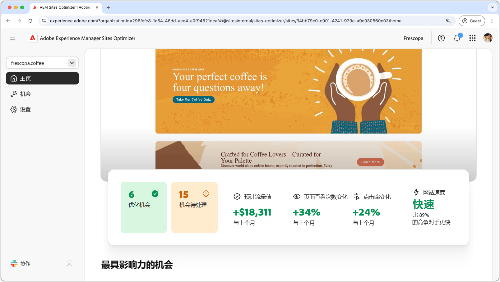

# AEM Sites Optimizer

>[!VIDEO](https://video.tv.adobe.com/v/3455095/?learn=on&enablevpops&captions=chi_hans)

Adobe Experience Manager (AEM) Sites Optimizer 是一项基于云的服务，可分析和改进 AEM 上构建的网站性能。它可识别页面加载、组件使用和内容交付方面的改进空间。此功能有助于提升网站性能，同时降低维护和更新成本。使用 Sites Optimizer，您可以确保流畅、可靠的在线体验，这对于保持参与度和转化率非常重要。

## 开始使用 Sites Optimizer

<!-- CARDS 

* ./opportunity-types/overview.md
   {title=Opportunity types}
   {description = Learn about the available Site Optimizer opportunities and how to use them to improve your site's performance.}
* ./documentation/overview.md
  * {title=Documentation}
  * {description=Explore the Sites Optimizer documentation to learn about all its capabilities.}

-->
<!-- START CARDS HTML - DO NOT MODIFY BY HAND -->

    

        

            

                <figure class="image x-is-16by9">
                    
                </figure>
            

            

                

                    

                        <a href="./opportunity-types/overview.md" target="_blank" rel="referrer" title="机会类型">机会类型</a>
                    

                    
了解可用的 Site Optimizer 机会，以及如何使用它们来提高您网站的性能。

                

                <a href="./opportunity-types/overview.md" target="_blank" rel="referrer" class="spectrum-Button spectrum-Button--outline spectrum-Button--primary spectrum-Button--sizeM" style="align-self: flex-start; margin-top: 1rem;">
                    了解详情
                </a>
            

        

    

    

        

            

                <figure class="image x-is-16by9">
                    
                </figure>
            

            

                

                    

                        <a href="./documentation/overview.md" target="_blank" rel="referrer" title="文档">文档</a>
                    

                    
浏览 Sites Optimizer 文档，了解其所有功能。

                

                <a href="./documentation/overview.md" target="_blank" rel="referrer" class="spectrum-Button spectrum-Button--outline spectrum-Button--primary spectrum-Button--sizeM" style="align-self: flex-start; margin-top: 1rem;">
                    了解详情
                </a>
            

        

    

<!-- END CARDS HTML - DO NOT MODIFY BY HAND -->
