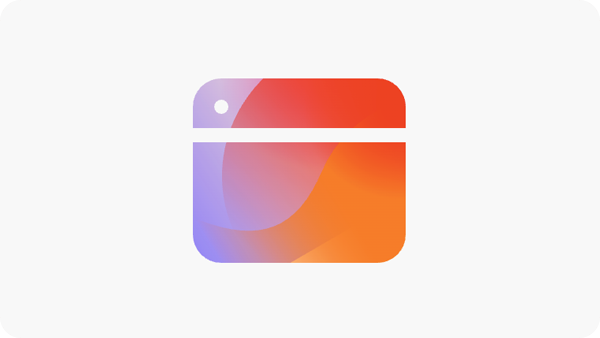

# 参与度机会

{align="center"}

AEM Sites Optimizer 中的参与度机会对于增强数字体验至关重要，因为它可以提供有关用户如何与网页交互的可操作分析。通过识别需要改进的领域（例如无障碍问题、中断的内部链接、高跳出率和缺少替代文本），营销人员和内容作者可以优化他们的网站，以获得更好的性能和用户参与度。这些机会有助于确保内容有效、易于发现且引人注目，最终推动更高的转化和更无缝的客户历程。利用 AEM Sites Optimizer 的推荐，团队可以不断完善其数字策略，并大规模提供高影响力的体验。

## 机会

<!-- CARDS

* ../documentation/opportunities/accessibility-issues.md
  {title=Accessibility issues}
  {image=../assets/common/card-puzzle.png}
* ../documentation/opportunities//broken-internal-links.md
  {title=Broken internal links}
  {image=../assets/common/card-link.png}
* ../documentation/opportunities//high-bounce-rate.md
  {title=High bounce rate}
  {image=../assets/common/card-arrows.png}
* ../documentation/opportunities/high-traffic-page-has-low-ctr.md
  {title=High traffic page has low CTR}
  {image=../assets/common/card-browser.png}
* ../documentation/opportunities/missing-alt-text.md  
  {title=Missing alt text}
  {image=../assets/common/card-arrows.png}

-->
<!-- START CARDS HTML - DO NOT MODIFY BY HAND -->

    

        

            

                <figure class="image x-is-16by9">
                    
                </figure>
            

            

                

                    

                        <a href="../documentation/opportunities/accessibility-issues.md" target="_blank" rel="referrer" title="无障碍问题">无障碍问题</a>
                    

                    
了解无障碍问题机会，以及如何使用它来提高您网站的安全性。

                

                <a href="../documentation/opportunities/accessibility-issues.md" target="_blank" rel="referrer" class="spectrum-Button spectrum-Button--outline spectrum-Button--primary spectrum-Button--sizeM" style="align-self: flex-start; margin-top: 1rem;">
                    了解详情
                </a>
            

        

    

    

        

            

                <figure class="image x-is-16by9">
                    
                </figure>
            

            

                

                    

                        <a href="../documentation/opportunities//broken-internal-links.md" target="_blank" rel="referrer" title="中断的内部链接">中断的内部链接</a>
                    

                    
了解中断的链接机会，以及如何使用它来提高您网站的参与度。

                

                <a href="../documentation/opportunities//broken-internal-links.md" target="_blank" rel="referrer" class="spectrum-Button spectrum-Button--outline spectrum-Button--primary spectrum-Button--sizeM" style="align-self: flex-start; margin-top: 1rem;">
                    了解详情
                </a>
            

        

    

    

        

            

                <figure class="image x-is-16by9">
                    
                </figure>
            

            

                

                    

                        <a href="../documentation/opportunities//high-bounce-rate.md" target="_blank" rel="referrer" title="高跳出率">高跳出率</a>
                    

                    
了解低浏览量机会，以及如何利用这种机会来提高您网站上的表单参与度。

                

                <a href="../documentation/opportunities//high-bounce-rate.md" target="_blank" rel="referrer" class="spectrum-Button spectrum-Button--outline spectrum-Button--primary spectrum-Button--sizeM" style="align-self: flex-start; margin-top: 1rem;">
                    了解详情
                </a>
            

        

    

    

        

            

                <figure class="image x-is-16by9">
                    
                </figure>
            

            

                

                    

                        <a href="../documentation/opportunities/high-traffic-page-has-low-ctr.md" target="_blank" rel="referrer" title="高流量页面存在低点击率">高流量页面存在低点击率</a>
                    

                    
了解高流量页面存在低点击率的优化机会以及如何利用它来增加您网站的参与度。

                

                <a href="../documentation/opportunities/high-traffic-page-has-low-ctr.md" target="_blank" rel="referrer" class="spectrum-Button spectrum-Button--outline spectrum-Button--primary spectrum-Button--sizeM" style="align-self: flex-start; margin-top: 1rem;">
                    了解详情
                </a>
            

        

    

    

        

            

                <figure class="image x-is-16by9">
                    
                </figure>
            

            

                

                    

                        <a href="../documentation/opportunities/missing-alt-text.md" target="_blank" rel="referrer" title="缺少替代文本">缺少替代文本</a>
                    

                    
了解缺少替代文本机会，以及如何使用它来提高您网站上的参与度。

                

                <a href="../documentation/opportunities/missing-alt-text.md" target="_blank" rel="referrer" class="spectrum-Button spectrum-Button--outline spectrum-Button--primary spectrum-Button--sizeM" style="align-self: flex-start; margin-top: 1rem;">
                    了解详情
                </a>
            

        

    

<!-- END CARDS HTML - DO NOT MODIFY BY HAND -->
