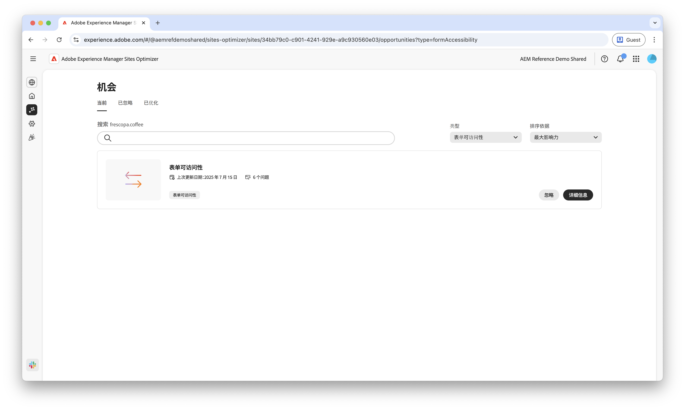

# Forms辅助功能机会

 Forms优化功能在早期访问计划下可用。 您可以从官方电子邮件ID写信到aem-forms-ea@adobe.com ，以加入提前访问计划并请求访问功能。

{align="center"}

Forms辅助功能机会对于增强用户交互和提高转化率至关重要。 评估表单以符合Web内容无障碍准则(WCAG)有助于确保为视觉、听觉、认知和运动障碍用户提供包容性的体验。 这不仅符合道德和法律要求，还提高了表单完成率并扩大了受众，从而带来了更好的用户体验和更强劲的业务成果。

## 机会

<!-- CARDS
 
* ../documentation/opportunities/low-views.md
  {title=Low views}
  {image=../assets/common/card-bag.png}
* ../documentation/opportunities/low-conversions.md
  {title=Low conversions}
  {image=../assets/common/card-bag.png}

--->
<!-- START CARDS HTML - DO NOT MODIFY BY HAND -->

    

        

            

                <figure class="image x-is-16by9">
                    
                </figure>
            

            

                

                    

                        <a href="../documentation/opportunities/forms-accessibility-issues.md" target="_blank" rel="referrer" title="Forms辅助功能问题">Forms辅助功能问题</a>
                    

                    
了解表单辅助功能问题，以及如何使用这些问题来提高您网站上的表单参与度。

                

                <a href="../documentation/opportunities/forms-accessibility-issues.md" target="_blank" rel="referrer" class="spectrum-Button spectrum-Button--outline spectrum-Button--primary spectrum-Button--sizeM" style="align-self: flex-start; margin-top: 1rem;">
                    了解详情
                </a>
            

        

    

<!-- END CARDS HTML - DO NOT MODIFY BY HAND -->
