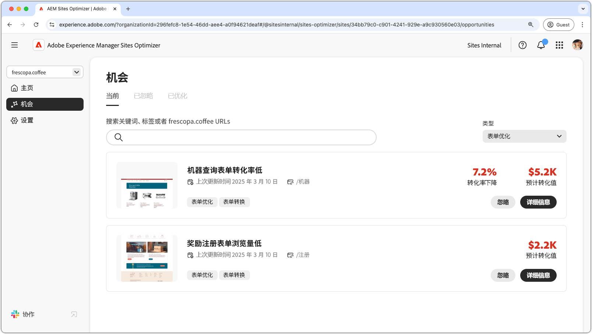

# 表单优化机会

{align="center"}

AEM Sites Optimizer 中的表单优化对于改善用户交互和达到最大转化率至关重要。通过识别需要改进的领域（例如表单的低浏览量和低转化），团队可以完善表单的设计、投放和内容，以提高参与度。优化的表单可确保无缝的用户体验，使访客更容易完成操作，并推动经营成果。通过使用AEM Sites Optimizer的分析，营销人员可以持续识别需要改进的方面，最终提高效率并提升整体网站性能。

## 机会

<!-- CARDS
 
* ../documentation/opportunities/low-views.md
  {title=Low views}
  {image=../assets/common/card-bag.png}
* ../documentation/opportunities/low-conversions.md
  {title=Low conversions}
  {image=../assets/common/card-bag.png}

--->
<!-- START CARDS HTML - DO NOT MODIFY BY HAND -->

    

        

            

                <figure class="image x-is-16by9">
                    
                </figure>
            

            

                

                    

                        <a href="../documentation/opportunities/low-views.md" target="_blank" rel="referrer" title="低浏览量">低浏览量</a>
                    

                    
了解低浏览量机会，以及如何使用它来提高您网站的表单参与度。

                

                <a href="../documentation/opportunities/low-views.md" target="_blank" rel="referrer" class="spectrum-Button spectrum-Button--outline spectrum-Button--primary spectrum-Button--sizeM" style="align-self: flex-start; margin-top: 1rem;">
                    了解详情
                </a>
            

        

    

    

        

            

                <figure class="image x-is-16by9">
                    
                </figure>
            

            

                

                    

                        <a href="../documentation/opportunities/low-conversions.md" target="_blank" rel="referrer" title="低转化">低转化</a>
                    

                    
了解低转化机会，以及如何使用它来提高您网站的表单参与度。

                

                <a href="../documentation/opportunities/low-conversions.md" target="_blank" rel="referrer" class="spectrum-Button spectrum-Button--outline spectrum-Button--primary spectrum-Button--sizeM" style="align-self: flex-start; margin-top: 1rem;">
                    了解详情
                </a>
            

        

    

<!-- END CARDS HTML - DO NOT MODIFY BY HAND -->
