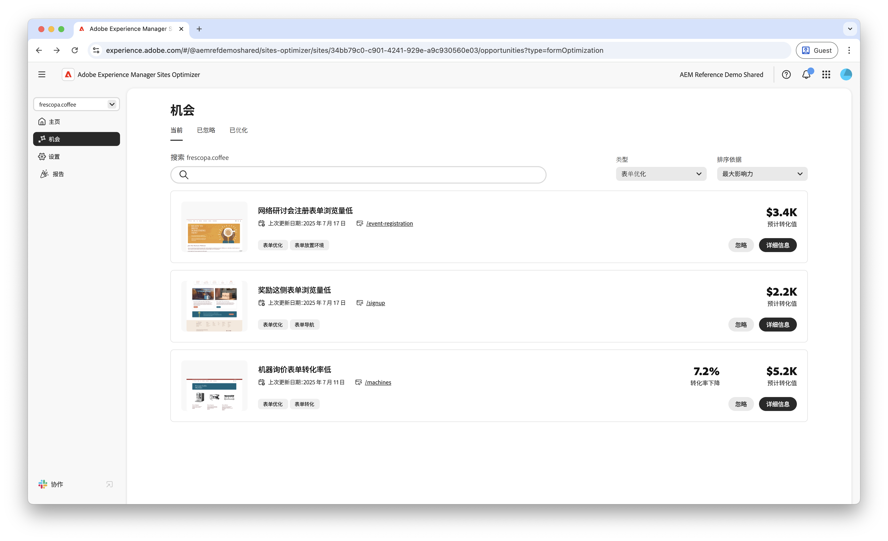

# Forms优化机会

 Forms Optimizer功能在早期访问计划下可用。 您可以从官方电子邮件ID写信到aem-forms-ea@adobe.com ，以加入提前访问计划并请求访问功能。

>[!VIDEO](https://video.tv.adobe.com/v/3469472/)

<!-- {align="center"} -->

Forms优化机会使组织能够系统地改善用户交互并提高表单转化。 通过检测低查看次数、低转化率和低导航率等问题，团队可以对表单设计、版面和内容进行数据驱动调整。 这些优化有助于简化用户体验，使访客更容易完成表单并实现预期结果。 利用Forms Optimizer提供的洞察信息，可支持持续识别和解决性能差距，从而实现更有效的表单和改进的业务成果。

## 机会

<!-- CARDS
 
* ../documentation/opportunities/low-views.md
  {title=Low views}
  {image=../assets/common/card-bag.png}
* ../documentation/opportunities/low-conversions.md
  {title=Low conversions}
  {image=../assets/common/card-bag.png}

--->
<!-- START CARDS HTML - DO NOT MODIFY BY HAND -->

    

        

            

                <figure class="image x-is-16by9">
                    
                </figure>
            

            

                

                    

                        <a href="../documentation/opportunities/low-views.md" target="_blank" rel="referrer" title="低浏览量">低浏览量</a>
                    

                    
了解低查看次数机会以及如何使用它来提高您网站上的表单参与度。

                

                <a href="../documentation/opportunities/low-views.md" target="_blank" rel="referrer" class="spectrum-Button spectrum-Button--outline spectrum-Button--primary spectrum-Button--sizeM" style="align-self: flex-start; margin-top: 1rem;">
                    了解详情
                </a>
            

        

    

    

        

            

                <figure class="image x-is-16by9">
                    
                </figure>
            

            

                

                    

                        <a href="../documentation/opportunities/low-conversions.md" target="_blank" rel="referrer" title="低转化">低转化</a>
                    

                    
了解低转化率机会以及如何使用它来提高您网站上的表单参与度。

                

                <a href="../documentation/opportunities/low-conversions.md" target="_blank" rel="referrer" class="spectrum-Button spectrum-Button--outline spectrum-Button--primary spectrum-Button--sizeM" style="align-self: flex-start; margin-top: 1rem;">
                    了解详情
                </a>
            

        

    

    

        

            

                <figure class="image x-is-16by9">
                    
                </figure>
            

            

                

                    

                        <a href="../documentation/opportunities/low-navigation.md" target="_blank" rel="referrer" title="无障碍问题">低导航</a>
                    

                    
了解导航机会较少以及如何使用它来提高网站上的表单参与度。

                

                <a href="../documentation/opportunities/low-navigation.md" target="_blank" rel="referrer" class="spectrum-Button spectrum-Button--outline spectrum-Button--primary spectrum-Button--sizeM" style="align-self: flex-start; margin-top: 1rem;">
                    了解详情
                </a>
            

        

    

<!-- END CARDS HTML - DO NOT MODIFY BY HAND -->
