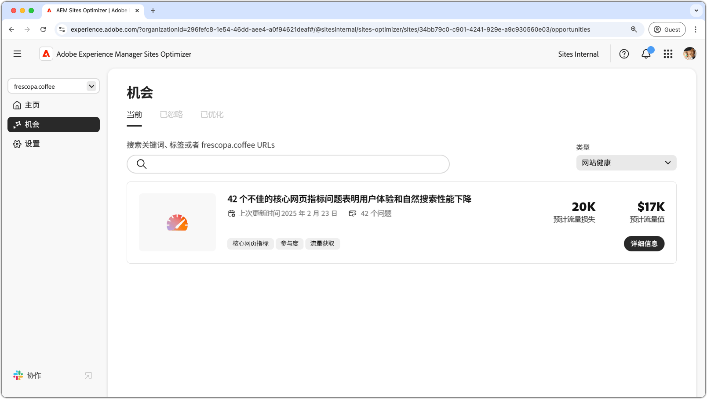

# 机会类型

{align="center"}

AEM Sites Optimizer 提供了有价值的洞察和推荐，帮助您提高网站的性能、可用性和安全性。这些见解将分组到以下关键机会领域：

* 参与度
* 流量获取
* 安全状态
* 站点运行状况

每个类别都会突出显示用于增强站点的不同方法。 一个类别可能会增加访客互动。 另一种方法可以提高可发现性。 其他则侧重于加强安全或维护站点稳定。

利用这些机会可改善用户体验、吸引合适的受众，并确保您的网站安全可靠。 增强参与和流量获取可促进交互和可见性，而强大的安全态势和站点运行状况有助于确保信任和稳定。  浏览下面的链接，查看按类别组织的机会，并找到改进网站的方法。

## 机会类型

<!-- CARDS 

* ./engagement.md
   { title = Engagement }
* ./security-posture.md
   { title = Security posture }
* ./site-health.md
   { title = Site health }
* ./traffic-acquisition.md
   { title = Traffic acquisition }
* ./form-optimization.md
   { title = Forms Optimizer }

-->
<!-- START CARDS HTML - DO NOT MODIFY BY HAND -->

    

        

            

                <figure class="image x-is-16by9">
                    
                </figure>
            

            

                

                    

                        <a href="./engagement.md" target="_blank" rel="referrer" title="参与度">参与度</a>
                    

                    
了解如何使用 Sites Optimizer 提高参与度。

                

                <a href="./engagement.md" target="_blank" rel="referrer" class="spectrum-Button spectrum-Button--outline spectrum-Button--primary spectrum-Button--sizeM" style="align-self: flex-start; margin-top: 1rem;">
                    了解详情
                </a>
            

        

    

    

        

            

                <figure class="image x-is-16by9">
                    
                </figure>
            

            

                

                    

                        <a href="./security-posture.md" target="_blank" rel="referrer" title="安全态势">安全态势</a>
                    

                    
了解如何使用 Sites Optimizer 提高您网站的安全性。

                

                <a href="./security-posture.md" target="_blank" rel="referrer" class="spectrum-Button spectrum-Button--outline spectrum-Button--primary spectrum-Button--sizeM" style="align-self: flex-start; margin-top: 1rem;">
                    了解详情
                </a>
            

        

    

    

        

            

                <figure class="image x-is-16by9">
                    
                </figure>
            

            

                

                    

                        <a href="./site-health.md" target="_blank" rel="referrer" title="网站健康">网站健康</a>
                    

                    
了解如何使用 Sites Optimizer 改善您网站的健康状况。

                

                <a href="./site-health.md" target="_blank" rel="referrer" class="spectrum-Button spectrum-Button--outline spectrum-Button--primary spectrum-Button--sizeM" style="align-self: flex-start; margin-top: 1rem;">
                    了解详情
                </a>
            

        

    

    

        

            

                <figure class="image x-is-16by9">
                    
                </figure>
            

            

                

                    

                        <a href="./traffic-acquisition.md" target="_blank" rel="referrer" title="流量获取">流量获取</a>
                    

                    
了解如何使用 Sites Optimizer 提高流量获取。

                

                <a href="./traffic-acquisition.md" target="_blank" rel="referrer" class="spectrum-Button spectrum-Button--outline spectrum-Button--primary spectrum-Button--sizeM" style="align-self: flex-start; margin-top: 1rem;">
                    了解详情
                </a>
            

        

    

    

        

            

                <figure class="image x-is-16by9">
                    
                </figure>
            

            

                

                    

                        <a href="./form-optimization.md" target="_blank" rel="referrer" title="Forms优化">Forms优化</a>
                    

                    
了解如何使用Forms Optimizer提高表单转化率。

                

                <a href="./form-optimization.md" target="_blank" rel="referrer" class="spectrum-Button spectrum-Button--outline spectrum-Button--primary spectrum-Button--sizeM" style="align-self: flex-start; margin-top: 1rem;">
                    了解详情
                </a>
            

        

    

    

        

            

                <figure class="image x-is-16by9">
                    
                </figure>
            

            

                

                    

                        <a href="./form-optimization.md" target="_blank" rel="referrer" title="Forms辅助功能">Forms辅助功能</a>
                    

                    
了解如何使用Forms Optimizer改进表单辅助功能。

                

                <a href="./form-optimization.md" target="_blank" rel="referrer" class="spectrum-Button spectrum-Button--outline spectrum-Button--primary spectrum-Button--sizeM" style="align-self: flex-start; margin-top: 1rem;">
                    了解详情
                </a>
            

        

    

<!-- END CARDS HTML - DO NOT MODIFY BY HAND -->

在早期访问计划下提供了Forms优化和Forms辅助功能。 您可以从官方电子邮件ID写信到aem-forms-ea@adobe.com ，以加入提前访问计划并请求访问功能。
