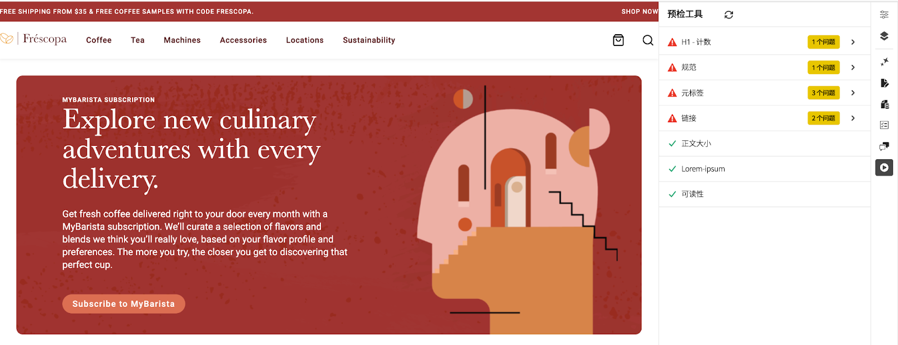

# 预检机会

{align="center"}

AEM Sites Optimizer预检机会有助于确保您的网页在投入使用之前针对性能、SEO和用户体验进行了优化。 通过识别潜在问题，例如链接损坏、缺少元标记和辅助功能问题，预检检查允许内容作者和营销人员在发布过程的早期解决这些问题。 这种主动预防性的方法最大限度地降低了发布次优内容的风险，提高了网站质量，并改善了总体数字效果。 利用印前检查机会支持更流畅的工作流程，减少发布后修复，并有助于提高搜索引擎排名和用户满意度。

## 机会

<!-- CARDS

* ../documentation/opportunities/invalid-or-missing-metadata.md
  {title=Canonical}
  {image=../assets/common/card-link.png}
* ../documentation/opportunities/broken-internal-links.md
  {title=Broken Internal Links}
  {image=../assets/common/card-link.png}
* ../documentation/opportunities/invalid-or-missing-metadata.md
  {title=Metatags}
  {image=../assets/common/card-code.png}
* ../documentation/opportunities/invalid-or-missing-metadata.md
  {title=H1 count}
  {image=../assets/common/card-code.png}
* ../documentation/opportunities/accessibility-issues.md
  {title=Accessibility}
  {image=../assets/common/card-puzzle.png}

-->
<!-- START CARDS HTML - DO NOT MODIFY BY HAND -->
<div class="columns">
    <div class="column is-half-tablet is-half-desktop is-one-third-widescreen" aria-label="Canonical">
        <div class="card" style="height: 100%; display: flex; flex-direction: column; height: 100%;">
            <div class="card-image">
                <figure class="image x-is-16by9">
                    <a href="../documentation/opportunities/invalid-or-missing-metadata.md" title="规范" target="_blank" rel="referrer">
                        
                    </a>
                </figure>
            </div>
            <div class="card-content is-padded-small" style="display: flex; flex-direction: column; flex-grow: 1; justify-content: space-between;">
                <div class="top-card-content">
                    <p class="headline is-size-6 has-text-weight-bold">
                        <a href="../documentation/opportunities/invalid-or-missing-metadata.md" target="_blank" rel="referrer" title="规范">规范</a>
                    </p>
                    <p class="is-size-6">了解规范机会以及如何使用它来提升 SEO 并防止重复内容问题。</p>
                </div>
                <a href="../documentation/opportunities/invalid-or-missing-metadata.md" target="_blank" rel="referrer" class="spectrum-Button spectrum-Button--outline spectrum-Button--primary spectrum-Button--sizeM" style="align-self: flex-start; margin-top: 1rem;">
                    <span class="spectrum-Button-label has-no-wrap has-text-weight-bold">了解详情</span>
                </a>
            </div>
        </div>
    </div>
    <div class="column is-half-tablet is-half-desktop is-one-third-widescreen" aria-label="Broken Internal Links">
        <div class="card" style="height: 100%; display: flex; flex-direction: column; height: 100%;">
            <div class="card-image">
                <figure class="image x-is-16by9">
                    <a href="../documentation/opportunities/broken-internal-links.md" title="中断的内部链接" target="_blank" rel="referrer">
                        
                    </a>
                </figure>
            </div>
            <div class="card-content is-padded-small" style="display: flex; flex-direction: column; flex-grow: 1; justify-content: space-between;">
                <div class="top-card-content">
                    <p class="headline is-size-6 has-text-weight-bold">
                        <a href="../documentation/opportunities/broken-internal-links.md" target="_blank" rel="referrer" title="中断的内部链接">中断的内部链接</a>
                    </p>
                    <p class="is-size-6">了解中断的内部链接机会以及如何使用它来识别和修复网站上中断或有问题的链接。</p>
                </div>
                <a href="../documentation/opportunities/broken-internal-links.md" target="_blank" rel="referrer" class="spectrum-Button spectrum-Button--outline spectrum-Button--primary spectrum-Button--sizeM" style="align-self: flex-start; margin-top: 1rem;">
                    <span class="spectrum-Button-label has-no-wrap has-text-weight-bold">了解详情</span>
                </a>
            </div>
        </div>
    </div>
    <div class="column is-half-tablet is-half-desktop is-one-third-widescreen" aria-label="Metatags">
        <div class="card" style="height: 100%; display: flex; flex-direction: column; height: 100%;">
            <div class="card-image">
                <figure class="image x-is-16by9">
                    <a href="../documentation/opportunities/invalid-or-missing-metadata.md" title="元标记" target="_blank" rel="referrer">
                        
                    </a>
                </figure>
            </div>
            <div class="card-content is-padded-small" style="display: flex; flex-direction: column; flex-grow: 1; justify-content: space-between;">
                <div class="top-card-content">
                    <p class="headline is-size-6 has-text-weight-bold">
                        <a href="../documentation/opportunities/invalid-or-missing-metadata.md" target="_blank" rel="referrer" title="元标记">元标记</a>
                    </p>
                    <p class="is-size-6">了解元标记机会以及如何使用它来优化页面的元数据以获得更好的 SEO 性能。</p>
                </div>
                <a href="../documentation/opportunities/invalid-or-missing-metadata.md" target="_blank" rel="referrer" class="spectrum-Button spectrum-Button--outline spectrum-Button--primary spectrum-Button--sizeM" style="align-self: flex-start; margin-top: 1rem;">
                    <span class="spectrum-Button-label has-no-wrap has-text-weight-bold">了解详情</span>
                </a>
            </div>
        </div>
    </div>
    <div class="column is-half-tablet is-half-desktop is-one-third-widescreen" aria-label="H1 count">
        <div class="card" style="height: 100%; display: flex; flex-direction: column; height: 100%;">
            <div class="card-image">
                <figure class="image x-is-16by9">
                    <a href="../documentation/opportunities/invalid-or-missing-metadata.md" title="H1 计数" target="_blank" rel="referrer">
                        
                    </a>
                </figure>
            </div>
            <div class="card-content is-padded-small" style="display: flex; flex-direction: column; flex-grow: 1; justify-content: space-between;">
                <div class="top-card-content">
                    <p class="headline is-size-6 has-text-weight-bold">
                        <a href="../documentation/opportunities/invalid-or-missing-metadata.md" target="_blank" rel="referrer" title="H1 计数">H1 计数</a>
                    </p>
                    <p class="is-size-6">了解 H1 计数机会以及如何使用它来确保正确的标题结构和 SEO 优化。</p>
                </div>
                <a href="../documentation/opportunities/invalid-or-missing-metadata.md" target="_blank" rel="referrer" class="spectrum-Button spectrum-Button--outline spectrum-Button--primary spectrum-Button--sizeM" style="align-self: flex-start; margin-top: 1rem;">
                    <span class="spectrum-Button-label has-no-wrap has-text-weight-bold">了解详情</span>
                </a>
            </div>
        </div>
    </div>
    <div class="column is-half-tablet is-half-desktop is-one-third-widescreen" aria-label="Accessibility">
        <div class="card" style="height: 100%; display: flex; flex-direction: column; height: 100%;">
            <div class="card-image">
                <figure class="image x-is-16by9">
                    <a href="../documentation/opportunities/accessibility-issues.md" title="辅助功能" target="_blank" rel="referrer">
                        
                    </a>
                </figure>
            </div>
            <div class="card-content is-padded-small" style="display: flex; flex-direction: column; flex-grow: 1; justify-content: space-between;">
                <div class="top-card-content">
                    <p class="headline is-size-6 has-text-weight-bold">
                        <a href="../documentation/opportunities/accessibility-issues.md" target="_blank" rel="referrer" title="辅助功能">辅助功能</a>
                    </p>
                    <p class="is-size-6">了解辅助功能机会以及如何使用它来确保所有用户都可以访问您的网站。</p>
                </div>
                <a href="../documentation/opportunities/accessibility-issues.md" target="_blank" rel="referrer" class="spectrum-Button spectrum-Button--outline spectrum-Button--primary spectrum-Button--sizeM" style="align-self: flex-start; margin-top: 1rem;">
                    <span class="spectrum-Button-label has-no-wrap has-text-weight-bold">了解详情</span>
                </a>
            </div>
        </div>
    </div>

</div>
<!-- END CARDS HTML - DO NOT MODIFY BY HAND -->

## 设置

AEM Sites Optimizer Preflight机会识别要求在Universal Editor、Document-Based Preview或AEM Cloud Service中设置Preflight扩展，以便在发布页面之前在您的页面上运行Preflight审核。

### 启用用户访问权限

要使用Preflight扩展，请确保您的用户在[Adobe Admin Console](https://adminconsole.adobe.com)中至少被分配到以下AEM Sites Optimizer产品配置文件之一：

* AEM Sites Optimizer — 自动建议用户
* AEM Sites Optimizer — 自动优化用户

### 启用Preflight扩展

>[!BEGINTABS]

>[!TAB 通用编辑器]

要在通用编辑器中设置Preflight，请执行以下步骤：

1. 打开&#x200B;**Extension Manager**：
   [https://experience.adobe.com/#/@org/aem/extension-manager/universal-editor](https://experience.adobe.com/#/@org/aem/extension-manager/universal-editor)
1. 找到&#x200B;**AEM Sites Optimizer预检扩展**&#x200B;并提交请求以启用它。
1. **Adobe AEM团队**&#x200B;将审核并为您的组织启用该扩展。
1. 启用该扩展后，在&#x200B;**通用编辑器**中打开一个页面，例如：
   `https://author-p12345-e123456.adobeaemcloud.com/ui#/@org/aem/universal-editor/canvas/author-p12345-e123456.adobeaemcloud.com/content/en/example/home.html`
1. **预检扩展**&#x200B;将显示在&#x200B;**侧边栏**&#x200B;中。
1. 从侧边栏选择&#x200B;**Preflight扩展**&#x200B;以启动当前页面的&#x200B;**Preflight审核**。

>[!TAB 基于文档的创作]

要为基于文档的创作设置Preflight，请执行以下步骤：

1. 将以下配置添加到Edge Delivery Services项目的GitHub存储库中的`/tools/sidekick/config.json`：

   ```json
   {
     "plugins": [
       {
         "id": "preflight",
         "titleI18n": {
           "en": "Preflight"
         },
         "environments": ["preview"],
         "event": "preflight"
       }
     ]
   }
   ```

1. 创建新文件`/tools/sidekick/aem-sites-optimizer-preflight.js`并添加以下内容：

   ```javascript
   (function () {
     let isAEMSitesOptimizerPreflightAppLoaded = false;
     function loadAEMSitesOptimizerPreflightApp() {
       const script = document.createElement('script');
       script.src = 'https://experience.adobe.com/solutions/OneAdobe-aem-sites-optimizer-preflight-mfe/static-assets/resources/sidekick/client.js?source=plugin';
       script.onload = function () {
         isAEMSitesOptimizerPreflightAppLoaded = true;
       };
       script.onerror = function () {
         console.error('Error loading AEMSitesOptimizerPreflightApp.');
       };
       document.head.appendChild(script);
     }
   
     function handlePluginButtonClick() {
       if (!isAEMSitesOptimizerPreflightAppLoaded) {
         loadAEMSitesOptimizerPreflightApp();
       }
     }
   
     // Sidekick V1 extension support
     const sidekick = document.querySelector('helix-sidekick');
     if (sidekick) {
       sidekick.addEventListener('custom:preflight', handlePluginButtonClick);
     } else {
       document.addEventListener('sidekick-ready', () => {
         document.querySelector('helix-sidekick')
           .addEventListener('custom:preflight', handlePluginButtonClick);
       }, { once: true });
     }
   
     // Sidekick V2 extension support
     const sidekickV2 = document.querySelector('aem-sidekick');
     if (sidekickV2) {
       sidekickV2.addEventListener('custom:preflight', handlePluginButtonClick);
     } else {
       document.addEventListener('sidekick-ready', () => {
         document.querySelector('aem-sidekick')
           .addEventListener('custom:preflight', handlePluginButtonClick);
       }, { once: true });
     }
   }());
   ```

1. 更新`loadLazy()`中的`/scripts/scripts.js`函数以导入预览URL的Preflight脚本：

   ```javascript
   if (window.location.href.includes('.aem.page')) {
      import('../tools/sidekick/aem-sites-optimizer-preflight.js');
   }
   ```

1. 打开要审核的页面的预览URL (`*.aem.page`)。
1. 在&#x200B;**Sidekick**&#x200B;中，单击&#x200B;**预检**&#x200B;按钮以开始审核当前页面。

>[!TAB AEM Sites页面编辑器]

要在AEM Sites页面编辑器中使用Preflight，您可以在Web浏览器中创建小书签。 请按照以下步骤操作：

1. 在Web浏览器中显示&#x200B;**书签栏**：

   * 按&#x200B;**Ctrl+Shift+B** (Windows)或&#x200B;**Cmd+Shift+B** (Mac)。

！。 在浏览器中创建新书签：

* 右键单击书签栏并选择&#x200B;**新建页面**&#x200B;或&#x200B;**添加书签**。
* 在&#x200B;**地址(URL)**&#x200B;字段中，粘贴以下代码：

```javascript
javascript:(function(){const script=document.createElement('script');script.src='https://experience.adobe.com/solutions/OneAdobe-aem-sites-optimizer-preflight-mfe/static-assets/resources/sidekick/client.js?source=bookmarklet&target-source=aem-cloud-service';document.head.appendChild(script);})();
```

1. 将书签命名为&#x200B;**Preflight**（或您喜欢的任何名称）。
1. 在`*.aem.page`AEM Sites页面编辑器&#x200B;**中打开要审核的页面的预览URL (**)。
1. 单击书签栏中的&#x200B;**Preflight**&#x200B;书签以开始审核当前页面。

>[!ENDTABS]

## 最佳实践

运行Preflight审核时，请牢记以下准则：

* 在发布到生产环境之前，始终对&#x200B;**暂存或预览页面**&#x200B;运行审核。
* 优先解决&#x200B;**影响严重的问题**，例如链接损坏、缺少H1标记或不安全的链接。
* 在运行审核之前，请确保为受保护的暂存环境启用了&#x200B;**身份验证**。
* 查看并应用&#x200B;**meta标记建议**&#x200B;以提高SEO性能。
