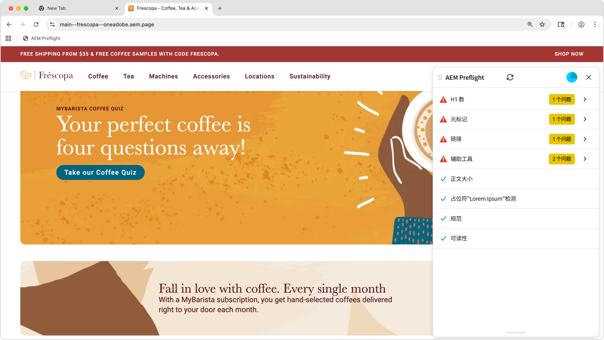

# 预检机会

{align="center"}

AEM Sites Optimizer [预检机会](../documentation/preflight/overview.md)可帮助确保网页在上线前已针对性能、SEO 和用户体验完成优化。通过识别潜在问题（如链接失效、缺少元标记和可访问性隐患），预检检查使内容作者和营销人员能够在发布流程早期解决这些问题。这种主动预防性的方法最大限度地降低了发布次优内容的风险，提高了网站质量，并改善了总体数字效果。 使用印前检查机会支持更流畅的工作流，减少发布后的修复，并有助于提高搜索引擎排名和用户满意度。

## 机会

<!-- CARDS

* ../documentation/preflight/accessibility.md
  {title=Accessibility}
  {image=../assets/common/card-puzzle.png}
* ../documentation/preflight/h1-count.md
  {title=H1 count}
  {image=../assets/common/card-link.png}
* ../documentation/preflight/links.md
  {title=Links}
  {image=../assets/common/card-link.png}
* ../documentation/preflight/meta-data.md
  {title=Metadata}
  {image=../assets/common/card-code.png}
* ../documentation/preflight/readability.md
  {title=Readability}
  {image=../assets/common/card-people.png}

-->
<!-- START CARDS HTML - DO NOT MODIFY BY HAND -->

    

        

            

                <figure class="image x-is-16by9">
                    
                </figure>
            

            

                

                    

                        <a href="../documentation/preflight/accessibility.md" target="_blank" rel="referrer" title="辅助功能">辅助功能</a>
                    

                    
了解 Sites Optimizer 中的预检辅助功能机会。

                

                <a href="../documentation/preflight/accessibility.md" target="_blank" rel="referrer" class="spectrum-Button spectrum-Button--outline spectrum-Button--primary spectrum-Button--sizeM" style="align-self: flex-start; margin-top: 1rem;">
                    了解详情
                </a>
            

        

    

    

        

            

                <figure class="image x-is-16by9">
                    
                </figure>
            

            

                

                    

                        <a href="../documentation/preflight/h1-count.md" target="_blank" rel="referrer" title="H1 计数">H1 计数</a>
                    

                    
了解 Sites Optimizer 中的预检辅助功能机会。

                

                <a href="../documentation/preflight/h1-count.md" target="_blank" rel="referrer" class="spectrum-Button spectrum-Button--outline spectrum-Button--primary spectrum-Button--sizeM" style="align-self: flex-start; margin-top: 1rem;">
                    了解详情
                </a>
            

        

    

    

        

            

                <figure class="image x-is-16by9">
                    
                </figure>
            

            

                

                    

                        <a href="../documentation/preflight/links.md" target="_blank" rel="referrer" title="链接">链接</a>
                    

                    
了解 Sites Optimizer 中的预检链接机会。

                

                <a href="../documentation/preflight/links.md" target="_blank" rel="referrer" class="spectrum-Button spectrum-Button--outline spectrum-Button--primary spectrum-Button--sizeM" style="align-self: flex-start; margin-top: 1rem;">
                    了解详情
                </a>
            

        

    

    

        

            

                <figure class="image x-is-16by9">
                    
                </figure>
            

            

                

                    

                        <a href="../documentation/preflight/meta-data.md" target="_blank" rel="referrer" title="元数据">元数据</a>
                    

                    
了解 Sites Optimizer 中的预检元数据机会。

                

                <a href="../documentation/preflight/meta-data.md" target="_blank" rel="referrer" class="spectrum-Button spectrum-Button--outline spectrum-Button--primary spectrum-Button--sizeM" style="align-self: flex-start; margin-top: 1rem;">
                    了解详情
                </a>
            

        

    

    

        

            

                <figure class="image x-is-16by9">
                    
                </figure>
            

            

                

                    

                        <a href="../documentation/preflight/readability.md" target="_blank" rel="referrer" title="可读性">可读性</a>
                    

                    
了解 Sites Optimizer 中的预检可读性机会。

                

                <a href="../documentation/preflight/readability.md" target="_blank" rel="referrer" class="spectrum-Button spectrum-Button--outline spectrum-Button--primary spectrum-Button--sizeM" style="align-self: flex-start; margin-top: 1rem;">
                    了解详情
                </a>
            

        

    

<!-- END CARDS HTML - DO NOT MODIFY BY HAND -->
