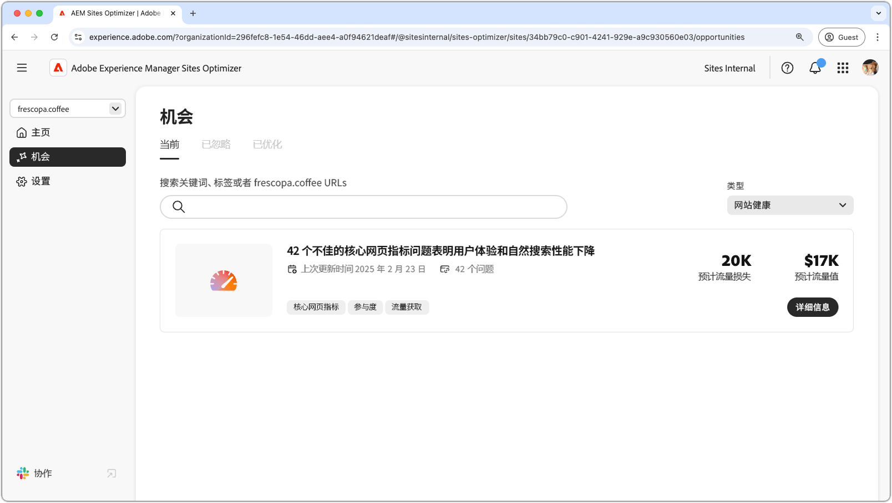

# 网站健康机会

{align="center"}

在 AEM Sites Optimizer 中维护网站健康对于提供快速、可靠和高性能的数字体验至关重要。通过识别改进机会（例如 Core Web Vitals），团队可以优化页面速度、交互性和视觉稳定性，以增强用户体验并提高搜索引擎排名。维护良好的网站可确保更顺畅的导航、更高的参与度和更佳的整体性能。利用 AEM Sites Optimizer 的洞察，可以进行持续监控和改进，确保网站长期保持高效和有效。

## 机会

<!-- CARDS

* ../documentation/opportunities/core-web-vitals.md
  {title=Core web vitals}
  {image=../assets/common/card-performance.png}

-->
<!-- START CARDS HTML - DO NOT MODIFY BY HAND -->

    

        

            

                <figure class="image x-is-16by9">
                    
                </figure>
            

            

                

                    

                        <a href="../documentation/opportunities/core-web-vitals.md" target="_blank" rel="referrer" title="Core Web Vitals">Core Web Vitals</a>
                    

                    
了解 Core Web Vitals 机会，以及如何使用它来提高流量获取。

                

                <a href="../documentation/opportunities/core-web-vitals.md" target="_blank" rel="referrer" class="spectrum-Button spectrum-Button--outline spectrum-Button--primary spectrum-Button--sizeM" style="align-self: flex-start; margin-top: 1rem;">
                    了解详情
                </a>
            

        

    

<!-- END CARDS HTML - DO NOT MODIFY BY HAND -->

